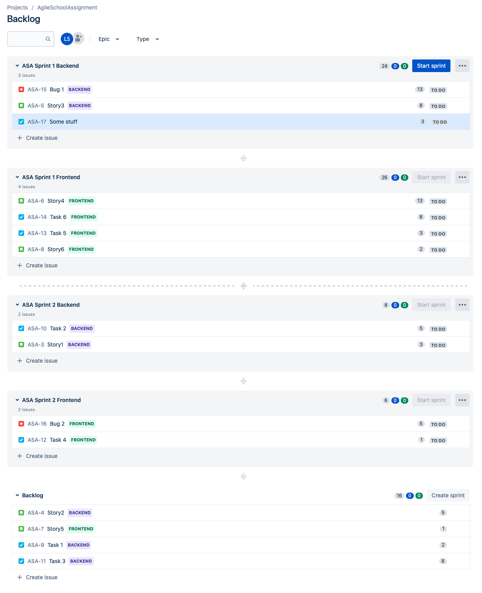
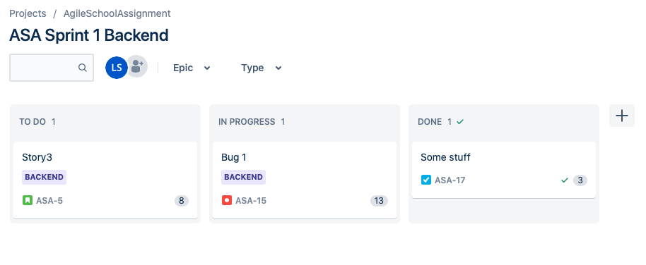
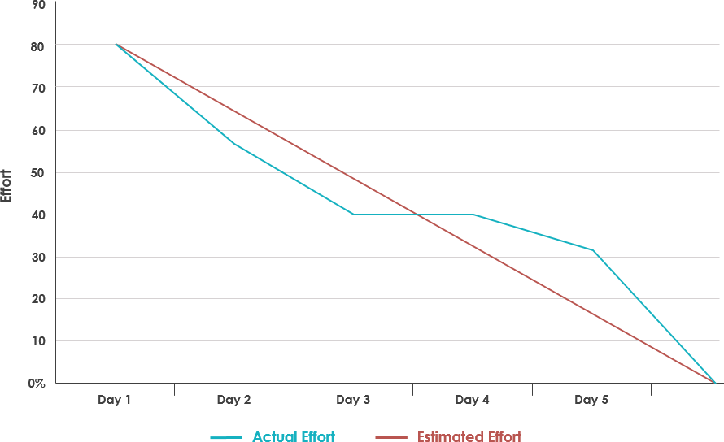

# Assignment
Individual assignment, create a "Scrum Team"

## Presentation of Assignment

You are working as an Agile Coach, and a Company have assigned you to create an Agile process who work for them.

Conditions is:
- There are 9 developers
- 3 Stakeholders (Product owner, Project manager (Not a scrum title but usual exist in real life), Project Leader (IRL))
- No predefined workflow

The company have existed since the 70-ties so there are still some older developers that have worked there for a long time, and some younger talents.

Your assignment is, with what you have learned about Scrum, to construct a workflow who should/must work for this company.

There should be:
- A team management (how is this done)
- There should be `x` number of backlogs (without content)
- There should be at least 1 Agile board
- There should be `y` number of Scrum Masters (how to assign these)

### Grade G
Create a process who could work in theory

### Grade VG
Argue for your decisions

## Thoughts

### Idea
Deliver a web app to market that have a user interface that connects to a backend with some kind of database.

### 2 teams
- Frontend, 4 developers
- Backend, 5 developer

If for some reason the ratio between frontend and backend isn't working, there is the possibility to change the ratio between the teams if the knowledge supports it.

### Stakeholders
- Product owner
- System Architect Frontend
- System Architect Backend

### Team members
- 9 Developers
    - 2 old grumpy developers
    - 3 medium developers
    - 4 younger talents

#### Frontend team
- 4 Developers
    - 1 old
    - 1 mid
    - 2 new

#### Backend team
- 5 Developers
    - 1 old
    - 2 mid
    - 2 new

### Scrum Master
Maybe one of the people (new) here should be the Scrum Master or external member of company.  
alt: Employ external
 
### Workflow
- Use of Jira for project planning
    - Epic for Frontend
    - Epic for Backend
- Scrum with 2 weeks Sprints, starts on Monday
- Daily stand-up at 8 am
- Sprint review last Friday at 1 pm
- Sprint retrospective last Friday at 3 pm
- Planning for next sprint parallel to retrospective Architects and Product owner prioritize
- Sprint planning in teams on Monday morning

# Result

## The general idea for the project.
Deliver a web app to market that have a user interface that connects to a backend with some kind of database.

## Stakeholder and team's assignment
### Stakeholders
Product owner is the one with the vision of what we are going to do, make or accomplish. They take into account risks and rewards, what is possible, what can be done, and what they are passionate about.
The System Architect are the ones that have the technical knowledge about how to build and plan the architecture for the frontend and backend respectively.

### Teams
I would split the developers into two teams, one Frontend team with 4 developers and one Backend with 5 developers. Furthermore,  I would assign one System Architect per team as stakeholders and assign the last stakeholder as Project owner.
I divide the developers into two teams since I don't think all the developers will be Full stack Developers, and two smaller teams makes sense with that assumption. They will work on separate ends of the project, so they will have separate scrum boards.

### General developer dynamic
I assume that I will have the following ration between the developers:
- 2 old grumpy developers
- 3 medium developers
- 4 younger talents

I imagine that:
- the older more senior developers will be harder to convince and get into the new workflow but sits on a lot of knowledge.
- the medium developers have somewhere in the range of 5 years of experience and will be easier to get into the new workflow.
- the younger developers have somewhere in de range of 0-2 years of experience and will need more guidance from the more senior developers. These are probably more open to try new things, so there could maybe be one good selection here to become Scrum Masters.  

I think that this could be near a real scenario. 

### Frontend team
I would assign 4 developers to this team because here I imagine that they construct the User Interface with for example the framework React. Regarding the ratio of programmers, I would go for:
- 1 old
- 1 mid
- 2 new

### Backend team
I would assign 5 developers to this team because here I imagine that they build the API between Frontend and Backend, the business logic and the connection to the database. Regarding the ratio of programmers, I would go for:
- 1 old
- 2 mid
- 2 new

### Team motivation
This could be a good mix. The teams will need to have all the skills needed to take the Product Owners´ vision and make it a reality. The team should be small, 3 to 9 people and, I have chosen too, split the 9 developers i half, into two teams. 

I think that 4 developers should be enough for Frontend since they don't need to work on databases ;).

I motivate 5 developers on the Backend since they have the additional workload of the API, database and major Business Logic.

I would also implement pair programming to level out and raise the knowledge bar for all members of the team.

If for some reason the ratio between frontend and backend isn't working, there is the possibility to change the ratio between the teams if the knowledge of developers supports it. It's generally not recommended having developers to jump between groups, but it could be an alternative if the load on one group have been completely misjudged. This is to be considered a permanent switch if it's to be implemented at all.

## Scrum master
This is the person who will coach the rest of the team/teams through the Scrum framework, ans help the team eliminate anything that is slowing them down.
I would argue for employing an external Scrum Master since there is no prior knowledge of Agile work on the company to ensure that the Agile methodology will not result in a failed Agile transition. 

When the company employees can work according to an Agile methodology that is molded to work for this specific company, one of the "younger talents" or maybe a medium developer could be assigned the role of Scrum Master. This is a possibility if it can be done without compromising the integrity and functionality of the teams. 

## Backlog
### Create and prioritize a Product Backlog
This is a list at high level of everything that needs to be built or done to make that vision a reality. This backlog exists and evolves over the lifetime of the product; it's the product roadmap. At any point, the Product Backlog is the single definitive view of "everything that could be done by the team ever, in order of priority". Only a single Product Backlog exists; this means the Product Owner is, required to make prioritization decisions across the entire spectrum. The Product Owner should consult with all stakeholders, and the team to make sure they are representing both what people want and what can be built. 

There will be one major backlog for the project, but it will be broken down i two parts since I have two teams to deal with. So when the backlog is, broken down it will be split down into what functionality to work on and work on it on both frontend and backend simultaneously. The Product Owner and Architects are responsible to plan what is prioritized ahead of each Sprint and will in this planning be responsible for the synchronization of Frontend and Backend in the bigger scope. They will not always be synced but on the greater scoop they should be able to interact with each other.

It could be possible to use a single backlog for each team, but I would like to have one for the entire project. It's possible to visually see each group momentum and progress with their respectively Scrum Board. 

### Refine and Estimate the Product Backlog
It is crucial, that the people who are actually going to complete the items in the Product Backlog estimate how much effort they will take. The team should look at each Backlog item, and see if it is actually doable. 
- Is there enough information to complete the item? 
- Is it small enough to estimate? 
- Is there a Definition of Done, that is, everyone agrees on what standards must be met to call something "done"?
- Does it create visible value?  

Each item must be able to be shown, to be demonstrated, hopefully to be potentially shippable. Do not estimate the Backlog in hours, because people ate absolutely terrible at that. Estimate by relative size: Small, Medium; or Large. Or even better use ,the Fibonacci sequence and estimate the point value for each item: 1, 2, 3, 5, 8, 13,21, etc. Fibonacci sequence is, used in my project, and the teams would use planning poker to estimate points for how complex tasks are to do. 

## Workflow planning
### Sprint Planning
This is the first of the Scrum meetings.The team, the Scrum Master, and the Product Owner sit down to plan the sprint. Sprints are always a fixed length of time, that is less than a month. Most people run in one to two weeks sprint, I have chosen 2 weeks. Two weeks, is chosen because I estimate that the truth about the project is, not changed in that amount of time. If we realize that 2 weeks are to long time, so we can't react fast enough, there is the possibility to shorten the sprint. Likewise, is true for the opposite, that it's possible to work in longer sprints. 

**But** it comes with a huge cost to change the lengths of the sprint, we lose all of our estimate history because that no longer hold  any truth
in the new sprint length. So this is not a decision to come easily.

The team look at the top of the Backlog and forecast how much of it they can complete in this sprint. If the team has been going for a few Sprints, they should take in the number of points the did the last Sprint. This number is, known as the teams **Velocity**. The Scrum Master and the team should be trying to increase that number every Sprint. This is another chance for the team, and the Product Owner to make sure, that everyone understands exactly how those items are going to fulfill the vision.

Also, during this meeting everyone should agree on a Sprint Goal, what everyone wants to accomplish with this Sprint. One of the pillars of Scrum is that the team has committed to what they think they can finish in one Sprint,that's it. It can, not be changed, it cannot be added to. The team must be able to work autonomously throughout the Sprint to complete what they forecast they could.

I think that a two-week Sprint could be a good start to get up to speed with the new Agile workflow. One week would probably be to narrow and three weeks to large gap to be handled. One week would probably change the focus from development to the process instead, and three weeks plus could potentially get people to forget or not get into the process enough, so they would easier get int old habits.

### Make Work Visible
I would use [Jira](https://www.atlassian.com/software/jira) from Atlassian for the planning of Scrum Boards. There should be one board with functionality for each team with what to do so each team will have their own backlog, but they should be synced on a greater scope so Frontend and Backend work on the same functionality.

I'm thinking that the teams will use three columns:
- To Do
- In Progress
- Done

The developers use TDD so all tests must pass for an issue to be allowed, to be moved to the "Done" column. If all test compile and there are no errors, we commit our code to for example GitHub which will trigger the CI/CD pipeline. If all tests pass and there are no errors the code will go live. For this to be able to work, a strong TDD culture must be present.

##### Example of how I'm thinking:  

In my example here Frontend and Backend is in the same planning but separated with different Epic (BACKEND/FRONTEND). In Jira there is the possibility to start one common Sprint for different boards, wish is how imagine it will be. 

I made 3 stories, 3 tasks and 1 bug for Frontend resp Backend and assigned the over 2 sprints and a backlog. 

##### Example of a started sprint:  

This view and, or a burn down chart would be on an always on display, so the teams can see the progress in real-time. This will hopefully inspire people when the visually can see the progress of the Sprint for the different groups. I think this will be a similar experience to when you play Tetris, that you get a little euphoria moment when something is completed.

#### The Burndown chart
on one axis is the number of points the team has taken into the Sprint, on the other is the number of days. Every day the Scrum Master tallies up the number of points completed and graphs them on the Burndown chart. Ideally there will be a steep downward slope leading to zero points left on the last day of the Sprint.

##### Example of Burndown chart
 

### Daily Stand-up or Daily Scrum
I think that the stand-up meeting should be as early as possible since you plan your day and identify potential problems early. I set the time to 8 am, but it's not rocks solid since it depends on if the company have flextime and so on, the point is as early as possible on the workday. This meeting can take no more than 15 minutes, the team,m and the Scrum Master answer three questions:

- What did you do yesterday to help the team finish the Sprint?
- What will you do today to help the team finish the Sprint?
- Is there any obstacle blocking you or the team from achieving the Sprint Goal?

That's the whole meeting. There's no assigning of task from above - the team is autonomous; they do that. There is no detailed report management. The Scrum Master is responsible for making the obstacles to the team's progress, o impediments, go away.

### Sprint Review or Demo Sprint

### Sprint Retrospective

## Workflow recap
Sprint review should be planed for the last Friday of the sprint at 1 pm. With a follow-up Sprint retrospective at 3 pm. While the Sprint retrospective is ongoing, the Architects and product owners should have a parallel planning meeting and prioritize for the next Sprint. The teams will have their Sprint planning on Monday morning.

