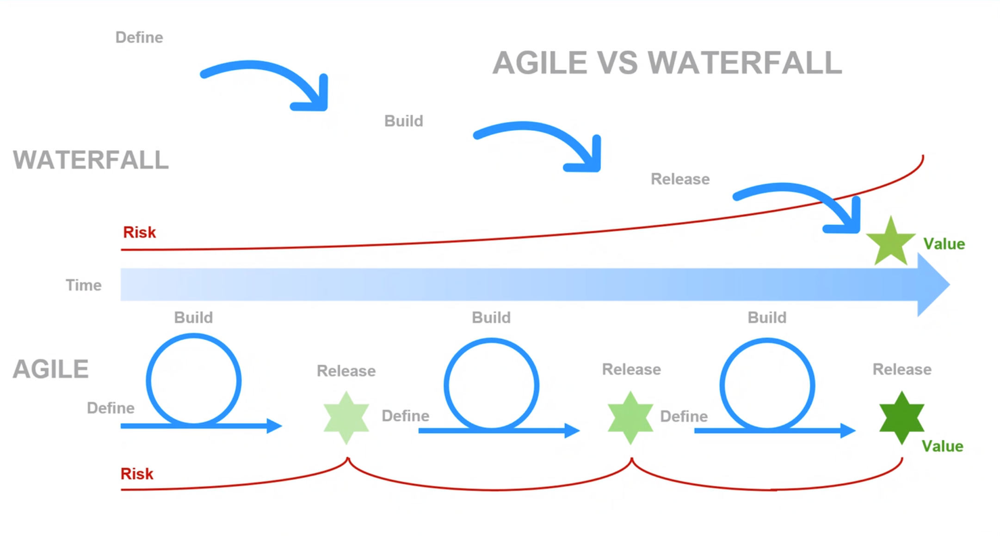
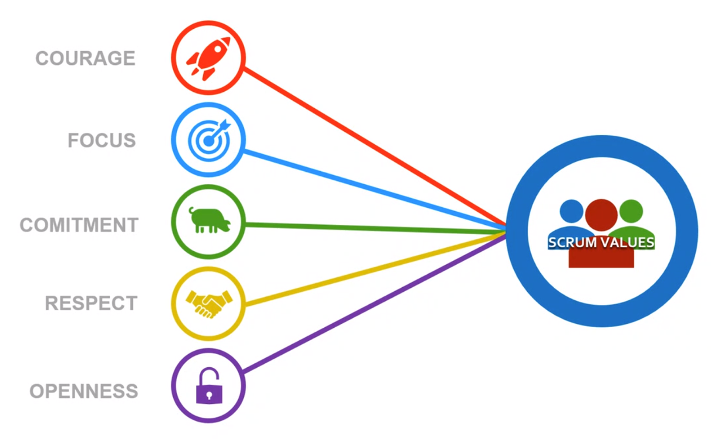
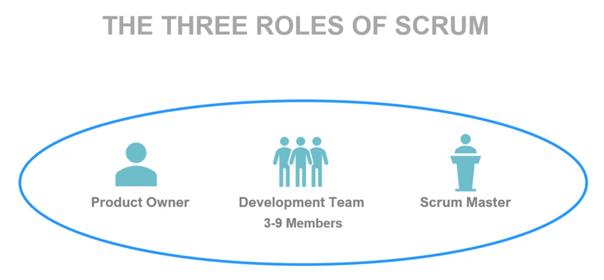
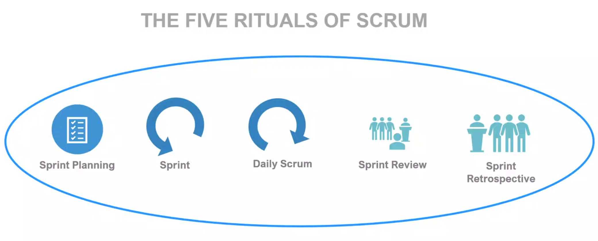
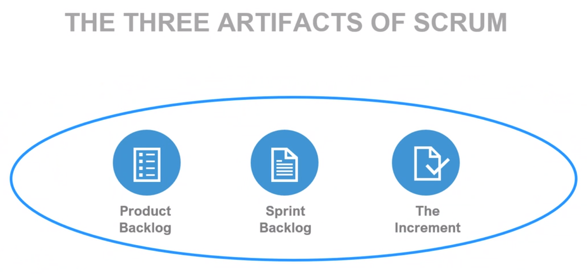
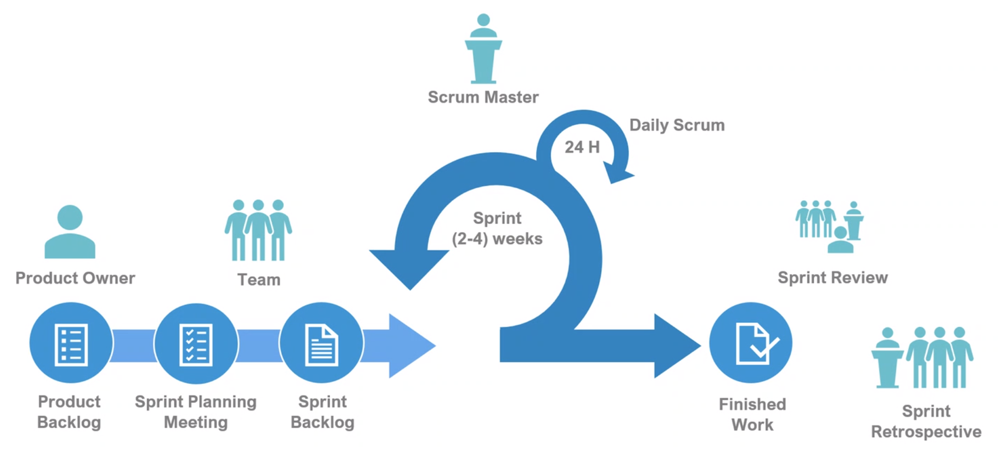
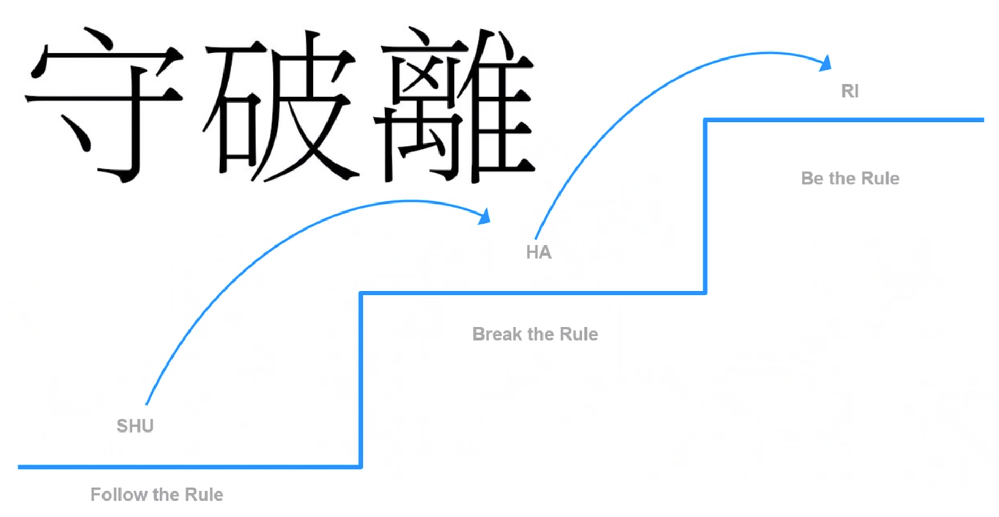

# 2020-10-12

## Agile vs Waterfall
- Risk over time
- Release value o finish

## Scrum

- Self organizing
- All competences in the team

- Sprint Planning
    - What will we do this/upcoming sprint
- Sprint can be 2 things
    - Iterations
    - The time we work in the sprint
    - 2-4 weeks
- Daily Scrum/StandUp meeting max 15 min
    - Did I complete my task yesterday
    - What will I do until tomorrow
    - Is there something that may be in my way to complete my task
- Sprint review
    - All is invited
    - Informal meeting
- Sprint retrospective
    - What went wrong
    - What did go well
    - Workflow

### Graphical overview

### Learn to master anything

`from Scrum: The Art of Doing Twice the Work in Half the Time`

## Recommended books
- The Lean Startup [here](https://www.bokus.com/bok/9781524762407/lean-startup/)

## Recourses
[What is scrum](https://www.scrum.org/resources/what-is-scrum)  
[Scrum Guides](https://www.scrumguides.org)  
[The Scrum Guide PDF](https://www.scrumguides.org/docs/scrumguide/v2017/2017-Scrum-Guide-US.pdf#zoom=100)
[The Scrum Guide PDF - Swedish Edition](https://www.scrumguides.org/docs/scrumguide/v2017/2017-Scrum-Guide-Swedish.pdf)
