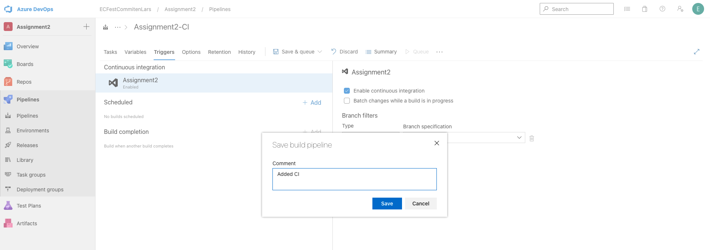
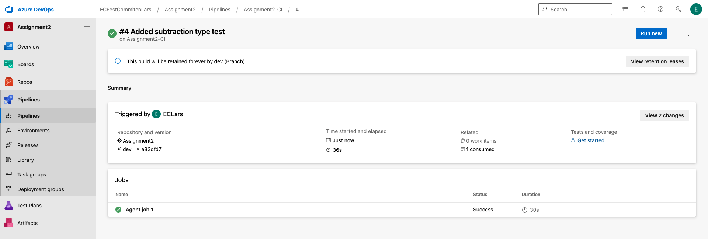
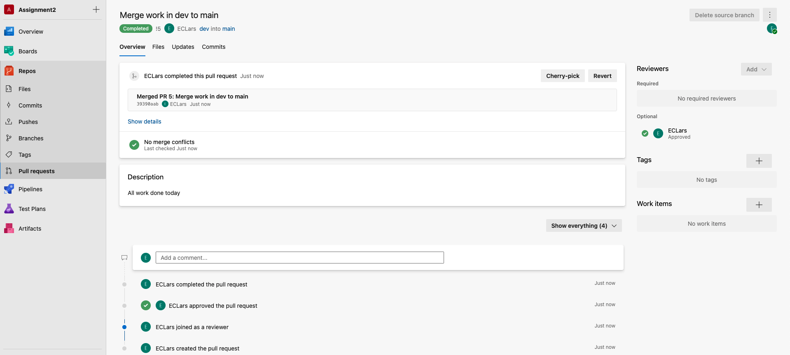

# CI/CD Assignment 2

# Table of Content

- [Assignment 2](#assignment-2)
    - [Introduction](#introduction)
    - [Report requirements](#report-requirements)
- [Report](#report)
    - [Documentation](#documentation)
        - [Questions](#questions)
        - [Answers](#answers)

# Assignment 2

After completing the course, the student should be able to:

**Knowledge:**

3. Explain CI/CD

**Skills:**

4. Use processes and methods for applying Continuous Integration
5. Apply tests to ensure quality codes
6. Use automation frameworks productively

## Introduction

This assignment consists of two parts. With this assignment, you must write a report in which you document how you have
thought through the practical steps.

The goal of the assignment is to build on previous assignment elements in the course and gain a greater understanding of
the various tools and concepts.

**Requirement:**

Create a python application with either Flask or any code that can be found on Github. This repo should have two
branches; **main**, **dev**

There must be at least five unit tests and one lint installed

A CI tool will be implemented to help us with our pull requests

All development takes place towards the dev branch and must be merged into the main with the help of a manual pull
request. This must be done regularly, ie as soon as something new has been implemented.

- Python / Java / JS
- Pytest to a greater extent
- Flake8
- A CI tool
- Use automation frameworks

OR

Based on assignment 1

- Implement more tests
- Use automation frameworks
- More code

## Report requirements:

The report should include the tools you worked with

- How you used them during the task
- If you encountered any obstacles and how to solve them
- Describe how you have used tests in your task
- Explain what is missing to achieve CD

# Report

1. Start new Project in Azure DevOps

2. Turn of notifications in project settings

3. Create Git Rep on Azure DevOps

4. Add SSH Credentials

5. Add files to git repo
    - Git clone project
    - Create branch `dev`
    - Add files from assignment 1
    - Add som more tests and reconfigure division function
    - `git add . && git push`
    - Result.
      
    - Branch main vas not created by default, so I created it manually-

6. Create Pipelines

Add agent job:

Python and set version

Add two Command Line jobbs

Install requirements.txt file

pyTest

Initially I thought of combining pyTest and flake8 on the same test but decided to separate them to easier see which
test that fails.

So I added one more Command line jobb for flake8.

On save this popup appears, entered a comment and chose save and run

The job failed.

Parallelism error means that I have to chang in billing in organizational settings.

Set a subscription (9 in my case)

Change pipelines for private repo from 0 to 1

Go back to pipelines

Run pipeline manually

Click on Agent job 1

Status

Successful build status

7. Merge dev to main

`main` is already based of `dev` because of initial error, so I have to commit a change to `dev` in order to merge
changes from `dev` to `main``

8. Created one `type` test for return type for addition and a run_test.sh file to run test with one command in terminal
   and pushed to dev. But I had forgotten to activate Continuous Integration in the pipeline.

9. Created one `type` test for return type for subtraction and push to dev, and the pipeline starts automatically.

Success!

10. New Pull request

Create

Approve + Complete

Complete merge

Result

## Documentation

The report should include the tools you worked with:

### Questions

1. How you used them during the task
2. If you encountered any obstacles and how to solve them
3. Describe how you have used tests in your task
4. Explain what is missing to achieve CD

### Answers

1. I have used the tools:
    - Azure DevOps for CI pipeline
    - GitKraken for git handling
    - PyCharm for Python development

2. Obstacles I encountered was:
    - There was no main branch created automatically, so I had to create it manually. That gave me the follow upp
      problem thar main was created from dev, so I had to make extra commits with changes to be able to make a first
      merge.
    - Parallellism problems so I had to change billing settings.
    - Forgot to add CI to my pipeline, so the build would not trigger automatically.

3. My tests check if it's the right return type and if the functions work as expected. There is a division by zero check
   that's also boken out into a separate function, so I can test it independently.

4. What is missing is that the pipeline is triggering a build that will be deployed to a production server either
   manually or automatically
