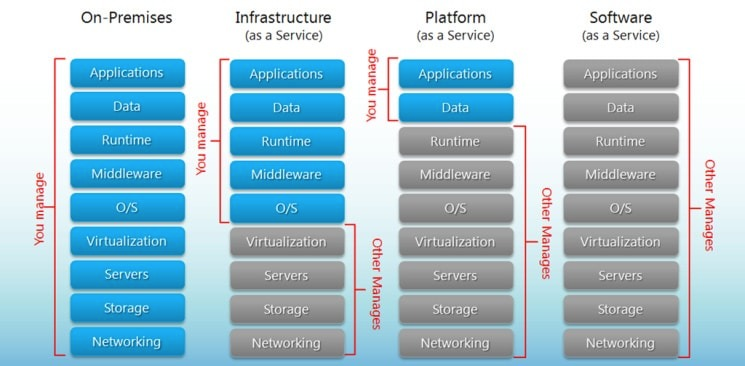
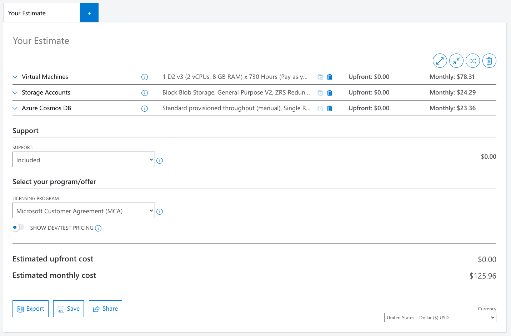
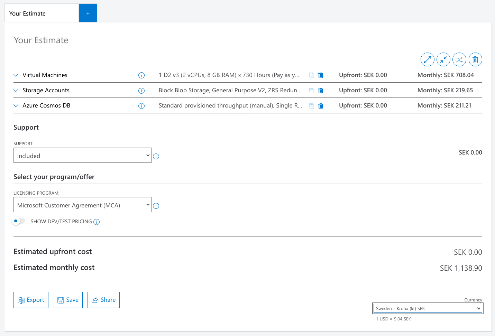
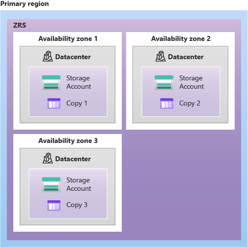

# Assignment

## A company's needs

Software Skills is an IT recruitment company located in central Gothenburg. The company consists of six recruiters and
their main purpose is to find competent staff for both in-house projects but also external customers. In a match,
Software Skills receive SEK 125,000.

Software Skills now want to digitize their business in the form of a digital product. The main purpose of this product
should be to match consulting profiles with available assignments at a good cost.

Since Software Skills have a collaboration with Future Skill, which consists of programmers, they have no need for
development assistance but are looking for more potential cloud solutions.

## Technical info:

1. Traffic will mainly come from Europe
2. A budget for operation is **10,000 SEK a month**, _all included_
3. Backups are needed but how often are you the one to recommend
4. Softwareskills get about 100 new profiles every day
5. Three times a year, large investments in marketing are made
6. All recruiters need their own account to administer
7. In addition to user data, CVs in the form of files will also need to be stored
8. Softwareskills want to be told/emailed as soon as the database reaches 60% of its full capacity
9. As the entire business circulates around data, profiles and assignments, it is super important that the data is not
   lost, even if something were to happen with the physical data center
10. Softwareskills wants to be able to see how users use their site

## Questions to answer:

1. [On-prem, IaaS, PaaS, SaaS?](#1-on-prem-iaas-paas-saas)
2. [Use a webshop template such as shop, wordpress or build your own](#2-use-a-webshop-template-such-as-shop-wordpress-or-build-your-own)
    - [Which cloud provider, why?](#which-cloud-provider-why)
3. [Recommended services, why?](#3-recommended-services-why)
4. [What does the monthly cost land on in about?](#4-what-does-the-monthly-cost-land-on-in-about)
5. [Risks?](#5-risks)
6. [How to ensure backups extra carefully?](#6-how-to-ensure-backups-extra-carefully)
7. [What benefits do you see with your solution versus someone else?](#7-what-benefits-do-you-see-with-your-solution-versus-someone-else)
8. [Is the project doable?](#8-is-the-project-doable)

# Answers

## 1. On-prem, IaaS, PaaS, SaaS?

[Image borrowed from Google][1]

### On-Premises

Fells like the wrong way to go as it will not be as dynamic as specified above. Everything with scaling and utilization
will be handled "manually" since we have to go oct and by more physical hardware if we want to scale up. The same will
be true for our internet access, we have to order more bandwidth if we need to scale up. And we can't forget that we
need this competence in-house and a secondary backup-site which can handle a failure on our first site. To mention just
a few caveats.

### IaaS

IaaS is one valid options as they offer "pay as you go services". For example if we need more storage it's just a couple
of clicks away. Benefits here is that we don't have to maintain an on-prem solution.

This would be a very cost-effective solution that allows us to handle our infrastructure without having to worry about
what physical hardware we are running on.

### PaaS

This could be an option based if we don't have the criteria to handle our infrastructure and just want to take our
application to market but still have a scalable application.

PaaS is a fast way to get an application up and running for developers but for this assignment would probably not be
needed since we have other criteria to account for.

### SaaS

SaaS providers often operate a subscription model with a fixed, inclusive monthly account fee. Which means it applicable
to for example Microsoft Office 365 Subscription or Dropbox. But this isn't what we are looking for.

### Conclusion

I think IaaS is the most valuable alternative based on the above reasoning.

## 2. Use a webshop template such as shop, wordpress or build your own

We have the following information available from the initial instructions:

> Since Software Skills have a collaboration with Future Skill, which consists of programmers, they have no need for development assistance but are looking for more potential cloud solutions.

So we can assume that Future Skill will handle this.

### Which cloud provider, why?

Codic Edition another sister company in the same organisation as Future Skill And Software Skills relies heavily on
Azure, so I would assume that Azure would be the preferred Cloud Provider.

## 3. Recommended services, why?

We could use Azure IaaS services:

- Compute
- Storage
- Network
- Security

## 4. What does the monthly cost land on in about?

I used [Azure pricing Calculator][2].

Since I don't know how much performance we need I made a cost analysis that could be reasonable with a lot of headroom
to expand in terms of performance and cost.

General settings:

- North Europe
- Zone-redundant storage (ZRS)
- Azure Cosmos DB
    - A fully managed NoSQL database (DB not specified in assignment)
    - Continuous backup instead of Periodic backups

[Excel Spreadsheet](cost_calculation/ExportedEstimateAzure.xlsx)

## 5. Risks?

There is the risk that the nort Europe zon could be disabled and stop working, but then I recon there would be bigger 
problems at play. The possible uptime could be better if I had chosen to use redundancy in a secondary region.

## 6. How to ensure backups extra carefully?

Had I chosen to hav periodic backup of for example the DB one possible solution would be to have continuous backup, 
but I already have that. So it would be possible spreading to more region's at an additional cost.

## 7. What benefits do you see with your solution versus someone else?

A lot of backup and redundancy is already integrated in this alternative at a reasonable initial cost. However, there 
are always the possibility that I forget something or other improvements.

## 8. Is the project doable?

Everything is possible.

[1]: https://www.google.com/url?sa=i&url=https%3A%2F%2Fwww.bigcommerce.com%2Fblog%2Fsaas-vs-paas-vs-iaas%2F&psig=AOvVaw0ZYjVv9mnwS_bl-z6P-HdQ&ust=1642421665493000&source=images&cd=vfe&ved=0CAsQjRxqFwoTCMjZvdGftvUCFQAAAAAdAAAAABAD

[2]: https://azure.microsoft.com/en-us/pricing/calculator/
