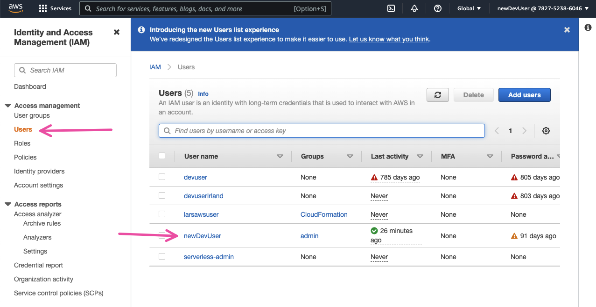
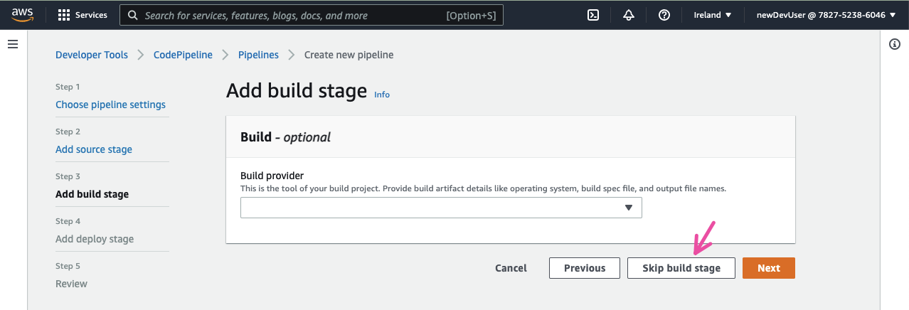
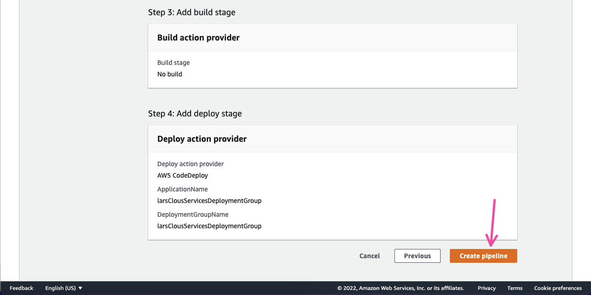
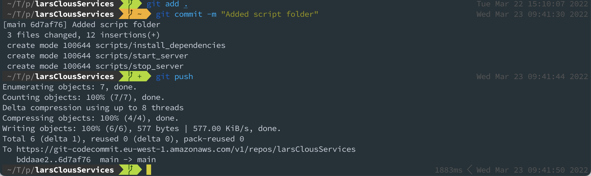
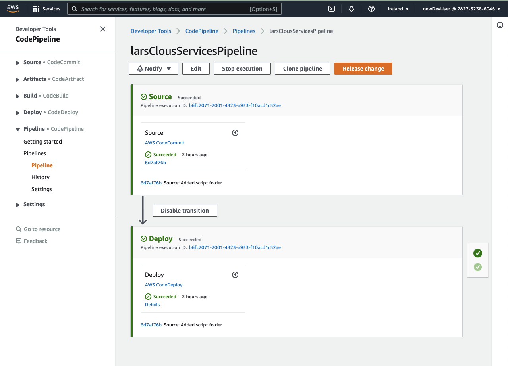

# Project

Deploy a web application, with your name in it, using CodePipeline. The code for your web app must be checked in by
CodeCommit.

- Good: Deploya on an EC2 instance
- A little better: Deploya on two load-balanced EC2 instances
- Better: Containerize (Docker) your application and deploy on ECS
- Best: Containerize (Docker) your application and deploy on a load balanced ECS
- A little better than best: Also serve a lolcat image that you uploaded to S3 from your web app.

Describe in words and pictures how to set up your CodePipeline. Also report how you designed the security around the
solution.

Credentials:
Username: newDevUser-at-782752386046 Password: TWjvUsIMramg/JhX6BnTHZLz5W4urMv7fgz/5+ii4ig=

# Guide

I have followed [this AWS guide](https://docs.aws.amazon.
com/codepipeline/latest/userguide/tutorials-simple-codecommit.html) for this project.

## Workflow

### Create CodeCommit repository

### Add role

### Add Git Credentials

### Clone repository

### Add Readme

### Add Simple html and config files 

### Create an EC2 Linux instance and install the CodeDeploy agent

#### Create an instance role

#### Create EC2 Instance

### Create an application in CodeDeploy

#### Create a CodeDeploy service role

#### Create an application in CodeDeploy

#### Create a deployment group in CodeDeploy

### Create pipeline in CodePipeline

### Forget to add a `script`folder to the project, so I fixed it

### Successful pipeline

### Result

Using `http` instead of `https` because I forgot to open port 443.

### Pipeline reruns on changes

