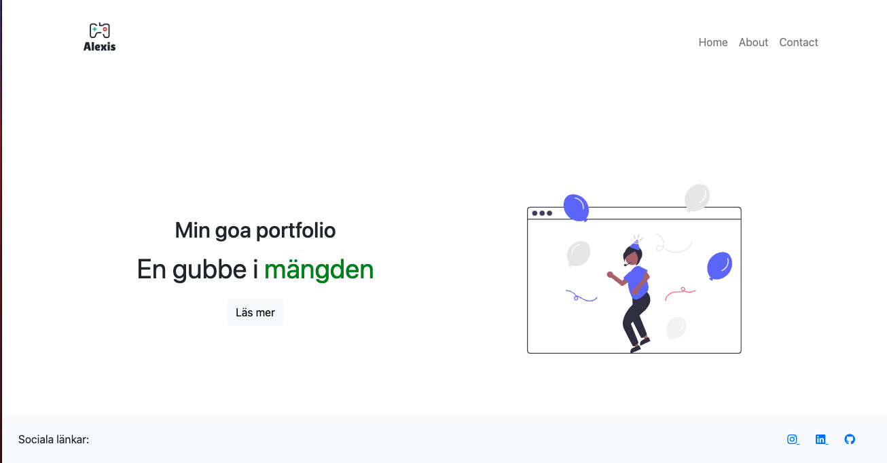

# Assignment 1 Containerteknologi(docker) Report

## Part 1 - Theoretically

### 1. Virtualization

1. Benefits of using Virtualization is that you can run multiple virtual machines on the same host/server simultaneously
   and therefore utilize the hardware more effectively.
2. Different types of Virtualization are:
    - Type 1 hypervisor runs directly on the host machine's physical hardware, and it's referred to as a bare-metal
      hypervisor. The Type 1 hypervisor doesn't have to load an underlying OS.
    - Type 2 hypervisor is typically installed on top of an existing OS. It is sometimes called a hosted hypervisor
      because it relies on the host machine's preexisting OS to manage calls to CPU, memory, storage and network
      resources.
3. A hypervisors primarily purpose is to handle the Virtual Machines (VM), networks and resources available on the host
   machine.
4. The definition of a VM is a server/machine running on a host machine without any physical hardware assigned to it,
   all hardware are virtualized (some hardware can be passthroughs if necessary).
5. There is a lot of hypervisors:
    - VMWare ESX/ESXi/Fusion/Worktation
    - Microsoft Hyper-V
    - Citrix XenServer
    - Proxmox
6. The role of virtualization is to utilize the hardware more effectively.
7. `VMware` is an American cloud computing and virtualization technology company, they provide virtualization Software.

### 2. Containerteknologi

1. The benefits of using containers instead of VMs ar that each container is running as a service and do not require any
   virtual hardware assigned to it. It also allows us to rebuild an application instead of upgrading it.
2. You could sa that an image is a recipe that you download and when you start or run the image it will transform into a
   container so a container is an image that is running.
3. Problems that are solved with containers is that you can run a container without allocating recourses to it like
   memory, cpu and harddrive.
4. Docker is a set of Platform as a Service (PaaS) products that use OS-level virtualization to deliver software in
   packages called containers.
5. A Dockerfile is a convenient automatic recipe to make a container without doing all the configuration manually.

## Part 2 Practical Application

1. Create a VM, I choose an Ubuntu Server 21.04.
    - 4 cores
    - 4GB RAM
    - 32GB HDD
2. Standard installation lock ip-address to `192.168.1.193`, enable OpenSSH
3. Restart
4. Login with SSH `ssh lars@172.16.192.4` in my case.
5. Run the
   script `wget https://raw.githubusercontent.com/deskavaenkelt/EcUtbildningDevOps/master/ContainerTeknologi/Assignment1/assignment1vmware.sh`
6. Make in executable `chmod +x assignment1vmware.sh`
7. Run script `sh assignment1vmware.sh`
8. Enter `root password`
9. [Complete log is here](script_output.log)

### Resultat från output:

#### HTML via `cat` in console

```html
<!DOCTYPE html>
<html lang="en">
<head>
    <meta charset="UTF-8">
    <meta http-equiv="X-UA-Compatible" content="IE=edge">
    <meta name="viewport" content="width=device-width, initial-scale=1.0">
    <title>My App</title>
    <link href="https://cdn.jsdelivr.net/npm/bootstrap@5.0.2/dist/css/bootstrap.min.css" rel="stylesheet"
          integrity="sha384-EVSTQN3/azprG1Anm3QDgpJLIm9Nao0Yz1ztcQTwFspd3yD65VohhpuuCOmLASjC" crossorigin="anonymous">
    <link rel="stylesheet" href="https://cdnjs.cloudflare.com/ajax/libs/font-awesome/5.15.4/css/all.min.css"
          integrity="sha512-1ycn6IcaQQ40/MKBW2W4Rhis/DbILU74C1vSrLJxCq57o941Ym01SwNsOMqvEBFlcgUa6xLiPY/NS5R+E6ztJQ=="
          crossorigin="anonymous" referrerpolicy="no-referrer"/>
    <link rel="stylesheet" href="/static/css/style.css">
</head>
<body>
<div class="container">

    <nav class="navbar navbar-expand-md navbar-light">
        <!-- <a href="/" class="navbar-brand">Min Portfolio</a> -->
        <!-- Om man istället vill ha en logga -->
        <a href="/" class="navbar-brand">
            
        </a>
        <button class="navbar-toggler" type="button" data-bs-toggle="collapse" data-bs-target="#toggleMobileMenu"
                aria-controls="#toggleMobileMenu" aria-expanded="false" aria-label="Toggle Navigation">
            <span class="navbar-toggler-icon"></span>
        </button>
        <div class="collapse navbar-collapse" id="toggleMobileMenu">
            <ul class="navbar-nav ms-auto text-center">
                <li><a class="nav-link" href="/">Home</a></li>
                <li><a class="nav-link" href="/about">About</a></li>
                <li><a class="nav-link" href="/contact">Contact</a></li>
            </ul>
        </div>
    </nav>


    <section class="hero row d-flex justify-content-center page-80">
        <div class="row d-flex flex-sm-row-reverse justify-content-center my-auto">
            <div class="col-md text-center">
                
            </div>
            <div class="col-md">
                <div class="text-center justify-content-center p-5">
                    <h2 class="hero-title">Min goa portfolio</h2>
                    <p class="hero-text">En gubbe i <span class="red">mängden</span></p>
                    <a type="button" class="btn btn-light" href="/about">Läs mer</a>
                </div>
            </div>
        </div>
    </section>


    <footer class="text-center text-lg-start bg-light fixed-bottom">
        <section
                class="d-flex justify-content-center justify-content-lg-between p-4 border-bottom"
        >
            <div class="me-5 d-none d-lg-block">
                <span>Sociala länkar:</span>
            </div>
            <div>
                <a href="" class="me-4">
                    <i class="fab fa-instagram"></i>
                </a>
                <a target="_blank" rel="noopener noreferrer" href="https://www.linkedin.com/in/alexis-flach"
                   class="me-4">
                    <i class="fab fa-linkedin"></i>
                </a>
                <a href="#" class="me-4">
                    <i class="fab fa-github"></i>
                </a>
            </div>
        </section>
    </footer>
</div>

<script src="https://cdn.jsdelivr.net/npm/bootstrap@5.0.2/dist/js/bootstrap.bundle.min.js"
        integrity="sha384-MrcW6ZMFYlzcLA8Nl+NtUVF0sA7MsXsP1UyJoMp4YLEuNSfAP+JcXn/tWtIaxVXM"
        crossorigin="anonymous"></script>
</body>
</html>
```

#### Resultat as screenshot

