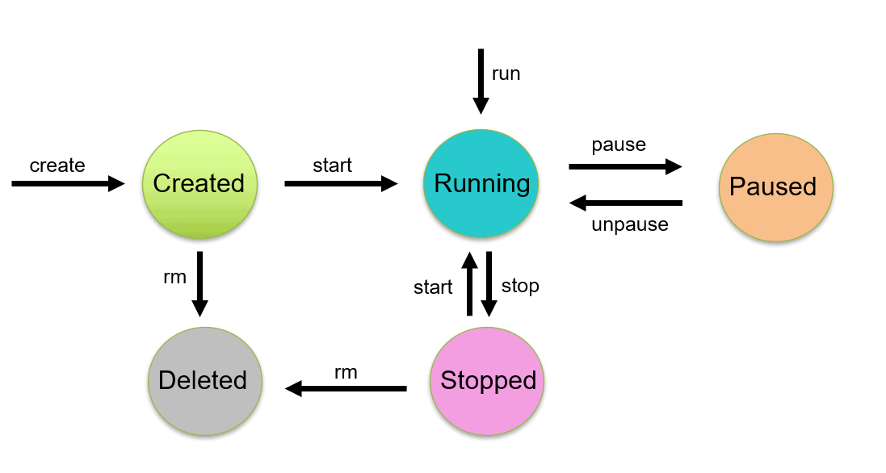

# Part 1

## Table of Contents

- [Docker and container technology](#docker-and-container-technology)
- [Docker client](#docker-client)
- [Docker Compose](#docker-compose)

## Docker and container technology

### What is Docker (platform)?

Docker is an open source containerization platform. It enables developers to package applications into
containers—standardized executable components combining application source code with the operating system (OS) libraries
and dependencies required to run that code in any environment.

### What is a Docker Image and how does one relate to Docker Containers?

A Docker image is a read-only template that contains a set of instructions for creating a container that can run on the
Docker platform. It provides a convenient way to package up applications and preconfigured server environments, which
you can use for your own private use or share publicly with other Docker users.

### What does container technology mean?

Container technology, also simply known as just a container, is a method to package an application, so it can be run,
with its dependencies, isolated from other processes. Container technology gets its name from the shipping industry.

### What is the Docker Registry?

A registry is a storage and content delivery system, holding named Docker images, available in different tagged
versions. Users interact with a registry by using docker push and pull commands.

### What is the Docker Linux Kernel job description (what does it do and how does it work)?

The Docker technology uses the Linux kernel and features of the kernel, like Cgroups and namespaces, to segregate
processes, so they can run independently. This independence is the intention of containers—the ability to run multiple
processes and apps separately from one another to make better use of your infrastructure while retaining the security
you would have with separate systems.

### How can Docker and Docker Containers be compared to ship transport?

Imagine that you have a company in Europe and you want to transport your products to China by sea. So, you can find a
ship with the adequate size and load the Ship with your cargo.

__Metaphor: In the software world, the ship is your Server.__

In a local trading association you find out that other companies are also sending products to China and you all can use
a bigger Ship and send your products together to save some money.

__Metaphor: Here, the big Ship is your server and the smaller ships are virtual machines. In this case, we have multiple
Ships with all the capabilities to travel to China, but they are all constrained to the capacity and limitations of the
big ship.__

If we have a big ship we load the ship with the cargo of every company.

__Metaphor: In software, you are now loading the Server with containers. Containers will guarantee you that the software
is isolated, protected and that a Container will take care what it needs, not the ship. Other benefit is that Containers
are immutable so you can be pretty sure that your container won't be violated.__

### What happens when we have a Docker file and run `docker build .`? Go through the build process

Create a file named `Dockerfile` in the same folder as the content for the container with the following contents.

This command used the Dockerfile to build a new container image. You might have noticed that a lot of “layers” were
downloaded. This is because we instructed the builder that we wanted to start from (for example) the node:12-alpine
image. But, since we didn’t have that on our machine, that image needed to be downloaded.

After the image was downloaded, we copied in our application and used yarn/npm to install our application’s
dependencies. The CMD directive specifies the default command to run when starting a container from this image.

## Docker client

Go through the life cycle of a container using Docker Commands.

Docker Container Lifecycle Management: Create, Run, Pause, Stop And Delete. Docker is a containerization platform for
developing, shipping, and running applications inside containers. We can deploy many containers simultaneously on a
given host.



### Create a container

```shell
$ docker create --name <container name> <image name>
```

### Start a container

```shell
$ docker start <container name>
```

### Run a container

```shell
$ docker run -it --name <container name> <image name>
```

### Pause a container

```shell
$ docker pause <container name>
```

### Stop a container

```shell
$ docker stop <container name>
```

### Delete a container

```shell
$ docker rm <container name>
```

### Kill a container

```shell
$ docker kill <container name>
```

## Docker Compose

Explain line by line the following in the docker-compose file:

```yml
version: "3.8"                            # Specify version of Docker-compose
services:                                 # Specifies the services we want to run
  flask:                                  # Name of the first service
    container_name: flaskcontainer        # Assigns name to container
    build:                                # Docker-compose builds from here
      context: ./app                      # Path to Dockerfile 
      dockerfile: Dockerfile.dev          # Specifies the Dev Dockerfile
    ports:                                # Which ports to operate on
      - "5000:5000"                       # Maps external ports to internal ports
    depends_on:                           # This dependency must be built first
      - db
    networks:                             # Specifies the networks to operate on
      - flask_app_net
  db:                                     # Name of the second service
      container_name: dbcontainer         # Name of the second service
      image: postgres:latest              # Pull latest Postgres image from DockerHub
      restart: always                     # Specifies the db to restart if for som reasons it stops
      environment:                        # Variabels for db environment
        POSTGRES_DB: mydb                 # Name on db
        POSTGRES_PASSWORD: postgres       # Password for db
        POSTGRES_USER: postgres           # Username for db
      volumes:                            # link local files to db (external to container)
        - postgres_data:/var/lib/postgresql/data/
      networks:                           # Specifies the networks to operate on
        - flask_app_net

  networks:                               # Network service
    flask_app_net:                        # Create/Use network
      driver: bridge                      # Use "bridge-driver" for network

  volumes:                                # Create local volumes
    postgres_data: db_data_volume         # Name on local volume
```

Assume that the folder where docker-compose also has a bottle application in a folder called "app". Also based on that
proper indentation is used.