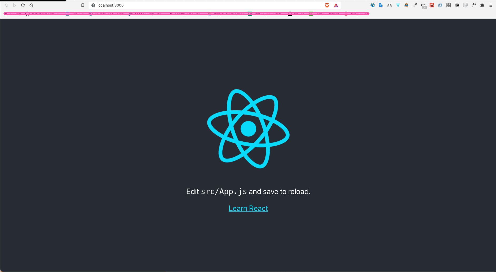
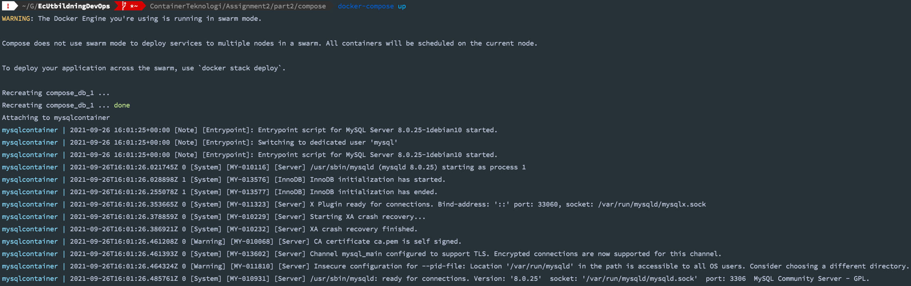
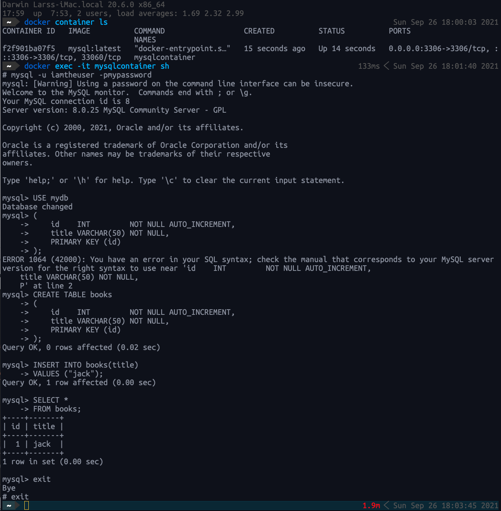
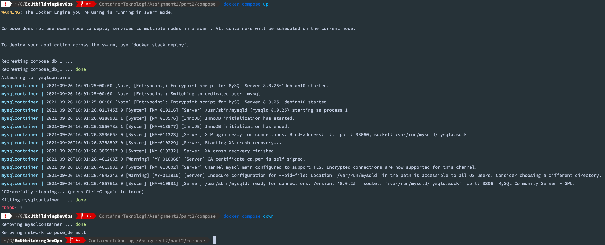
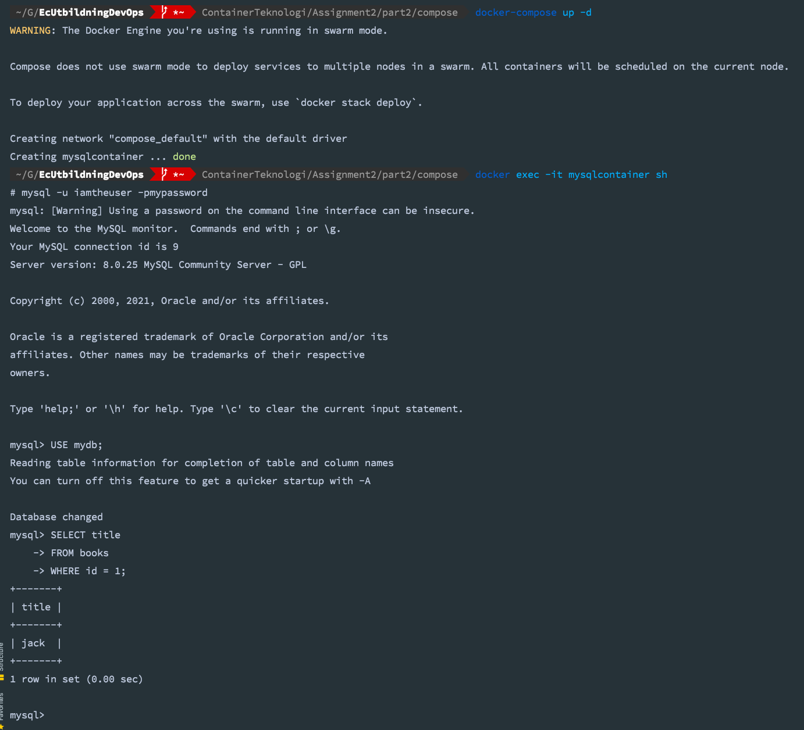
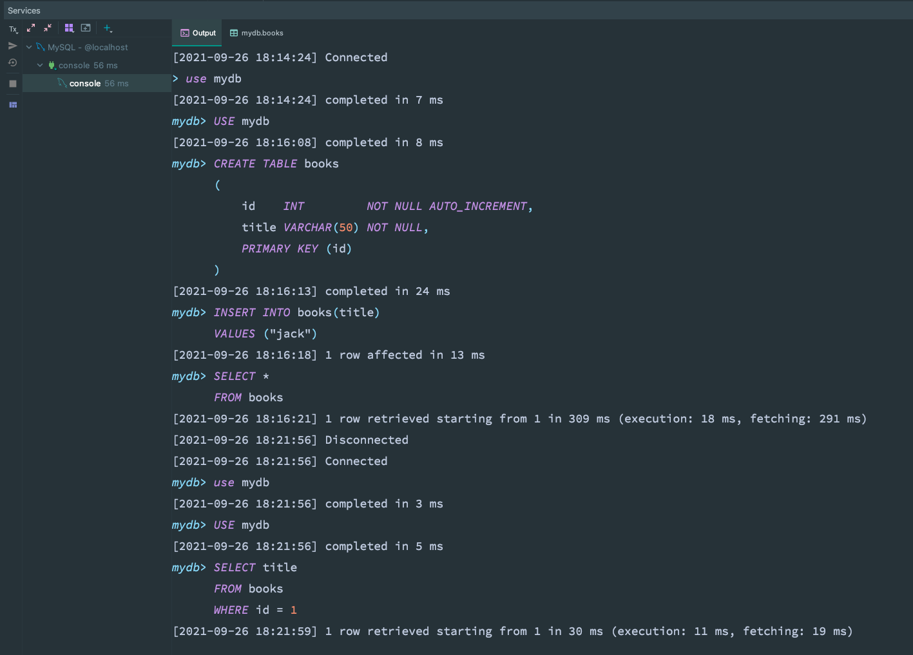

# Part 2 Practical

## Table of Contents

- [Flask App](#flask-app)
- [Multi-stage Build](#multi-stage-build)
- [](#)
- [](#)

## Flask App

On your computer: Create a folder called the `flask-app`.

In this folder you create three files and copy the respective code in the files.

[`app.py`](flask-app/app.py)

```python
from flask import Flask

app = Flask(__name__)


@app.route('/')
def index():
    return '<h1>Hello World</h1>'


if __name__ == '__main__':
    app.run(host='0.0.0.0')
```

[`requirements.txt`](flask-app/requirements.txt)

```text
Flask==2.0.1
```

[`donotinclude.txt`](flask-app/donotinclude.txt)

```text
textthatshouldnotbeincluded
```

### Task Actions

### 1 + 4 Create Dockerfile with python version 3.9 and alpine 3.13.

[`Dockerfile`](flask-app/Dockerfile)

```dockerfile
FROM python:3.9-alpine3.13

COPY . .

RUN pip3 install -r requirements.txt

CMD ["python3", "app.py"]
```

### 2. Ignore file `donotinclude.txt`

[`.dockerignore`](flask-app/.dockerignore)

```text
donotinclude.txt
```

### 3. Add maintainer

Edit [`Dockerfile`](flask-app/Dockerfile)

```dockerfile
FROM python:3.9-alpine3.13

COPY . .

RUN pip3 install -r requirements.txt

LABEL maintainer = "deskavaenkelt" 

CMD ["python3", "app.py"]
```

### 5 + 6 Run container and push to DockerHub

I'll do everything in a shell script-file, and save the log as documentation.

[`run_dockerfile.sh`](flask-app/run_dockerfile.sh)

```shell
#!/bin/bash
echo ---------------------------------------------
echo run docker container
echo ---------------------------------------------
docker build -t deskavaenkelt/flask-app .
docker run -p 5000:5000 -d --name dsve-flask-app deskavaenkelt/flask-app

echo ---------------------------------------------
echo Give server time to be able to respond
echo ---------------------------------------------
sleep 1

echo ---------------------------------------------
echo print response from server
echo ---------------------------------------------
curl localhost:5000
echo
echo ---------------------------------------------
echo stop docker container
echo ---------------------------------------------
docker stop dsve-flask-app

echo ---------------------------------------------
echo Push to DockerHub
echo ---------------------------------------------
docker push deskavaenkelt/flask-app

echo ---------------------------------------------
echo Cleanup/remove container
echo ---------------------------------------------
docker container rm dsve-flask-app
docker rmi deskavaenkelt/flask-app

echo ---------------------------------------------
echo Done
echo ---------------------------------------------
```

```shell
chmod +x run_dockerfile.sh
sh run_dockerfile.sh
```

[Result logging](flask-app/console.log)

## Multi-stage Build

I create a React project for this.

```shell
npx create-react-app multi-stage
cd multi-stage
npm start
```



Create [`Dockerfile`](multi-stage/Dockerfile)

```dockerfile
#Build Stage Start

#Specify a base image
FROM node:alpine as builder 

#Specify a working directory
WORKDIR '/app'

#Copy the dependencies file
COPY package.json .

#Install dependencies
RUN npm install

#Copy remaining files
COPY . .

#Build the project for production
RUN npm run build 

#Run Stage Start
FROM nginx

#Copy production build files from builder phase to nginx
COPY --from=builder /app/build /usr/share/nginx/html
```

In CLI run the following commands

```shell
docker build -t progressivecoder/docker-react-app .
docker run -p 8080:80 progressivecoder/docker-react-app
```

All this can be reduced to a single `.sh-file` if we create a `Dockerfile_for_multi_stage` template and copy to the 
react project folder.

[`multi-stage.sh`](multi-stage.sh)

```shell
#!/bin/bash
echo ---------------------------------------------
echo Create Docker-React-Application
echo ---------------------------------------------
npx create-react-app multi-stage
cp Dockerfile_for_multi_stage ./multi-stage/Dockerfile
cd multi-stage
docker build -t deskavaenkel/docker-react-app .
docker run -p 80:80 -d --name docker-react-app deskavaenkel/docker-react-app
docker container ls
sleep 1
curl localhost:80
docker stop docker-react-app
docker container rm docker-react-app
docker rmi deskavaenkel/docker-react-app
echo ---------------------------------------------
echo Done
echo ---------------------------------------------
```

Run script with

```shell
chmod +x multi-stage.sh
sh multi-stage.sh
```

[Result logging](console_multi_stage.log)

## Docker Compose

You will now, using Docker Compose, run a container based on MySQL's official Image.

[`docker-compose.yml`](compose/docker-compose.yml)

```yml
version: "3.9"
services:
  db:
    container_name: mysqlcontainer
    image: mysql:latest
    ports:
      - "3306:3306"
    volumes:
      - mysql_assignment2:/var/lib/mysql
    environment:
      MYSQL_DATABASE: mydb
      MYSQL_USER: iamtheuser
      MYSQL_ROOT_PASSWORD: mypassword
      MYSQL_PASSWORD: mypassword
volumes:
  mysql_assignment2:
```

In CLI type:

```shell
docker-compose up -d
docker exec -it mysqlcontainer sh
mysql -u iamtheuser -pmypassword
```

```mysql
# First database run
USE mydb;

CREATE TABLE books
(
    id    INT         NOT NULL AUTO_INCREMENT,
    title VARCHAR(50) NOT NULL,
    PRIMARY KEY (id)
);

INSERT INTO books(title)
VALUES ("jack");

SELECT *
FROM books;
```

```shell
^CGracefully stopping... (press Ctrl+C again to force)
Killing mysqlcontainer  ... done
docker-compose down
>
Removing mysqlcontainer ... done
Removing network mysql_default
```

`docker-compose up`



Enter in other Terminal



`docker-compose down`



Run again (detached this time): 

```shell
docker-compose up -d
docker exec -it mysqlcontainer sh
mysql -u iamtheuser -pmypassword
```

```mysql
# Second database run
USE mydb;

SELECT title
FROM books
WHERE id = 1;
```

Second database run



Output from database in IntelliJ IDEA



[File with MySQL commands](compose/mysql.sql)


