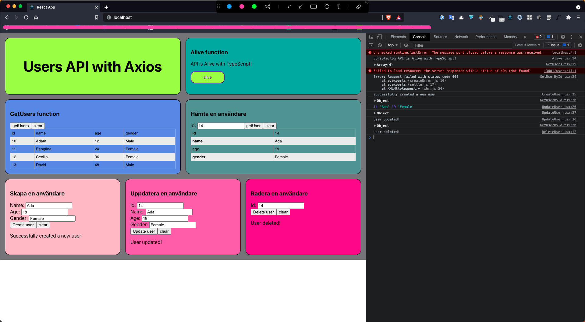

# Part 3 Project

## Build and start Dockerfiles manually

### Backend

[`Dockerfile`](backend/Dockerfile)

```dockerfile
FROM node:10-alpine

# update packages
RUN apk update

# create root application folder
WORKDIR /app

# copy configs to /app folder
COPY package*.json ./
COPY tsconfig.json ./
COPY tslint.json ./
# copy source code to /app/src folder
COPY src /app/src

# check files list
RUN ls -a

RUN npm install
RUN npm run build

EXPOSE 3001

CMD [ "node", "./dist/server.js" ]
```

In `CLI`

```shell
docker build . -t deskavaenkelt/node-backend
docker run -p 3001:3001 -d --name node-backend deskavaenkelt/node-backend
docker container ls
docker container stop node-backend && docker container rm node-backend
```

### Frontend

[`Dockerfile`](frontend/Dockerfile)

```dockerfile
#Build Stage Start

#Specify a base image
FROM node:alpine as builder

#Specify a working directory
WORKDIR '/app'

#Copy the dependencies file
COPY package.json .

#Install dependencies
RUN npm install

#Copy remaining files
COPY . .

#Build the project for production
RUN npm run build

#Run Stage Start
FROM nginx

#Copy production build files from builder phase to nginx
COPY --from=builder /app/build /usr/share/nginx/html
```

In `CLI`

```shell
docker build -t deskavaenkelt/node-frontend .
docker run -d -p 80:80 --name node-frontend deskavaenkelt/node-frontend
docker container ls
docker container stop node-frontend && docker container rm node-frontend
```

## Docker-Compose

[`docker-compose.yml`](docker-compose.yml)

```yml
version: "3.9"
services:
  backend:
    build: ./backend
    container_name: node-backend
    ports:
      - "3001:3001"
    networks:
      - flask_app_net
  frontend:
    build: ./frontend
    container_name: node-frontend
    ports:
      - "80:80"
    depends_on:
      - backend
```

In `CLI`

```shell
docker-compose up -d
docker-compose down
```


