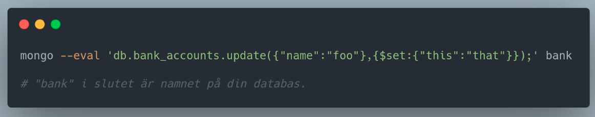
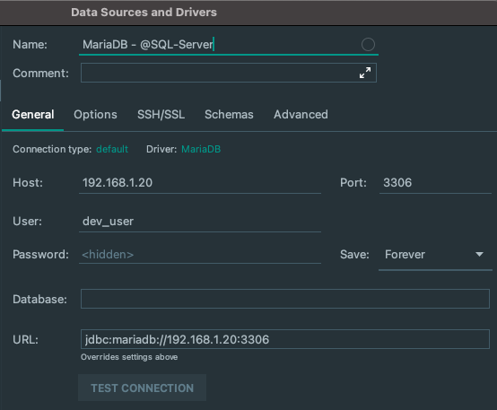
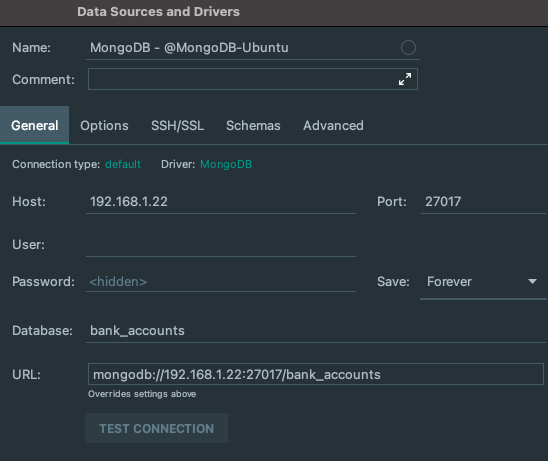

# Databases in Linux
## Assignment 1

## Things to  evaluate
### Knowledge
1. Describe the database systems MySQL, MongoDB and NOSQL
2. Explain the elements of Database Management
3. Give examples of differences between SQL and NOSQL

### Skills
4. Use the SQL environment to build and manage an SQL database
5. Use the NOSQL environment to build and manage a NOSQL database
6. Apply searches in different database systems
7. Uses CRUD in its environment

### Competencies
8. Create, develop and maintain your own and others' databases

Point number 8 is not clearly shown here in the statement, but it is because the 
principle is the same whether you use your own database or someone else's.
Of course, you can work with communicating with a course partner's database if 
you feel like it, but there is absolutely no requirement as you will demonstrate 
this competence even if you only use your own database.

There are also questions further down that evaluate this competence extra.

(For example, "If you give another party access to your database, what is 
important to think about?" ... and more)

## Bank account database
- In this assignment, we will write a small program that can handle bank accounts in a database.
- This file comes with "fake" data to be used in the database.
- It also comes with some shell script to import the data.

### Part 1 (MySQL/MariaDB)
This task should be written in ".sql" files.
The "functions" mentioned below should be written in separate .sql files.

1. A function for creating new bank accounts in the database. (create.sql)
2. A function for retrieving all bank accounts in the database. (read.sql)
3. A function for updating "holding" in a bank account with a specific ID in the database. (update.sql)
4. A function for deleting a bank account in the database. (delete.sql)

With these points implemented, you have now implemented something called CRUD.

Try running each function separately and make sure they work.

### Part 2 (MongoDB)
Here we will write functions that perform operations against the MongoDB database. 
These functions must be written: (same as in part 1 but fixed to MongoDB). 
These functions must be written in separate .sh files.
Example:
update.sh

1. A function for creating new bank accounts in the database. (create.sh) 
2. A function for retrieving all bank accounts in the database. (read.sh)
3. A function for updating a bank account in the database. (update.sh) 
4. A function to delete a bank account in the database. (delete.sh)

With these points implemented, you have now implemented something called CRUD.

Try running each function separately and make sure they work.

### Part 3
Create a new table / collection in your databases, both in MongoDB and in 
MySQL/MariaDB.
This table shall be called "locations".
Then just leave this table there, we will use it in assignment 2.
The reason why we create the table in this assignment is to show parts of the 
knowledge in points 4 and 5.

### Questions
1. Where can I find the log files for the databases? (MySQL / MariaDB, 
   and MongoDB)
2. What is the difference between an SQL database like MySQL / MariaDB 
   and a NoSQL database like MongoDB?
3. What are the similarities between the databases?
4. Think, when do you want to select an SQL database, and when do you 
   want to select a NoSQL database?
5. If you give another party access to your database, what is important 
   to keep in mind?
6. What type of information can be sensitive / problematic to save a 
   database when it comes to eg GDPR?
7. Name some SQL databases, as well as some NoSQL databases.
8. If several companies, organizations or individuals use the same database, 
   why is it then important to set up separate users in the database for 
   these parties?
9. Which parts of CRUD affect / make changes to the database, and which 
   parts of CRUD make not that?
10. How do you connect to someone else's database from the terminal? 
    (View both on MySQL and MongoDB)

# Result

## Part 1 - MySQL/MariaDB
### Server setup
Installed an TurnKey Server with MySQL/MariaDB (in a LXC) and assigned 
it the ip-address 192.168.1.20.
- Setup PyCharm to connect to server

### Import data to MySQL/MariaDB
I started to split bank_accounts.sql (from provided files folder) into 
2 files and did som minor changes.
- To create database:
    - `1_create_databas_and_table.sql`
- To insert into database:
    - `2_insert_into_bank_accounts.sql`

### Tasks
- [x] create.sql
- [x] read.sql
- [x] update.sql
- [x] delete.sql
- [x] Test files separately and make sure they work.

## Part 2 - MongoDB
### Server setup
Installed an Ubuntu Server with MongoDB (in a LXC) and assigned it the 
ip-address 192.168.1.22.
I followed these guides for server setup:
- [Initial Server Setup with Ubuntu 20.04](https://www.digitalocean.com/community/tutorials/initial-server-setup-with-ubuntu-20-04)
- [How To Install MongoDB on Ubuntu 20.04](https://www.digitalocean.com/community/tutorials/how-to-install-mongodb-on-ubuntu-20-04)
- [How To Configure Remote Access for MongoDB on Ubuntu 20.04](https://www.digitalocean.com/community/tutorials/how-to-configure-remote-access-for-mongodb-on-ubuntu-20-04)
- Setup PyCharm to connect to server

### Import data to MongoDB
- Transfer files from mu computer to server
   - `scp bank_accounts.json lars@192.168.1.22:/home/lars`
- Connect to server
   - `ssh lars@192.168.1.22`
- Import JSON data to MongoDB in terminal of Server
   - `mongoimport --db bank --collection bank --file 
     ./bank_accounts.json --jsonArray`
- Verify import
    - `mongo` in terminal
    - `show dbs` in mongo shell
    - `use bank` in mongo shell
    - `show collections` in mongo shell
    - `db.bank_accounts.find()` in mongo shell

### Tasks
- [x] create.sh
- [x] read.sh
- [x] update.sh
- [x] delete.sh
- [x] Test files separately and make sure they work.

## Part 3 - Questions
1. Where can I find the log files for the databases? (MySQL / MariaDB, 
   and MongoDB)
    - `/var/log/mysql/`
    - `/var/log/mongodb/`
2. What is the difference between an SQL database like MySQL / MariaDB 
   and a NoSQL database like MongoDB?
   
   Difference | MongoDB | MySQL  
   ---------- | ------- | -------  
   What are MongoDB and MySQL?      | MongoDB is an open-source database developed by MongoDB, Inc. MongoDB stores data in JSON-like documents that can vary in structure. It is a popular NoSQL database. | MySQL is a popular open-source relational database management system (RDBMS) that is developed, distributed and supported by Oracle Corporation.
   How Data is Stored?              | In MongoDB, each individual records are stored as ‘documents’. | In MySQL, each individual records are stored as ‘rows’ in a table.
   Hierarchical upper of a record   | Documents belonging to a particular class or group as stored in a ‘collection’. Example: collection of users. | A ‘table’ is used to store rows (records) of similar type.

3. What are the similarities between the databases?
    - Both databases support a rich query language. MySQL, like many relational databases, uses structured query language (SQL) for access. MongoDB uses the MongoDB Query Language (MQL), designed for easy use by developers. The documentation compares MQL and SQL syntax for common database operations.
4. Think, when do you want to select an SQL database, and when do you 
   want to select a NoSQL database?
   
   Difference | MongoDB | MySQL  
   ---------- | ------- | -------
   SQL or NoSQL | MongoDB is what is called a NoSQL database. This means that pre-defined structure for the incoming data can be defined and adhered to but also, if required different documents in a collection can have different structures. It has a dynamic schema. | MySQL as the name suggests uses Structured Query Language (SQL) for database access. The schema can not be changed. The inputs following the given schema are only entered.
   __Example:__ In a table, if there are columns for name, address and there is need to enter ‘age’ in new column in one of the entries, it will not take it as the column is not defined in schema.  
   
   _This can be achieved in MongoDB_, any new field can be inserted irrespective of the schema and is thus known to have dynamic schema.
   
5. If you give another party access to your database, what is important 
   to keep in mind?
    - Restrict access, for example only give access to a specific database.
    - Does the user need write access? If not make user "read-only"
    - Firewall policies
6. What type of information can be sensitive / problematic to save a 
   database when it comes to eg GDPR?
    - Definition under the GDPR: data consisting of racial or ethnic origin, political opinions, religious or philosophical beliefs, or trade union membership, genetic data, biometric data, data concerning health or data concerning a natural person's sex life or sexual orientation.
    - Only save bare minimum information
7. Name some SQL databases, as well as some NoSQL databases.
    - SQL
        - Oracle
        - MySQL
        - MariaDB
        - Sybase
        - Microsoft SQL Server
        - Access
        - Ingres
    - NoSQL
        - MongoDB
        - CouchDB
        - CouchBase
        - Cassandra
        - HBase
        - Redis
        - Riak
        - Neo4J
8. If several companies, organizations or individuals use the same database, 
   why is it then important to set up separate users in the database for 
   these parties?
    - For the same reasons as pt.5
    - You don't want unauthorized persons to hav access to your database
    - Some needs read-/write-access and som only read-access
    - With separate users you can have more layers of security
9. Which parts of CRUD affect / make changes to the database, and which 
   parts of CRUD make not that?
    - Create, update and delete make changes to the database
    - Read can't make changes
10. How do you connect to someone else's database from the terminal? 
    (View both on MySQL and MongoDB)
     - SSH connection and manually enter `mysql` or `mongo`
     - Connect to remote database using for example an IDE, I use PyCharm
       
       