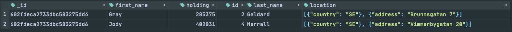

# Assignment 2

**Deadline v7 19/2 23:59**

## Table of Contents

- [Databases and Linux](#databases-and-linux)
    - [Points to be evaluated:](#points-to-be-evaluated)
    - [Introduction](#introduction)
    - [Part 1](#part-1)
    - [Part 2](#part-2)
    - [Part 3](#part-3)
    - [Part 4](#part-4)
    - [Questions](#questions)
- [Plan](#plan)
    - [Plan part 1](#plan-part-1)
    - [Plan part 2](#plan-part-2)
    - [Plan part 3](#plan-part-3)
    - [Plan part 4](#plan-part-4)
- [Result and Report](#result-and-report)
    - [Result MySQL](#result-mysql)
        - [MySQL part 1](#mysql-part-1)
        - [MySQL part 2](#mysql-part-2)
        - [MySQL part 3](#mysql-part-3)
        - [MySQL part 4](#mysql-part-4)
    - [Result MongoDB](#result-mongodb)
        - [MongoDB part 1](#mongodb-part-1)
        - [MongoDB part 2](#mongodb-part-2)
        - [MongoDB part 3](#mongodb-part-3)
        - [MongoDB part 4](#mongodb-part-4)
    - [Result questions](#result-questions)

# Databases and Linux

## Points to be evaluated:

6. Apply searches in different database systems (MySQL / Mariadb and MongoDB)

7. Uses CRUD in their environment:

8. Create, develop and maintain your own and others' databases

## Introduction

In this assignment we among other things to use databases and tables that we create in assignment 1, we will also create
new. If you do not have your databases and tables from the previous assignment so that you create these again.

With this assignment, you must also write a report, where you explain how you intended. The more detailed the reports,
the greater the chance you have of reaching the grade you want. Every moment in this assignment should be reported in
the report. You choose yourself I must the format you write the report.

I concluded that the document also contains questions that you must answer.

## Part 1

In the assignment 1, we created a table in MySQL and a collection in MongoDB.   
We called this table “locations”.

This table would contain these fields:

1. ID (created automatically in Mongo)
2. country (string)
3. address (string)

Now it's time to create data in this table and collection. The following data should be in both MongoDB and MySQL:

| country | address          |
| ------- | ---------------- |
| SE      | Vimmerbygatan 20 |
| US      | Asteroid road 5  |
| US      | Comet road 41    |
| SE      | Brunnsgatan 7    |

## Part 2

Now we will create another table in MySQL / MariaDB.

- Here you will not get as many instructions soo you have to think for yourself.
- We want to create a table that we will use as a relationship table.
- This table will describe relationships between bank accounts and “locations”.
- You decide what the table should be called, and how you design this table.

Here you can forget MongoDB for a moment if you want, this step only needs to be applied in MySQL / MariaDB (there will
be questions about this in MongoDB later instead).

Things to keep in mind:

1. You should use foreign keys
2. The table shall not contain any information other than locations ID and bank account ID.

After you have created the table, we will also put some data in it.   
You will put rows / documents that describe the following:

1. Bank account **'Corbin', 'Hauck'** must be linked to a location with the address **Brunnsgatan 7**
2. Bank account **'Vanya', 'Worsell'** must be linked to a location with the address **Asteroid road 5**
3. Bank account **'Eldon', 'McCartan'** must be linked to a location with the address **Vimmerbygatan 20**
4. Bank account **'Ingunna', 'Castellucci'** must be linked to a location with the address **Comet road 41**

Explain in your report how you did. Also send with your code you did to apply this.

## Part 3

Now we will perform searches on our data.

- Write a question in MySQL that retrieves all bank accounts that are linked to "locations" where the country is "SE".
- Write in your report how you did.
- There are several solutions here, and no solution who does the job is wrong. (again, you choose if you also want to do
  this in MongoDB)

## Part 4

Now you must show understanding of CRUD. Write in your report, examples of MongoDB and SQL questions that are of the
characters:

1. Create
2. Read
3. Update
4. Delete

## Questions

1. What is the equivalent in MongoDB to a foreign key?
2. What is the equivalent of a SELECT in MongoDB?
3. How did you solve parts 2 and 3 in MongoDB? (you do not need to make a complete solution, but describe in a rough way
   how you had done)
4. What information do you need to be able to log in to someone else's database?
5. Why would you like to use a database?
6. Mention some other places / situations in addition to databases that CRUD is used

# Plan

Create the Table "locations"

## Plan part 1

| variable | properties                       |
| -------- | -------------------------------- |
| id       | INT, PRIMARY KEY, AUTO_INCREMENT |
| country  | VARCHAR(3)                       |
| address  | VARCHAR(50)                      |

### MySQL/MariaDB

- [x] Create Table
    - Field id
    - Field country
    - Field address
- [x] Insert data

### MongoDB

- [x] Create Collection
    - Field id
    - Field country
    - Field address
- [x] Insert data

### Data to insert

| country | address          |
| ------- | ---------------- |
| SE      | Vimmerbygatan 20 |
| US      | Asteroid road 5  |
| US      | Comet road 41    |
| SE      | Brunnsgatan 7    |

### Fill in Report

- [ ] Report

## Plan part 2

Create a Relationship table between locations and bank_accounts

**bank_accounts table:**

| variable   | properties                       |
| ---------- | -------------------------------- |
| id         | INT, PRIMARY KEY, AUTO_INCREMENT |
| first_name | VARCHAR(50)                      |
| last_name  | VARCHAR(50)                      |
| holding    | INT                              |

**locations table:**

| variable | properties                       |
| -------- | -------------------------------- |
| id       | INT, PRIMARY KEY, AUTO_INCREMENT |
| country  | VARCHAR(50)                      |
| address  | VARCHAR(50)                      |

**relationship table:**

| variable          | properties                       |
| ----------------- | -------------------------------- |
| id                | INT, PRIMARY KEY, AUTO_INCREMENT |
| bank_accounts_id  | INT, FOREIGN KEY                 |
| locations_id      | INT, FOREIGN KEY                 |

### MySQL/MariaDB

- [x] Create Table
    - Field id
    - Field bank_accounts_id
    - Field locations_id
- [x] Insert data

### MongoDB

- [ ] Create Collection
    - Field id
    - Field bank_accounts_id
    - Field locations_id
- [ ] Insert data

### Data

1. Bank account **'Corbin', 'Hauck'** must be linked to a location with the address **Brunnsgatan 7**
2. Bank account **'Vanya', 'Worsell'** must be linked to a location with the address **Asteroid road 5**
3. Bank account **'Eldon', 'McCartan'** must be linked to a location with the address **Vimmerbygatan 20**
4. Bank account **'Ingunna', 'Castellucci'** must be linked to a location with the address **Comet road 41**

### Fill in Report

- [ ] Report

## Plan part 3

Now we will perform searches on our data.

### MySQL/MariaDB

- [X] Write a question in MySQL that retrieves all bank accounts that are linked to "locations" where the country is "
  SE".
- [x] Write in your report how you did.

### MongoDB

- [ ] Write a question in MySQL that retrieves all bank accounts that are linked to "locations" where the country is "
  SE".
- [ ] Write in your report how you did.

### Fill in Report

- [ ] Report

## Plan part 4

Now you must show understanding of CRUD

Write in your report, examples of MongoDB and SQL questions that are of the characters:

### MySQL/MariaDB

- [x] Create
- [x] Read
- [x] Update
- [x] Delete

### MongoDB

- [ ] Create
- [ ] Read
- [ ] Update
- [ ] Delete

# Result and Report

[Source code concatenated into one file](mysql_files/all_sql_in_one_file.sql)

## Result MySQL

I have been working in IntelliJ and mad the connections to the databases in there.

### Server setup

Installed an TurnKey Server with MySQL/MariaDB (in a LXC) and assigned it the ip-address 192.168.1.20.

- Setup PyCharm to connect to server

### Import data to MySQL/MariaDB

I started by creating a new database that I did all work in.

```mariadb
CREATE DATABASE databases_in_linux_assignment_2_mariadb;
USE databases_in_linux_assignment_2_mariadb;
```

Creation of the table bank_accounts:

```mariadb
CREATE TABLE bank_accounts
(
    id         INT PRIMARY KEY AUTO_INCREMENT,
    first_name VARCHAR(50),
    last_name  VARCHAR(50),
    holding    INT
);
```

[Source code](mysql_files/1_create_initial_database_and_table.sql)

The table was filled with data from the [file](mysql_files/2_insert_into_bank_accounts.sql).

### MySQL part 1

Then I used the Template-table I created under planing and created the table.

| variable | properties                       |
| -------- | -------------------------------- |
| id       | INT, PRIMARY KEY, AUTO_INCREMENT |
| country  | VARCHAR(3)                       |
| address  | VARCHAR(50)                      |

The code for creating the table:

```mariadb
CREATE TABLE locations
(
    id      INT PRIMARY KEY AUTO_INCREMENT,
    country VARCHAR(3),
    address VARCHAR(50)
);
```

Insert data:

```mariadb
INSERT INTO Corbinlocations (country, address)
VALUES ('SE', 'Vimmerbygatan 20'),
       ('US', 'Asteroid road 5'),
       ('US', 'Comet road 41'),
       ('SE', 'Brunnsgatan 7');
```

[Source code](mysql_files/3_part_1.sql)

### MySQL part 2

In this step I created the relationship table:

| variable          | properties                       |
| ----------------- | -------------------------------- |
| id                | INT, PRIMARY KEY, AUTO_INCREMENT |
| bank_accounts_id  | INT, FOREIGN KEY                 |
| locations_id      | INT, FOREIGN KEY                 |

The code for creating the table:

```mariadb
CREATE TABLE relationship
(
    id               INT PRIMARY KEY AUTO_INCREMENT,
    bank_accounts_id INT,
    locations_id     INT,
    FOREIGN KEY (bank_accounts_id) REFERENCES bank_accounts (id),
    FOREIGN KEY (locations_id) REFERENCES locations (id)
);
```

This information should be inserted:

1. Bank account **'Corbin', 'Hauck'** must be linked to a location with the address **Brunnsgatan 7**
2. Bank account **'Vanya', 'Worsell'** must be linked to a location with the address **Asteroid road 5**
3. Bank account **'Eldon', 'McCartan'** must be linked to a location with the address **Vimmerbygatan 20**
4. Bank account **'Ingunna', 'Castellucci'** must be linked to a location with the address **Comet road 41**

Since I didn't want to search and insert the information manually i first created sql querys for every person to get the
id for that person.

```mariadb
SELECT id
FROM bank_accounts
WHERE first_name = 'Corbin'
  AND last_name = 'Hauck';

SELECT id
FROM bank_accounts
WHERE first_name = 'Vanya'
  AND last_name = 'Worsell';

SELECT id
FROM bank_accounts
WHERE first_name = 'Eldon'
  AND last_name = 'McCartan';

SELECT id
FROM bank_accounts
WHERE first_name = 'Ingunna'
  AND last_name = 'Castellucci';
```

Then I did the same for locations

```mariadb
SELECT id
FROM locations
WHERE country = 'SE'
  AND address = 'Vimmerbygatan 20';

SELECT id
FROM locations
WHERE country = 'US'
  AND address = 'Asteroid road 5';

SELECT id
FROM locations
WHERE country = 'US'
  AND address = 'Comet road 41';

SELECT id
FROM locations
WHERE country = 'SE'
  AND address = 'Brunnsgatan 7';
```

The manually way to insert the information would have been (with the numbers: `(3, 5)`):

```mariadb
INSERT INTO relationship (bank_accounts_id, locations_id)
VALUES (3, 5)
```

There is the possibility replace the numbers `3` and `5` with `SELECT` statements:

```mariadb
INSERT INTO relationship (bank_accounts_id, locations_id)
VALUES ((SELECT id FROM bank_accounts WHERE first_name = 'Corbin' AND last_name = 'Hauck'),
        (SELECT id FROM locations WHERE country = 'SE' AND address = 'Brunnsgatan 7'));
```

[Source code](mysql_files/4_part_2.sql)

### MySQL part 3

Write a question in MySQL that retrieves all bank accounts that are linked to "locations" where the country is " SE".

```mariadb
SELECT b.first_name, b.last_name, l.country
FROM relationship r
         INNER JOIN bank_accounts b ON r.bank_accounts_id = b.id
         INNER JOIN locations l on r.locations_id = l.id
WHERE country = 'SE';
```

Here I had the `relations` table as the base and used joins to join the information from bank_accounts and locations.
The `b`, `r`and `l` letters ar shorthands for the tables and make the query shorter.

I did INNER JOINS on:

- `relationship.bank_accounts_id to bank_accounts.id`
- `relationship.locations_id to locations.id`

And sorted on 'SE'.

[Source code](mysql_files/5_part_3.sql)

### MySQL part 4

Examples of CRUD functionality in my database:

```mariadb
# CREATE
insert into bank_accounts (first_name, last_name, holding)
values ('Lars', 'Dsve', 333);

# READ
SELECT *
FROM bank_accounts;

SELECT *
FROM bank_accounts
WHERE first_name = 'Lars';

# UPDATE
SELECT *
FROM bank_accounts
WHERE first_name = 'Lars';

UPDATE bank_accounts
set holding = 666
WHERE first_name = 'Lars'
  AND last_name = 'Dsve';

# DELETE
SELECT count(*)
FROM bank_accounts;

DELETE
FROM bank_accounts
WHERE first_name = 'Lars'
  AND last_name = 'Dsve';
```

[Source code](mysql_files/6_part_4.sql)

## Result MongoDB

### Server setup

Installed an Ubuntu Server with MongoDB (in a LXC) and assigned it the ip-address 192.168.1.22. I followed these guides
for server setup:

- [Initial Server Setup with Ubuntu 20.04](https://www.digitalocean.com/community/tutorials/initial-server-setup-with-ubuntu-20-04)
- [How To Install MongoDB on Ubuntu 20.04](https://www.digitalocean.com/community/tutorials/how-to-install-mongodb-on-ubuntu-20-04)
- [How To Configure Remote Access for MongoDB on Ubuntu 20.04](https://www.digitalocean.com/community/tutorials/how-to-configure-remote-access-for-mongodb-on-ubuntu-20-04)
- Setup PyCharm to connect to server

### Import data to MongoDB

- Transfer files from mu computer to server
    - `scp bank_accounts.json lars@192.168.1.22:/home/lars`
- Connect to server
    - `ssh lars@192.168.1.22`
- Import JSON data to MongoDB in terminal of Server
    - `mongoimport --db bank --collection bank_accounts --file ./bank_accounts.json --jsonArray`
- Verify import
    - `mongo` in terminal
    - `show dbs` in mongo shell
    - `use bank` in mongo shell
    - `show collections` in mongo shell
    - `db.bank_accounts.find()` in mongo shell

### MongoDB part 1

Then I used the Template-table I created under planing and created the collection.

| variable |
| -------- |
| id       |
| country  |
| address  |

The code for creating the collection (this is not necessary):

```javascript
db.createCollection("locations")
```

Insert data:

```javascript
db.locations.insertMany([
    { country: "SE", address: "Vimmerbygatan 20" },
    { country: "US", address: "Asteroid road 5" },
    { country: "US", address: "Comet road 41" },
    { country: "SE", address: "Brunnsgatan 7" }
])
```

[Source code](mongodb_files/part_1.js)

### MongoDB part 2

In this step I created the relationship table (more on this later):

| variable          |
| ----------------- |
| id                |
| bank_accounts_id  |
| locations_id      |

The code for creating the table:

This information should be inserted:

1. ~~Bank account **'Corbin', 'Hauck'** must be linked to a location with the address **Brunnsgatan 7**~~
2. ~~Bank account **'Vanya', 'Worsell'** must be linked to a location with the address **Asteroid road 5**~~
3. ~~Bank account **'Eldon', 'McCartan'** must be linked to a location with the address **Vimmerbygatan 20**~~
4. ~~Bank account **'Ingunna', 'Castellucci'** must be linked to a location with the address **Comet road 41**~~

Could not find the names in the db so replaced them with the first 4 entries:

1. Bank account **'Gray', 'Geldard'** must be linked to a location with the address **Brunnsgatan 7**
2. Bank account **'Faith', 'Scoon'** must be linked to a location with the address **Asteroid road 5**
3. Bank account **'Jody', 'Merrall'** must be linked to a location with the address **Vimmerbygatan 20**
4. Bank account **'Modesta', 'Featherstonhaugh'** must be linked to a location with the address **Comet road 41**

#### First attempt

**Get id for address**

```javascript
db.locations.find(
    { $and: [{ country: "SE" }, { address: "Vimmerbygatan 20" }] }, { id: 1, _id: 0 })
db.locations.find(
    { $and: [{ country: "US", address: "Asteroid road 5" }] }, { id: 1, _id: 0 })
db.locations.find(
    { $and: [{ country: "US", address: "Comet road 41" }] }, { id: 1, _id: 0 })
db.locations.find(
    { $and: [{ country: "SE", address: "Brunnsgatan 7" }] }, { id: 1, _id: 0 })
```

**Result:**

```
1
2
3
4
```

**Get id for user**

```javascript
db.bank_accounts.find(
    { $and: [{ first_name: "Gray", last_name: "Geldard" }] }, { id: 1, _id: 0 })
db.bank_accounts.find(
    { $and: [{ first_name: "Faith", last_name: "Scoon" }] }, { id: 1, _id: 0 })
db.bank_accounts.find(
    { $and: [{ first_name: "Jody", last_name: "Merrall" }] }, { id: 1, _id: 0 })
db.bank_accounts.find(
    { $and: [{ first_name: "Modesta", last_name: "Featherstonhaugh" }] }, { id: 1, _id: 0 })
```

**Result:**

```
2
3
4
5
```

Insert into relations collections:

```javascript
db.relationship.insertMany([
    { bank_accounts_id: 2, locations_id: 4 },
    { bank_accounts_id: 3, locations_id: 2 },
    { bank_accounts_id: 4, locations_id: 1 },
    { bank_accounts_id: 5, locations_id: 3 },
])
```

And about here I realized that I had been trying to make a relationship database with MongoDB...

```javascript
// Correction
db.relationship.drop()
```

#### Second attempt

Tried for a while and could not get it to work, so I just put the code here with no mor explanation.

```javascript
// Part 2 - Second attempt
db.locations.find()
db.bank_accounts.find()

gray_update_criteria = { $and: [{ first_name: "Gray", last_name: "Geldard" }] }
gray_update_address = {
    $set: {
        address: [
            {
                $ref: "locations",
                $id: ObjectId("602ed661a4601e69cac21163")
            }
        ]
    }
}

faith_update_criteria = { $and: [{ first_name: "Faith", last_name: "Scoon" }] }
faith_update_address = {
    $set: {
        address: [
            {
                $ref: "locations",
                $id: ObjectId("602ed661a4601e69cac21161")
            }
        ]
    }
}

jody_update_criteria = { $and: [{ first_name: "Jody", last_name: "Merrall" }] }
jody_update_address = {
    $set: {
        address: [
            {
                $ref: "locations",
                $id: ObjectId("602ed661a4601e69cac21160")
            }
        ]
    }
}

modesta_update_criteria = { $and: [{ first_name: "Modesta", last_name: "Featherstonhaugh" }] }
modesta_update_address = {
    $set: {
        address: [
            {
                $ref: "locations",
                $id: ObjectId("602ed661a4601e69cac21162")
            }
        ]
    }
}

option = { multi: true }

db.bank_accounts.find(gray_update_criteria)
db.bank_accounts.find(faith_update_criteria)
db.bank_accounts.find(jody_update_criteria)
db.bank_accounts.find(modesta_update_criteria)

db.bank_accounts.updateOne(gray_update_criteria, gray_update_address)
db.bank_accounts.updateOne(faith_update_criteria, faith_update_address)
db.bank_accounts.updateOne(jody_update_criteria, jody_update_address)
db.bank_accounts.updateOne(modesta_update_criteria, modesta_update_address)

db.bank_accounts.find()

db.bank_accounts.aggregate({
    $lookup: {
        from: "locations",
        localField: "address.$id",
        foreignField: "locations._id",
        as: "locations"
    }
})
```

#### Third attempt

I did change approach to just solve the problem in a simple maner.

```javascript
db.bank_accounts.drop()
db.bank_accounts.find()

db.bank_accounts.updateOne(
    { $and: [{ first_name: "Gray", last_name: "Geldard" }] },
    { $set: { location: [{ country: "SE" }, { address: "Brunnsgatan 7" }] } }
)

db.bank_accounts.updateOne(
    { $and: [{ first_name: "Faith", last_name: "Scoon" }] },
    { $set: { location: [{ country: "US" }, { address: "Asteroid road 5" }] } }
)

db.bank_accounts.updateOne(
    { $and: [{ first_name: "Jody", last_name: "Merrall" }] },
    { $set: { location: [{ country: "SE" }, { address: "Vimmerbygatan 20" }] } }
)

db.bank_accounts.updateOne(
    { $and: [{ first_name: "Modesta", last_name: "Featherstonhaugh" }] },
    { $set: { location: [{ country: "US" }, { address: "Comet road 41" }] } }
)
```

[Source code](mongodb_files/part_2.js)

### MongoDB part 3

Write a question in MySQL that retrieves all bank accounts that are linked to "locations" where the country is " SE".

```javascript
db.bank_accounts.find({ location: { country: "SE" } })
```

**Result**



[Source code](mongodb_files/part_3.js)

### MongoDB part 4

Examples of CRUD functionality in my database:

```javascript
// CREATE
db.bank_accounts.count()
db.bank_accounts.insertOne(
    {
        id: 1001,
        first_name: "Larss",
        last_name: "Dsves",
        holding: 667
    }
)
db.bank_accounts.count()


// READ
db.bank_accounts.find()
db.bank_accounts.find({ first_name: "Larss" })
db.bank_accounts.find({ "holding": 667 })
db.bank_accounts.find({ "id": 667 })


// UPDATE
update_criteria = { id: 1001 }
db.bank_accounts.find(update_criteria)

update_frist_name = { $set: { first_name: "Lars" } }
update_last_name = { $set: { last_name: "Dsve" } }
update_holding = { $set: { holding: 666 } }

db.bank_accounts.updateOne(update_criteria, update_frist_name)
db.bank_accounts.updateOne(update_criteria, update_last_name)
db.bank_accounts.updateOne(update_criteria, update_holding)

after_update_criteria = { first_name: "Lars" }
db.bank_accounts.find(after_update_criteria)


// DELETE
db.bank_accounts.count()
delete_criteria = { first_name: "Lars" }
db.bank_accounts.find(delete_criteria)
db.bank_accounts.deleteOne(delete_criteria)
db.bank_accounts.find(delete_criteria)
db.bank_accounts.count()
```

[Source code](mongodb_files/part_4.js)

## Result questions

1. What is the equivalent in MongoDB to a foreign key?
    - DBRef `$ref`
2. What is the equivalent of a SELECT in MongoDB?
    - `.find()`, `.find({})`
3. How did you solve parts 2 and 3 in MongoDB? (you do not need to make a complete solution, but describe in a rough way
   how you had done)
    - I solved it.
    - I did insert the location data into an already existing document.
    - `db.bank_accounts.find({ location: { country: "SE" } })`
4. What information do you need to be able to log in to someone else's database?
    - Ip-address
    - Port
    - Username
    - Password
5. Why would you like to use a database?
    - If you would likt to search on data
    - To handle custumers, and their historical purchases
    - And so on...
6. Mention some other places / situations in addition to databases that CRUD is used
    - In a game where you create/delete a characters who can level up and so on
    - File handling
    - Updates to your Operating System
