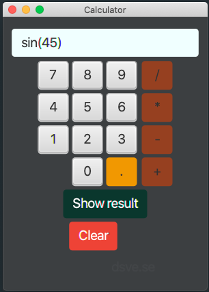
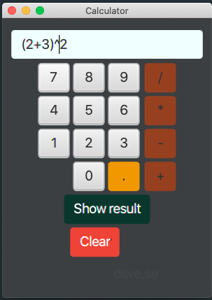

# Calculator with GUI

## GUI

Made in JavaFX-11 
 
The color scheme leave a lot to desire, but the program works.

## Start

## sin(45) input

## sin(45) result

## Parenthesis equation

## Parenthesis result

