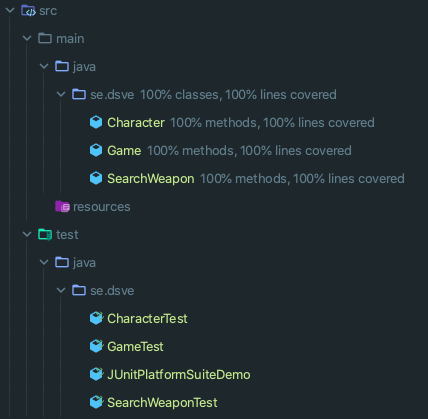
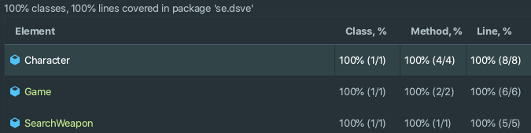

# Assignment 2 done with TDD practices

## Original instructions
Instructions to start with where I striped out all code handed to us and start from blank/empty files.

### G requirement:

Med hjälp av koden nedanför(det går även bra att använda sig utav det template vi skrev ihop på föreläsningen 23/9)
skall du skriva vidare på metoden searchWeapon.
Metoden tar in ett parameter argument som motsvarar vapnet man vill söka på.
Metoden skall använda sig utav det parameter argument som matas in och iterera igenom switch satsen.
finner metoden det vapen som har sökts på så skall den tala om vilken karaktär som bär på det sökta vapnet
ifall metoden inte finner en match så skall metoden tala om vilket vapen som söktes efter och ge oss ett meddelande om att det inte kunde finnas.
Notera att det är OK att hårdkoda hela stycket.

### VG requirement
Skriv ytterligare en metod som utrustar valfri karaktär med vapnet "Excalibur". Se till att anropa denna metod på karaktären.
Det går bra att hårdkoda även här.

# Goal
Write a program that meets the requirement's with minimum amount of code using TDD practices.

## G requirement
Search for a weapon and return the character that have that weapon equipped.
If there is no match return a message that the weapon isn't equipped by any character. 

## VG requirement
Write a method that equips a character with a new weapon.

# Result

G and VG requirements ar separated into different parts.
- G part have hardcoded return statements
- VG part is not hardcoded

To merge the two parts wasn't the goal here.

