# Lecture 1

## Install VirtualBox for your system
I use a Mac so the tutorial will be for that.

Download from [here](https://www.virtualbox.org/wiki/Downloads)

## Download

1. Choose VirtualBox version appropriate for your system.
2. Extension pack.
3. Install VirtualBox.
4. When done double-click on the extension pack, and it will add itself to VirtualBox.  

## Create a new host

- Click New

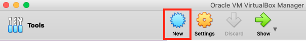

- Name your host
- Choose right type and Version

- Choose a memory size (min 2 GB)

- Create new drive

- Choose VDI

- Dynamically allocated

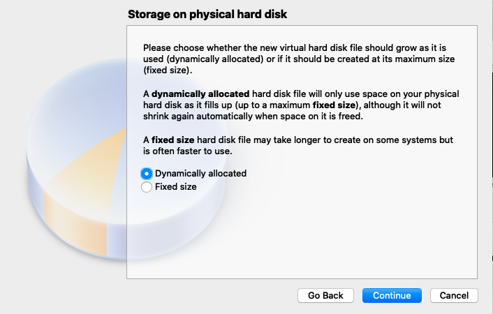

- File location and size

## Change settings for the new host

- Settings

- Allocate more core's

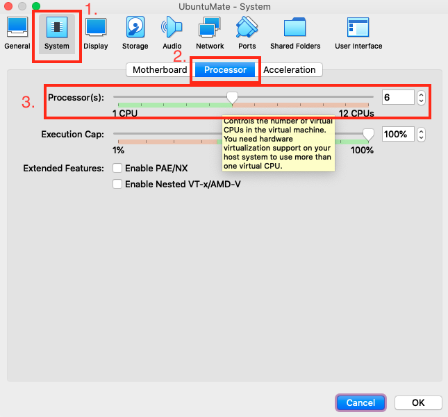

- Allocate more video memory

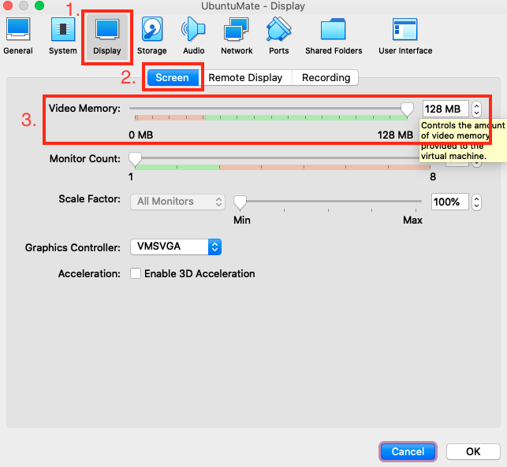

- Mount the downloaded ISO

- Should look like this

- Change to USB 3.0

## Start the host

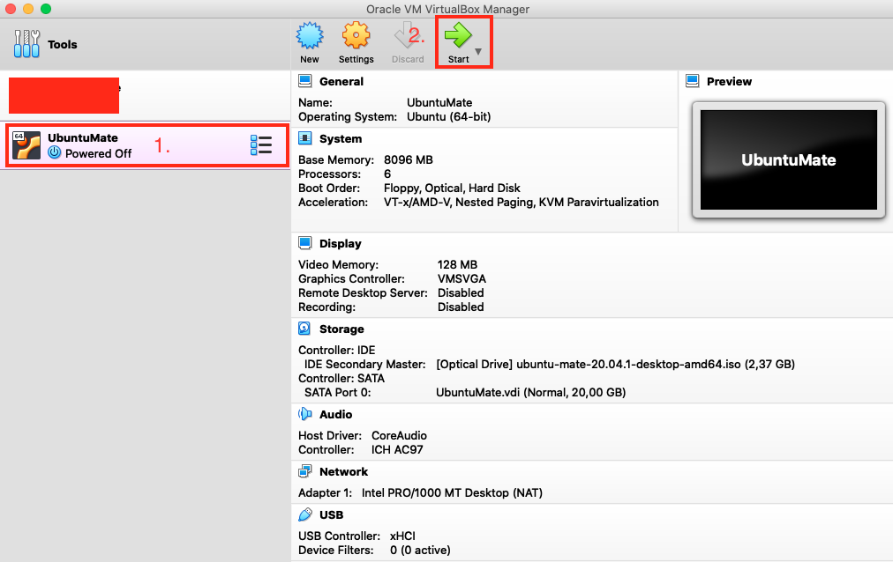

- Select OS Language

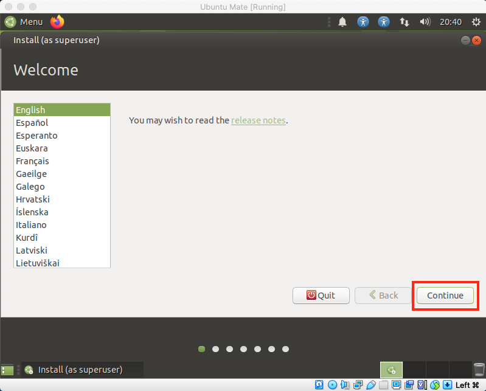

- Choose keyboard layout

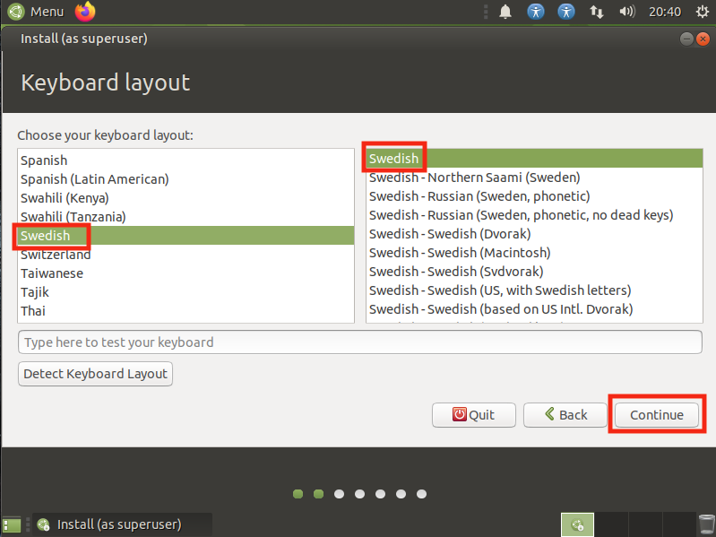

- Installation options

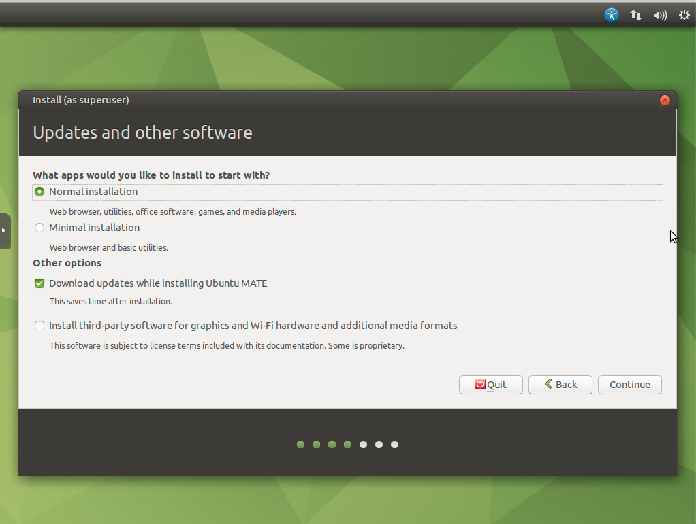

- Installation options (I use minimal with third-party stuff)

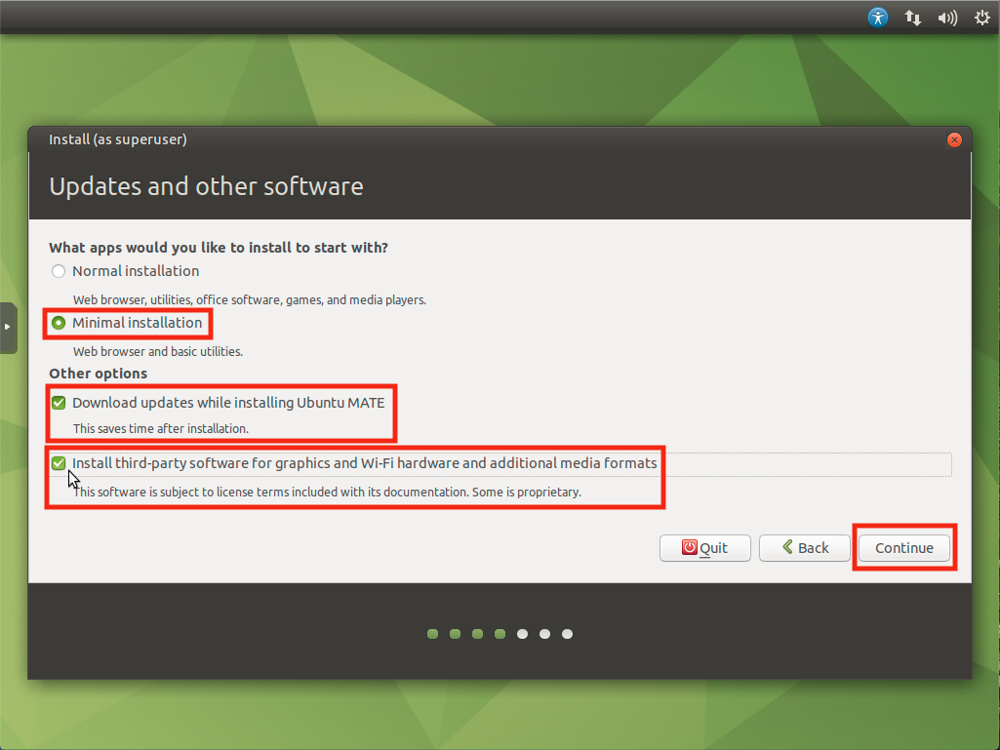

- Erase disk

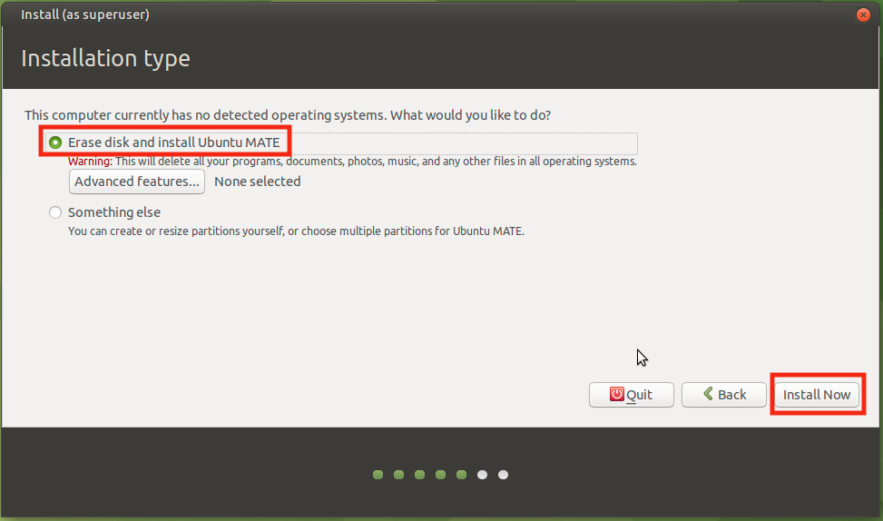

- Erase disk, confirm

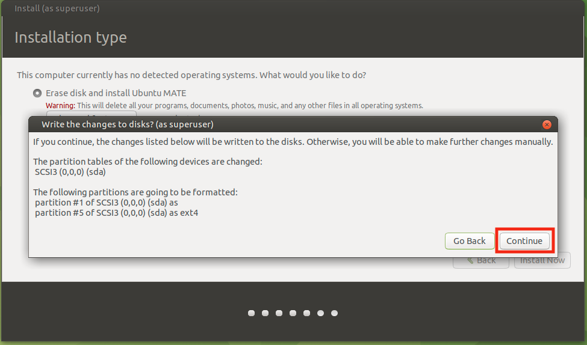

- Chose time zone

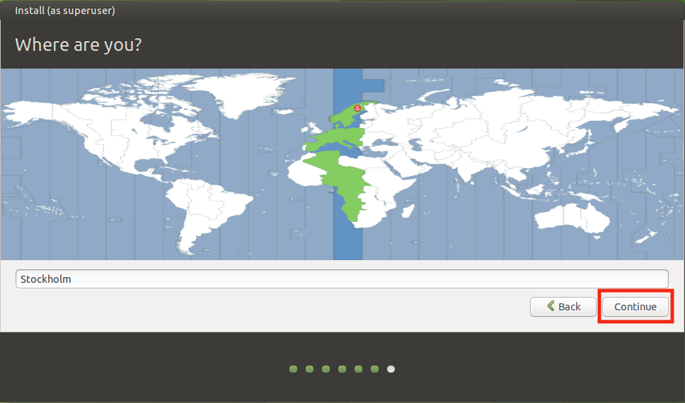

- Enter User credentials

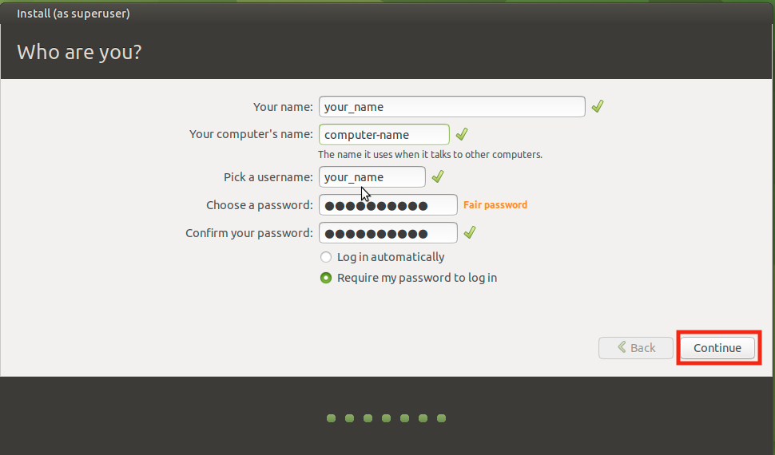

- Wait for installation to finish

- Installation completed

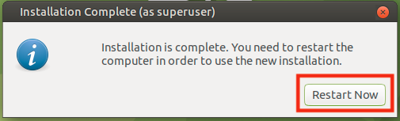

- Remove installation media, just press enter. You have to close/shutdown the VM to be able to remove the media.

## Next step
Follow tutorial in Java folder to get Java working