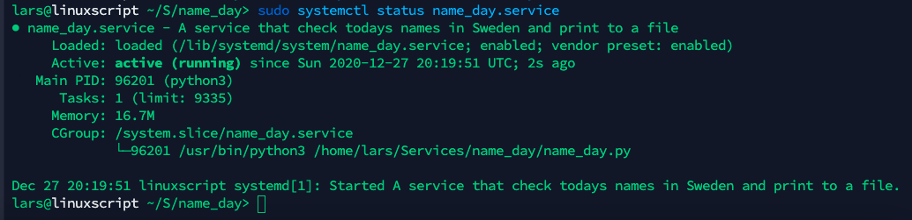

# Python Project

## Knowledge to be evaluated
- [ ] Describe different types of services in Linux
- [x] Use the terminal to use different shell commands
- [x] Use the Linux environment in a relative way
- [x] Use version management of code via terminal
- [x] Create Python script
- [x] Create Automated tasks and processes in Linux environment
- [x] Create and organise Python projects with modules and classes

# Result

## Describe different types of services in Linux

## Project log

### Step 1
#### Goal: To access the data in Python 
- Make sure that I get data from the api request
- Convert response to JSON format and save i `data` variable
- Make sure I can access and print individual keys from `data` 

### Step 2
#### Goal: Save all relevant data (that I chose) to a list
- Create methods for every single thing to do
- Save the relevant data to a new list
- Format the data to a nice locking string
- Print the string

### Step 3
#### Goal: Write string to file, so it locks good
- Save string from step 2 in to a file
- Append new data to the file
- Format string if necessary to lock nice

### Step 4
#### Goal: Refactor to nice locking code and whit easy to understand methods and variable name
- Create classes, class is used for data structure 
- Create modules, api and data transformations
- Refactor and clean up code

### Step 5
#### Goal: write a service script
- Create a service file to run m script as a service

### Step 6
#### Goal: Get the service up and running on a virtual Linux Server OS 
- Clone repo to my virtual Ubuntu Server machine 
- Check path to python
- Check path to repo on disk
- Update those in `nameday_service` ([`instructions below`](#get-the-service-up-and-running))
- Copy `nameday_service` to `/lib/systemd/system/name_day.service`
- Restart systemd daemon
- Start the service 
- Check status

### Step 7
#### Goal: Make Executable .sh files
- Installer
- Uninstaller
- Restart
- Start
- Stop

### Step 8
#### Goal: Make an automated installer
- Create in installation directory
- Should download all files
- Make executable files executable
- Copy service to systemd
- Start Service

##### Link to installer:

`curl https://raw.githubusercontent.com/deskavaenkelt/EcUtbildningDevOps/master/Linux%20and%20Script%20Languages/Python/Project/auto_installer.sh | bash`

## [Get the service up and running]

### Step 1 - Edit Service File
Instructions for editing `nameday_service`
On your Linux System enter those two commands and take note on the paths
- `which python3`
- `pwd`

In the `name_day.service` file on the line `ExecService`  
`[Service]`  
`ExecStart=/venv/bin/python ./main.py`

Replace:
- `/venv/bin/python` with the path from the command `which python3`
- `./main.py` with the path from the command `pwd` + `main.py`

### Step 2 - Enable newly added Service
In Terminal enter:

`sudo cp name_day.service /lib/systemd/system/name_day.service`

Reload daemon:

`sudo systemctl daemon-reload`

Now enable the service to start on system boot, also start the service using the following commands.

`sudo systemctl enable name_day.service`

`sudo systemctl start name_day.service`

### Step 3 – Start/Stop/Restart/Status new Service
Finally, check the status of your service as following command.

`sudo systemctl status name_day.service`

Use below commands to stop, start and restart your service manually.

`sudo systemctl stop dummy.service`

`sudo systemctl start dummy.service`

`sudo systemctl restart dummy.service`
