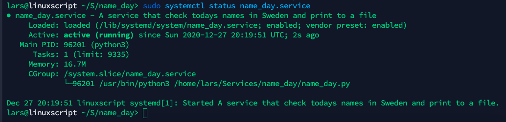

# Python Project

## Knowledge to be evaluated
- [ ] Describe different types of services in Linux
- [x] Use the terminal to use different shell commands
- [x] Use the Linux environment in a relative way
- [x] Use version management of code via terminal
- [x] Create Python script
- [x] Create Automated tasks and processes in Linux environment
- [x] Create and organise Python projects with modules and classes

# Result

## Describe different types of services in Linux

## Project log

## Get the service up and running

### Step 1 - Edit Service File
Instructions for editing `nameday_service`
On your Linux System enter those two commands and take note on the paths
- `which python3`
- `pwd`

In the `name_day.service` file on the line `ExecService`  
`[Service]`  
`ExecStart=/venv/bin/python ./main.py`

Replace:
- `/venv/bin/python` with the path from the command `which python3`
- `./main.py` with the path from the command `pwd` + `main.py`

### Step 2 - Enable newly added Service
In Terminal enter:

`sudo cp name_day.service /lib/systemd/system/name_day.service`

Reload daemon:

`sudo systemctl daemon-reload`

Now enable the service to start on system boot, also start the service using the following commands.

`sudo systemctl enable name_day.service`

`sudo systemctl start name_day.service`

### Step 3 – Start/Stop/Restart/Status new Service
Finally, check the status of your service as following command.

`sudo systemctl status name_day.service`

Use below commands to stop, start and restart your service manually.

`sudo systemctl stop dummy.service`

`sudo systemctl start dummy.service`

`sudo systemctl restart dummy.service`