# Add a computer to a domain

In my case since I don't have DHCP-Server activated, yet I set the IP-Addresses manually.

Don't forget to set a static IP-address before this step if you follow this tutorial. [Instructions here in Network section](../../Network)

## Table of content

- [Add Computer before connecting to domain](#add-computer-before-connecting-to-domain)
- [Set computer name](#set-computer-name)
- [Add Windows Server to an Existing Domain](#add-windows-server-to-an-existing-domain)
- [Add an existing Windows 10 computer to an Existing Domain](#add-an-existing-windows-10-computer-to-an-existing-domain)
- [Add a newly installed Windows 10 computer to an Existing Domain](#add-a-newly-installed-windows-10-computer-to-an-existing-domain)
- 
- 

# Add Computer before connecting to domain

There is the possibility to add a computer to the domain before it is connected to the network.

In "Active Directory Users and Computers"

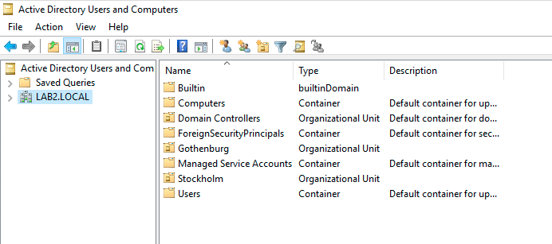

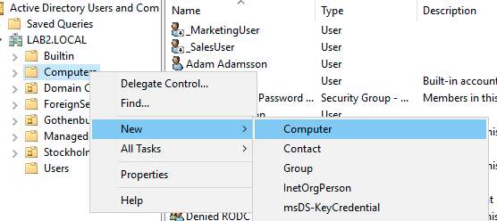

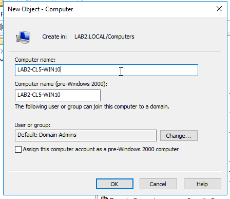

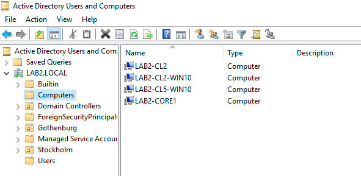

# Set computer name

Right Click the `Start Menu` > Click `System` 

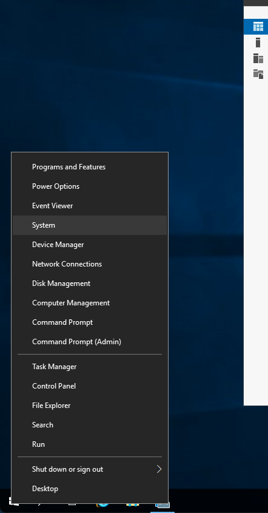

Click `Advanced System Settings`

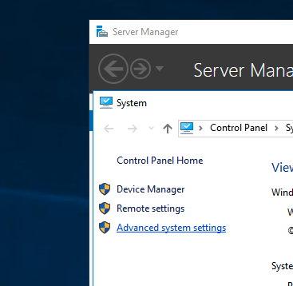

Click `Computer Name` -> `Change...`

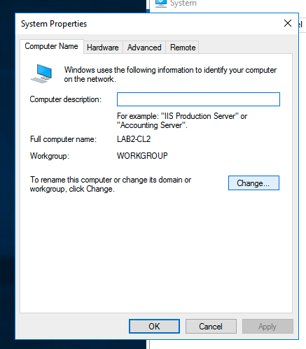

Enter a new `Computer Name` OR go to next part to add server/client to domain

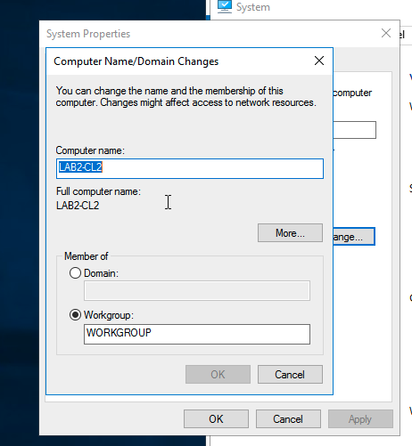

Press `OK` and restart your computer.

# Add Windows Server to an Existing Domain

Click on "Member of Domain", enter your domain and Click `OK`

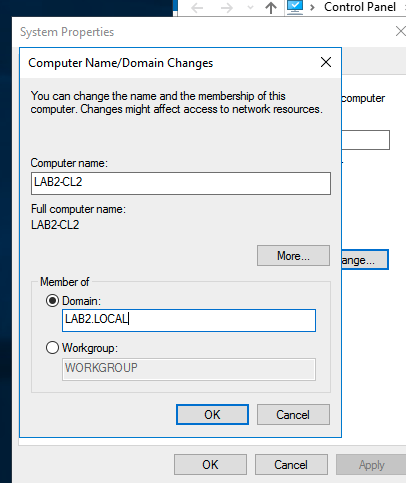

Enter valid credentials to join the Domain Server, press `OK`

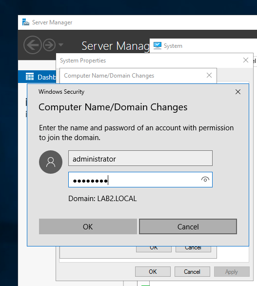

Press `OK`

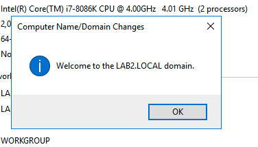

Press `OK`

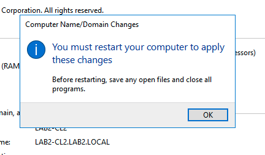

Press `Close`

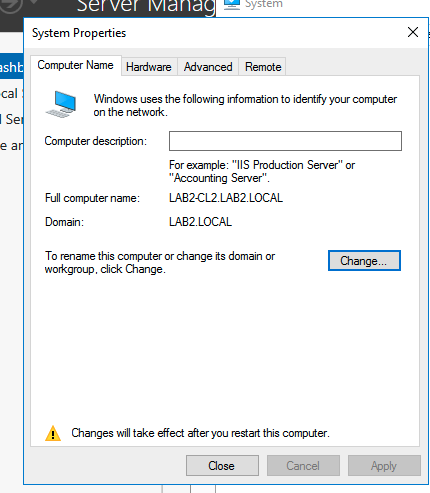

Press `Restart Now`

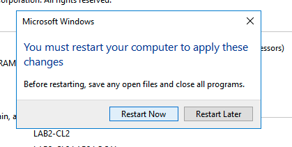

Login screen after reboot, log in with any valid user.

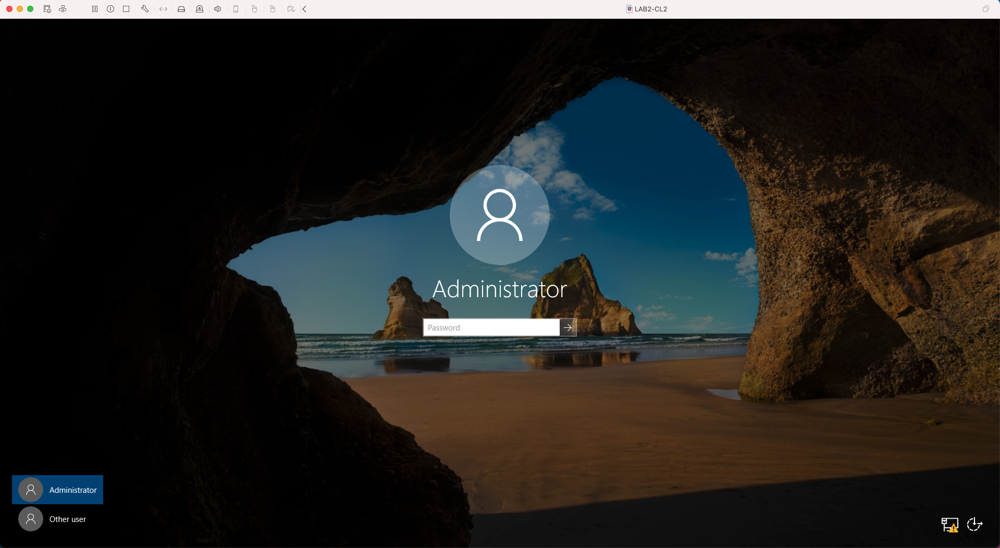

# Add an existing Windows 10 computer to an Existing Domain

# Add a newly installed Windows 10 computer to an Existing Domain

