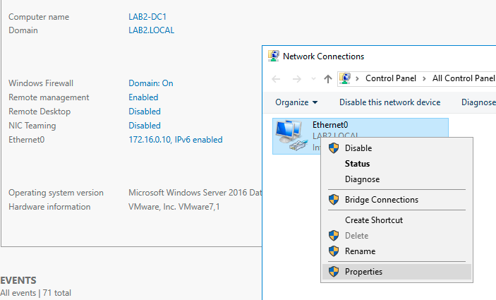
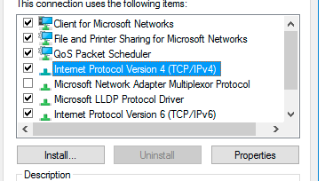
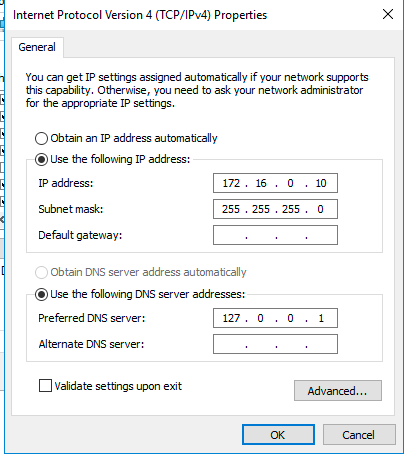
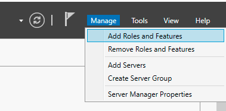
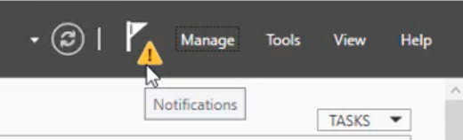
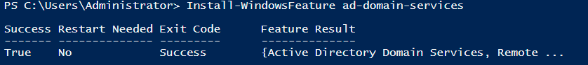
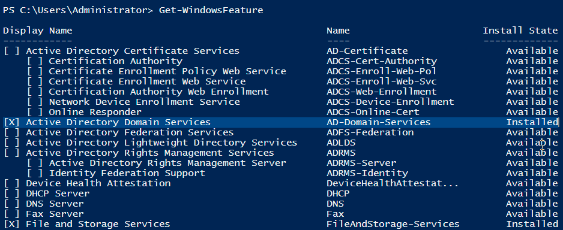

# Active Directory

## Table of content

- [Installation](#installation)
    - [Configure network](#configure-network)
    - [Add Feature Domain Controller](#add-feature-domain-controller)
    - [Deployment Configuration](#deployment-configuration)
    - [PowerShell add additional Domain Controller on Member Server ](#powershell-add-additional-domain-controller-on-member-server-lab2-dc2)

# Installation

## Configure network

1. Open Server Manager
2. Click on Computer name and set it to what you want (in my case `LAB2-DC1`) then reboot
3. Set static IP if not set already
    - Click on ethernet
    - Right klick Ethernet0 and klick on properties  
      
    - Dubble klick on "Internet Protocol Version 4 (TCP/IPv4)"  
      
    - Enter the following  
      
    - Press OK end close all windows

## Add Feature Domain Controller

4. Now we add roles and features  
   
5. Next
6. **Role-based or feature-based installation** > Next
7. Choose your computer name `LAB2-DC1` > Next
8. Choose "Active Directory Domain Services", klick "Add features" in the pop-up window then klick next
9. No more features ar needed to add so klick on Next
10. Click Next on the informative screen
11. Click Install
    - The service is now being installed, but the feature is not activated.
12. When ready klick on "Promote this server to a domain controller"
    - If you already clicked on Close
    - There is a notification icon that you can click on  
      

## Deployment Configuration

13. Choose "Add new forest"
    - Root domain name: `LAB2.LOCAL`
    - Next
14. Domain Controller Options:
    - Functional level: Windows server 2016 (minimum level of our domain controllers)
    - Type the Directory Services Restore Mode (DSRM) password
    - Next
15. DNS Options
    - Next
16. Additional Options
    - The NetBIOS domain name: `LAB2`
    - Next
17. Paths
    - Next
18. Review Options
    - Next
19. Prerequisites Check
    - Install

## PowerShell add additional Domain Controller on Member Server `LAB2-DC2`

```powershell
Install-WindowsFeature ad-domain-services
```



```powershell
Get-WindowsFeature
```



```powershell
Import-Module ADDSDeployment
```

```powershell
Install-ADDSDomainController -DomainName lab2.local -SiteName Default-First-Site-Name -InstallDns -Credential (Get-Credential)
```

Enter credentials:  
Username: `lab2\administrator`  
Password: `yourPassword`

`SafeModeAdministratorPassword: ********`  
`Confirm SafeModeAdministratorPassword: ********`

[Script](../PowerShell/PowerShell_install_Active_Directory_on_member_server.ps1)

Script handed to me from GUI

```
#
# Windows PowerShell script for AD DS Deployment
#

Import-Module ADDSDeployment
Install-ADDSDomainController `
-NoGlobalCatalog:$false `
-CreateDnsDelegation:$false `
-Credential (Get-Credential) `
-CriticalReplicationOnly:$false `
-DatabasePath "C:\Windows\NTDS" `
-DomainName "LAB2.LOCAL" `
-InstallDns:$true `
-LogPath "C:\Windows\NTDS" `
-NoRebootOnCompletion:$false `
-ReplicationSourceDC "LAB2-DC1.LAB2.LOCAL" `
-SiteName "Default-First-Site-Name" `
-SysvolPath "C:\Windows\SYSVOL" `
-Force:$true

lab2\administrator
```
