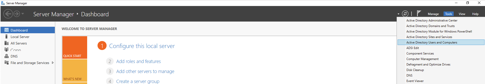
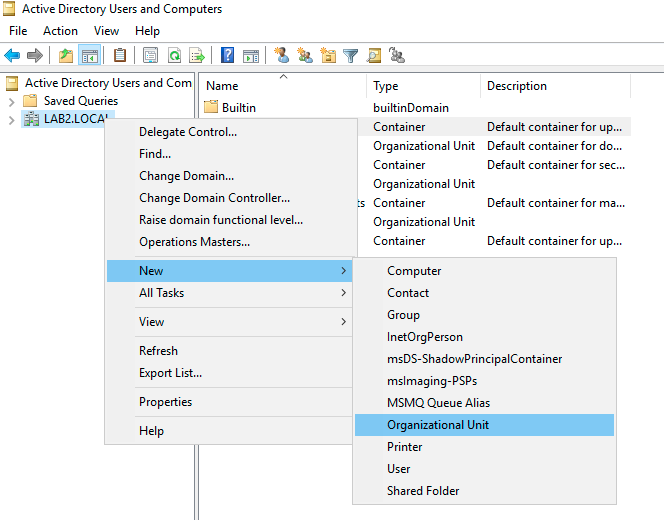
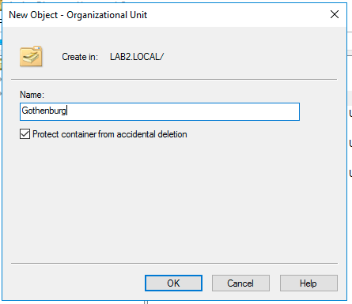
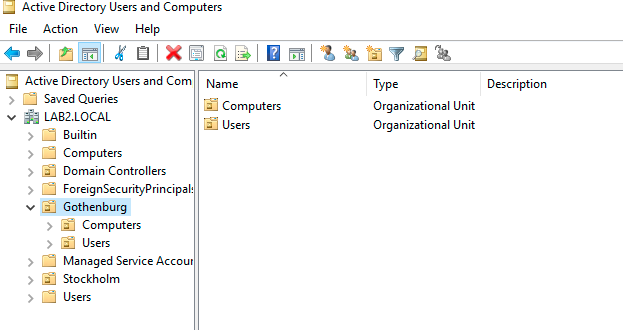
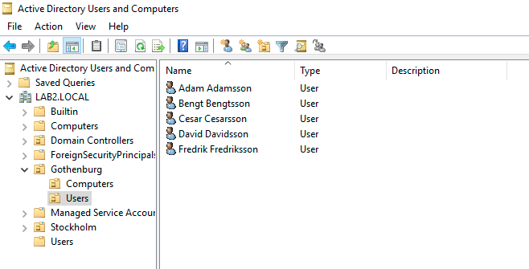
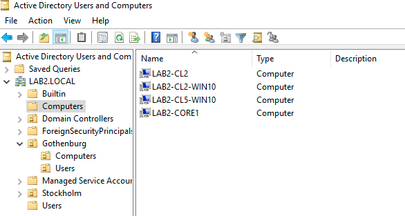
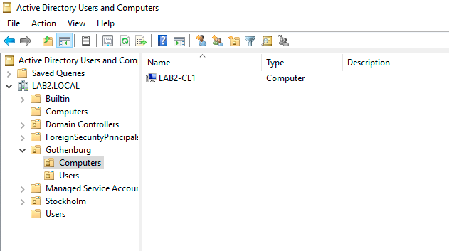

# Active Directory - Organizational Unit

## Table of content

- [Start](#start)
- 
- 
- 
- 
- 
- 

# Start

Open In "Active Directory Users and Computers"

Add the OA (Organizational Units):

- Gothenburg
- Stockholm

Inside Gothenburg add two more OA:

- Computers
- Users

Move the users:
- Adam
- Bengt
- Cesar
- David

to Gothenburg => Users by:
- Right click and move
- Select users and drag them to the folder

The same can be done for computers:

