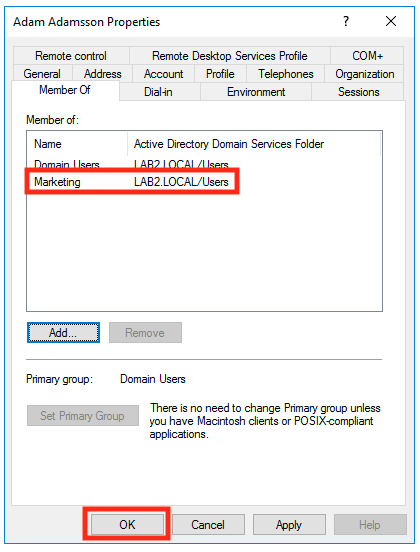

# Active Directory - Users and groups

## Table of content

- [Users to be added](#users-to-be-added)
- [Active Directory Users and Computers](#active-directory-users-and-computers)
- [Create Group](#create-group)
- [Add user to group](#add-user-to-group)
    - [First](#first)
    - [Second](#second)
    - [Third](#third)
    - [Verify that the user is added](#verify-that-the-user-is-added)
- [Create template user and add to a group](#create-template-user-and-add-to-a-group)
    - [Create template user](#create-template-user)
    - [Create user from template user](#create-user-from-template-user)
- [Add user with PowerShell](#add-user-with-powershell)
    - [New User](#new-user)
    - [Add user to a group](#add-user-to-a-group)
    - [All in one - Nicely formatted](#all-in-one---nicely-formatted)

# Users to be added

|First name | Last name   | User logon name   |
| --------- | ----------- | ----------------- |
| Adam      | Adamsson    | admadm            |
| Bengt     | Bengtsson   | benben            |
| Cesar     | Cesarsson   | cesces            |
| David     | Davidsson   | davdav            |
| Fredrik   | Fredriksson | frefre            |

Password: newPassword2021

# Active Directory Users and Computers

Open Active Directory Users and Computers in Server Manager:


## Create user

#### Step 1


#### Step 2


#### Step 3


#### Step 4


#### Step 5


## Create Group

#### Step 1


#### Step 2


#### Step 3


## Add user to group

There are at least 3 ways to do it in the UI:

### First

#### Step 1


#### Step 2


### Second

#### Step 1


#### Step 2


#### Step 3


#### Step 4



### Third

#### Step 1


#### Step 2


#### Step 3


#### Step 4


#### Step 5


#### Step 6


### Verify that the user is added

#### Step 1


#### Step 2


## Create template user and add to a group

### Create template user

#### Step 1


#### Step 2


#### Step 3


#### Step 4


#### Step 5


#### Step 6


#### Step 7


### Create user from template user

#### Step 8


#### Step 9


#### Step 10


#### Step 11


#### Step 12


#### Step 13


## Add user with PowerShell

### New User

Create a new user "Cesar Cesarsson":

```powershell
New-ADUser -DisplayName "Cesar Cesarsson" -Name "Cesar Cesarsson" -GivenName "Cesar" -Surname "Cesarsson" -SamAccountName "cesces" -UserPrincipalName "cesces@lab2.local" -AccountPassword(Read-Host -AsSecureString "Input Password") -Enabled $true -ChangePasswordAtLogon $true
```

### Add user to a group

```powershell
Add-ADGroupMember -Identity Marketing -Members cesces
```

### All in one - Nicely formatted

Create a new user "David Davidsson":

```powershell
New-ADUser `
-DisplayName "David Davidsson" `
-Name "David Davidsson" `
-GivenName "David" `
-Surname "Davidsson" `
-SamAccountName "davdav" `
-UserPrincipalName "davdav@lab2.local" `
-AccountPassword(Read-Host -AsSecureString "Input Password") `
-Enabled $true `
-ChangePasswordAtLogon $true

Add-ADGroupMember -Identity Marketing -Members davdav
```

### Add user script from ADAC

This script was provided when I added "Fredrik Fredriksson" in "Active Directory Administrative Center":

```powershell
New-ADUser -DisplayName:"Fredrik Fredriksson" -GivenName:"Fredrik" -Name:"Fredrik Fredriksson" -Path:"OU=Users,OU=Gothenburg,DC=LAB2,DC=LOCAL" -SamAccountName:"frefre" -Server:"LAB2-DC1.LAB2.LOCAL" -Surname:"Fredriksson" -Type:"user"

Set-ADAccountPassword -Identity:"CN=Fredrik Fredriksson,OU=Users,OU=Gothenburg,DC=LAB2,DC=LOCAL" -NewPassword:"System.Security.SecureString" -Reset:$true -Server:"LAB2-DC1.LAB2.LOCAL"

Enable-ADAccount -Identity:"CN=Fredrik Fredriksson,OU=Users,OU=Gothenburg,DC=LAB2,DC=LOCAL" -Server:"LAB2-DC1.LAB2.LOCAL"

Add-ADPrincipalGroupMembership -Identity:"CN=Fredrik Fredriksson,OU=Users,OU=Gothenburg,DC=LAB2,DC=LOCAL" -MemberOf:"CN=Marketing,CN=Users,DC=LAB2,DC=LOCAL" -Server:"LAB2-DC1.LAB2.LOCAL"

Set-ADAccountControl -AccountNotDelegated:$false -AllowReversiblePasswordEncryption:$false -CannotChangePassword:$false -DoesNotRequirePreAuth:$false -Identity:"CN=Fredrik Fredriksson,OU=Users,OU=Gothenburg,DC=LAB2,DC=LOCAL" -PasswordNeverExpires:$false -Server:"LAB2-DC1.LAB2.LOCAL" -UseDESKeyOnly:$false

Set-ADUser -ChangePasswordAtLogon:$true -Identity:"CN=Fredrik Fredriksson,OU=Users,OU=Gothenburg,DC=LAB2,DC=LOCAL" -Server:"LAB2-DC1.LAB2.LOCAL" -SmartcardLogonRequired:$false
```
