# Assignment 1

## Table of content

- [Part 1](#part-1)
    - [Questions](#questions)
- [Part 2](#part-2)
    - [Create a Windows Server](#create-a-windows-server)
    - [Starting criteria](#starting-criteria)
    - [Network](#network)
    - [Windows Server DC1](#windows-server-dc1)
    - [Windows 10](#windows-10)
- [Part 3 - PowerShell](#part-3---powershell)
    - [Create RefDisks](#create-refdisks)
        - [Sysprep](#sysprep)
        - [Windows Server 2019](#windows-server-2019)
        - [Windows 10 Pro](#windows-10-pro)
        - [Giggan](#giggan)
    - [Create a new VM with PowerShell](#create-a-new-vm-with-powershell)
    - [Add new user with PowerShell](#add-new-user-with-powershell)
    - [Add random user with PowerShell](#add-random-user-with-powershell)
- [Part 4](#part-4)
- [Optional](#optional)

# Part 1

## Questions

1. Describe a use case for Windows Server.
    - To be able to have a domain controller with user administration.
    - DHCP Server to give IP-Addresses to computers that connect to the network.

2. What is Active Directory?
    - Active Directory (AD) is a directory service developed by Microsoft for Windows domain networks. It is included in
      most Windows Server operating systems as a set of processes and services. Active Directory is an umbrella title
      for a broad range of directory-based identity-related services.

3. What is a Domain Controller?
    - On Microsoft Servers, a domain controller (DC) is a server computer that responds to security authentication
      requests (logging in, etc.) within a Windows domain. A domain is a concept introduced in Windows NT whereby a user
      may be granted access to a number of computer resources with the use of a single username and password
      combination.

4. What is Hyper-V?
    - Microsoft Hyper-V is a native hypervisor, it can create virtual machines on x86-64 systems running Windows.

5. What is System Center Virtual Machine Manager?
    - A System Center Virtual Machine Manager (SCVMM) is a virtual support center for Microsoft Windows machines, that
      entails the system administrators to have a centrally virtualized environment that holds multiple physical servers
      consolidated in it.

6. What is PowerShell?
    - PowerShell is a task automation and configuration management framework from Microsoft, consisting of a
      command-line shell, and the associated scripting language.

7. Where do you troubleshoot or monitor services in Windows Server?
    - Logg files
    - Task manager

8. What is a "Role" in Windows Server?
    - Server roles refer to the roles that your server can play on your network — roles such as a file server, a web
      server, or a DHCP or DNS server. Features refer to additional capabilities of the Windows operating system itself,
      such as the .NET Framework or Windows Backup.

# Part 2

## Create a Windows Server

Set up a Windows Server ~~(2016)~~ (2019), this will act as a domain controller. Install the necessary extensions /
roles on this server needed for this.

## Starting criteria

I installed Windows Server 2019 on a physical computer with the following specifikation:

- i7-4790K (4 Core, 8 Threads)
- 32GB RAM
- SSD
    - 128GB OS
    - 128GB ISOs
    - 256GB RefDisks
    - 256GB VMs

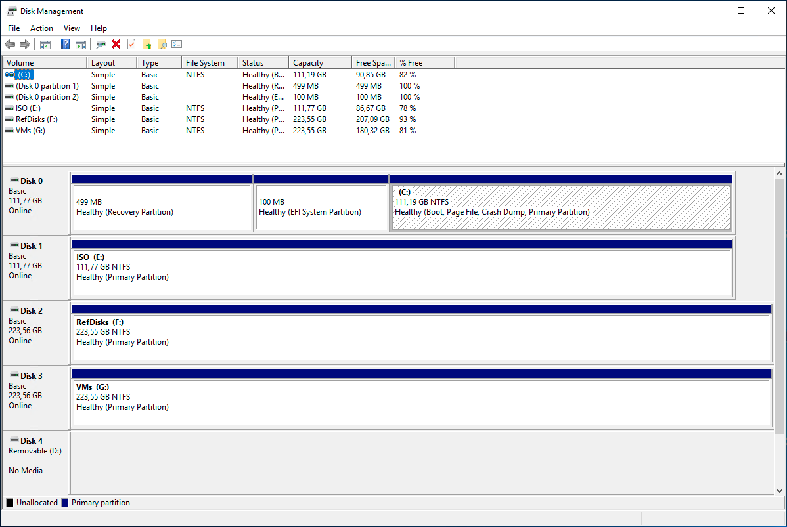

I will use the iso's int the image below.

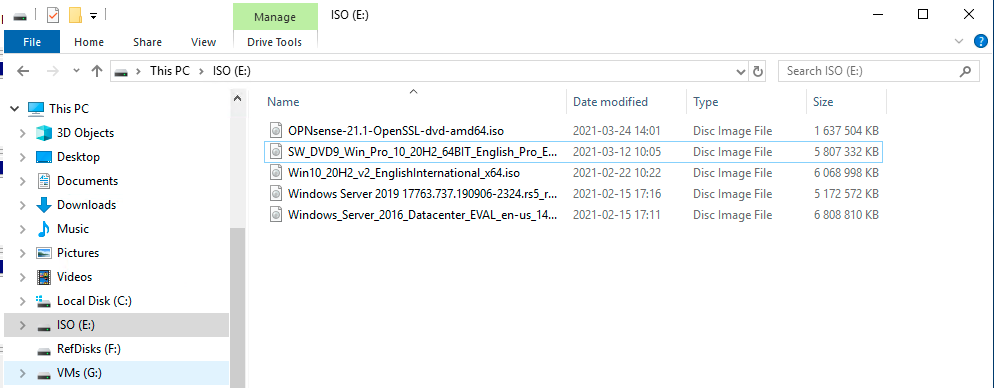

This machine will run all other machines for this assignment as VMs under Hyper-V and will be called "GIGGAN".

So I only install the role **"Hyper-V Manger"** on GIGGAN.

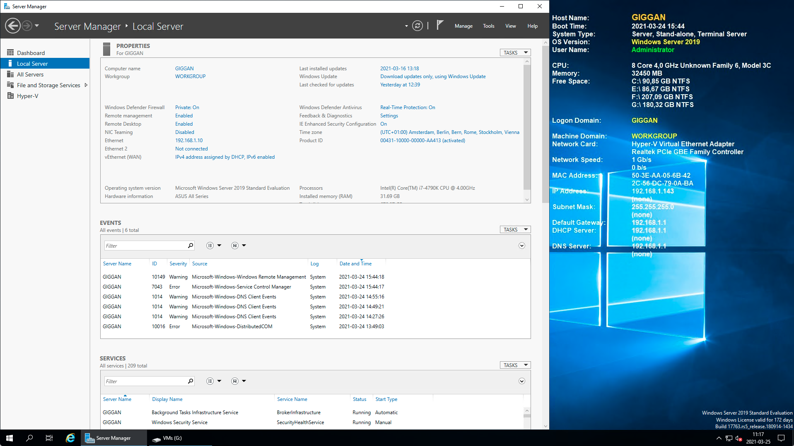

I use a tool from SysInternals that Microsoft has
available [here](https://docs.microsoft.com/en-us/sysinternals/downloads/bginfo) that displays the Server information to
the right in the image above.

## Network

All VMs will run on their own privat network, so they don't interfere with my regular network. This forces me to create
2 virtual networks in the "Virtual Switch Manager" on GIGGAN.

[Configuration here](network)

# Windows Server DC1

The server that will be domain controller.

[Configuration here](dsve-dc1)

## Windows 10

Windows machine that will be joined to the domain.

[Configuration here](dsve-cl1)

# Part 3 - PowerShell

## Create RefDisks

### Sysprep

Install a VM and install it as usual, then open CMD as Administrator and type:

```powershell
cd C:\Windows\System32\Sysprep\
sysprep
#alt
./sysprep
```

### Windows Server 2019

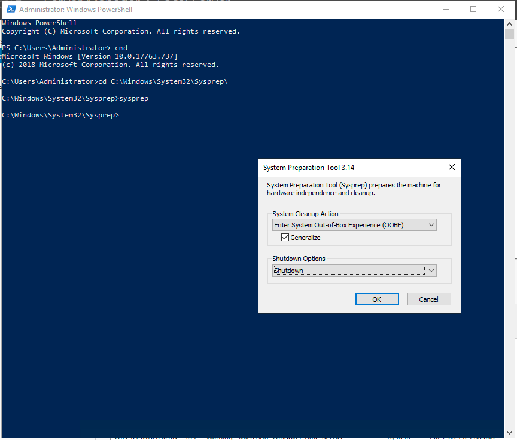
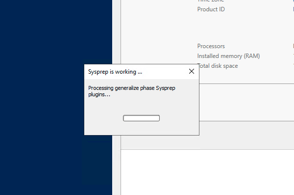

### Windows 10 Pro

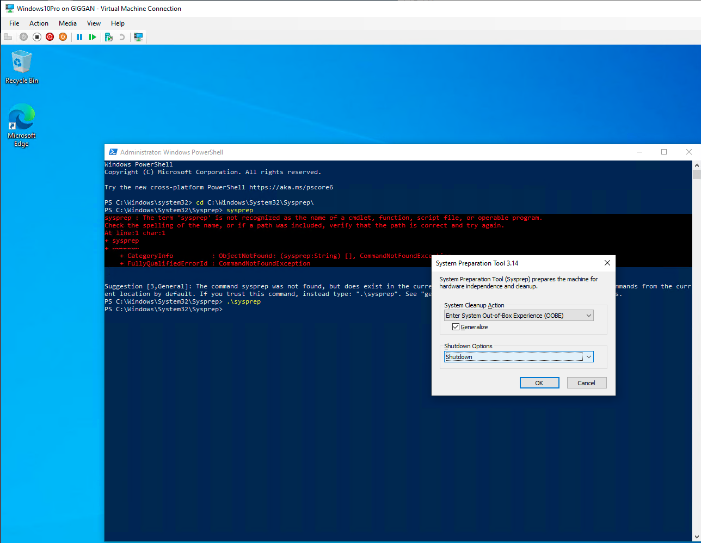

### Giggan

Export the VMs

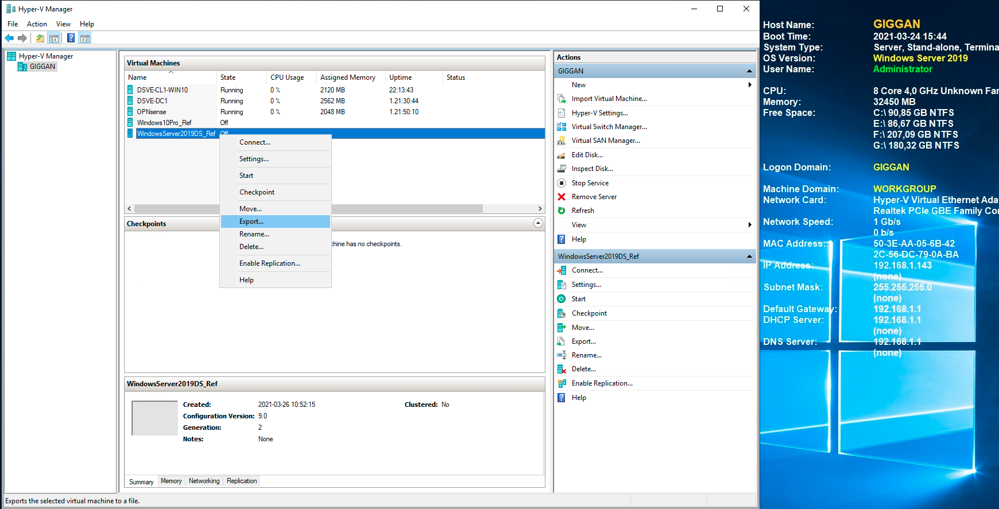

Rename the file with today's date and move to RefDisks.

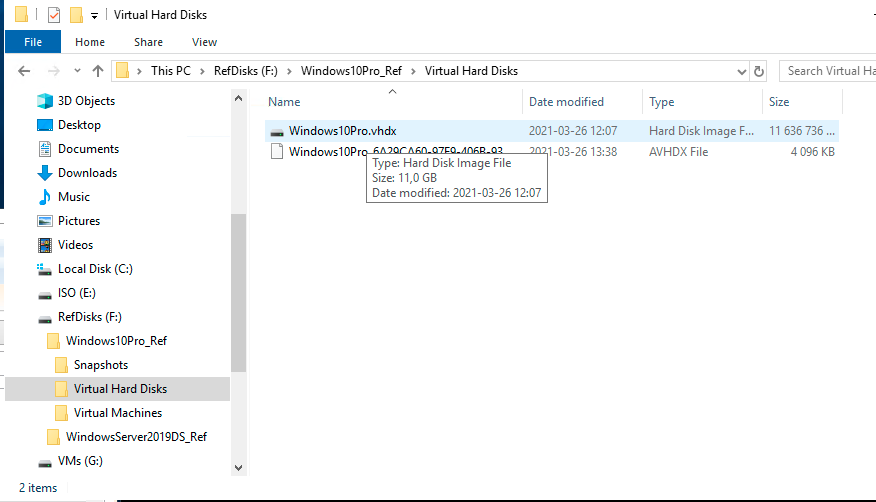

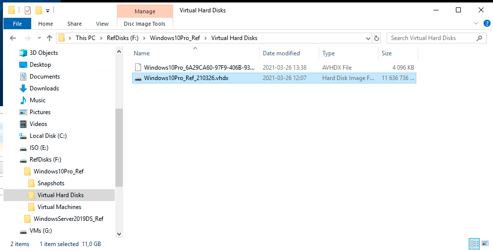

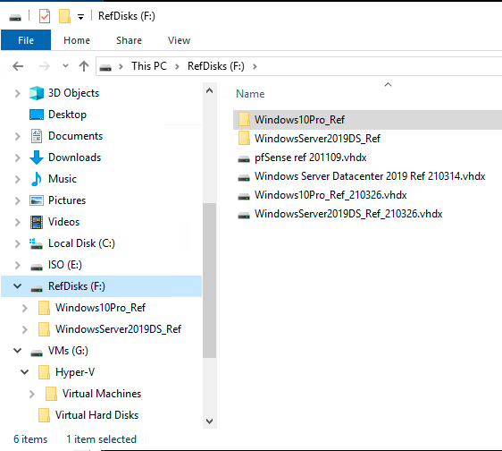

## Create a new VM with PowerShell

Copy an existing Virtual Hard Drive, create a new Windows Server 2019 VM and start it:

```powershell
 $VMName = "DSVE-DC2"
 $RefDisk = "F:\WindowsServer2019DS_Ref_210326.vhdx"
 $VMPath = "G:\Virtual Hard Disks\$VMName.vhdx"
 $VMMemorySize = 4096MB
 $VMProcCount = 4

 Copy-Item $RefDisk -Destination $VMPath

 $VM = New-VM -Name $VMName -MemoryStartupBytes $VMMemorySize -VHDPath $VMPath -Generation 2 -SwitchName LAN
 $VM | Set-VMProcessor -Count $VMProcCount
 $VM | Start-VM
```

Copy an existing Virtual Hard Drive, create a new Windows 10 Pro VM and start it:

```powershell
 $VMName = "DSVE-CL2"
 $RefDisk = "F:\Windows10Pro_Ref_210326.vhdx"
 $VMPath = "G:\Virtual Hard Disks\$VMName.vhdx"
 $VMMemorySize = 4096MB
 $VMProcCount = 4

 Copy-Item $RefDisk -Destination $VMPath

 $VM = New-VM -Name $VMName -MemoryStartupBytes $VMMemorySize -VHDPath $VMPath -Generation 2 -SwitchName LAN
 $VM | Set-VMProcessor -Count $VMProcCount
 $VM | Start-VM
```

I create 2 more Windows Servers 2019 and one more Windows 10 Pro machine:

- DSVE-DC2 (Server)
- DSVE-DC3 (Server)
- DSVE-CL2 (Windows 10)

#### Result

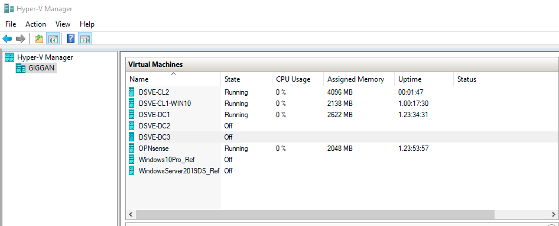

## Add new user with PowerShell

```powershell
$FirstName = "Bengt"
$LastName = "Bengtsson"
$Domain = "ad.dsve.se"

New-ADUser `
-DisplayName "$FirstName $LastName" `
-Name "$FirstName $LastName" `
-GivenName "$FirstName" `
-Surname "$LastName" `
-SamAccountName "$FirstName.$LastName".ToLower() `
-UserPrincipalName "$FirstName.$LastName@$Domain" `
-AccountPassword(Read-Host -AsSecureString "Input Password") `
-Enabled $true `
-ChangePasswordAtLogon $true

Add-ADGroupMember -Identity Marketing -Members davdav
```

## Add random user with PowerShell

```powershell
$Names = (Invoke-RestMethod -Uri "http://names.drycodes.com/10?nameOptions=boy_names").split("_")
$FirstName = $Names[0]
$Lastname = $Names[1]
$Domain = "ad.dsve.se"

New-ADUser `
-DisplayName "$FirstName $LastName" `
-Name "$FirstName $LastName" `
-GivenName "$FirstName" `
-Surname "$LastName" `
-SamAccountName "$FirstName.$LastName".ToLower() `
-UserPrincipalName "$FirstName.$LastName@$Domain" `
-AccountPassword(Read-Host -AsSecureString "Input Password") `
-Enabled $true `
-ChangePasswordAtLogon $true

Add-ADGroupMember -Identity Marketing -Members davdav
```

# Part 4

## Nano Server

Set up Nano Server in a container under Hyper-V on your previously created Windows Server machine.

- Install the roles required for this.
- Explain how you proceeded.
- Is it possible to automate this with PowerShell as well?
    - Yes since I listed the commands in my report

## Create DSVE-ContainerHost01 VM

[Configuration here](nano-server)

# Optional

Guides by me:

- [Active Directory](../ActiveDirectory)
- [Installation](../Installation)
- [Network](../Network)
- [PowerShell](../PowerShell)
- [Servers](../Servers)
