# Windows 10 - Client Machine

## Table of Content

- [Windows 10](#windows-10)
- [1st way to do it](#1st-way-to-do-it)
- [2nd way to do it (PowerShell)](#2nd-way-to-do-it-powershell)

# Windows 10

## 1st way to do it

1. Settings for Windows 10:

- Name: DSVE-CL1-WIN10
- Generation 2
- Startup memory: 4096 MB
- Add LAN network
- Virtual hard disk get standard settings (Location `G:\Virtual Hard Disks\`)
- Install from ISO (Win10_20H2_v2_EnglishInternational_x64.iso)
- Finish

2. Open Settings for "DSVE-CL1-WIN10" and change:

- Change to 4 cores

3. Start VM:

4. Install Windows and make a standard installation with Windows 10 Pro

5. Create an offline user

6. Set static IP settings

7. Join Domain


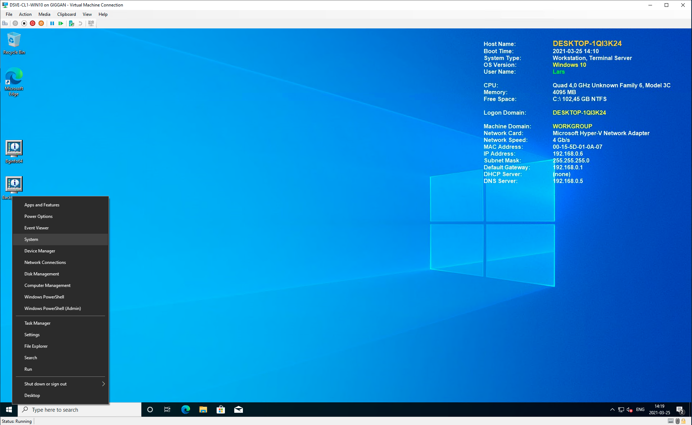
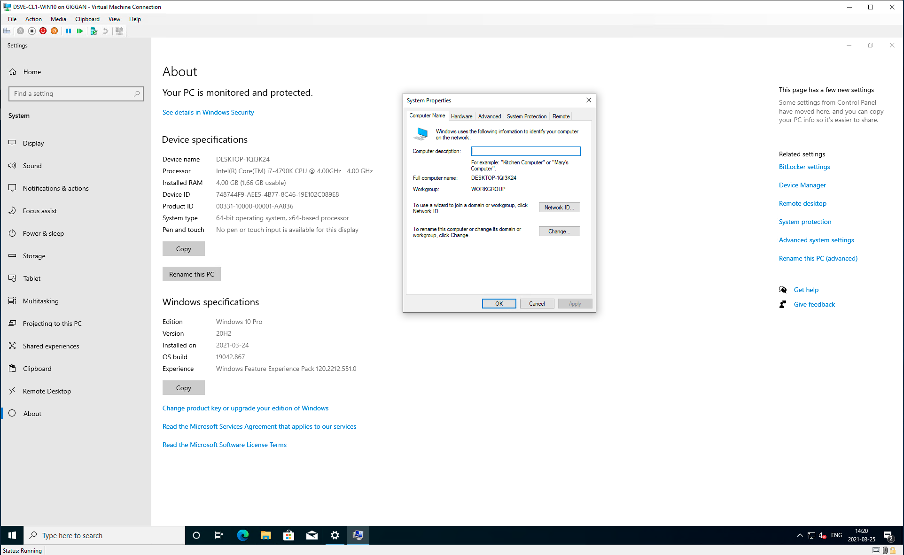
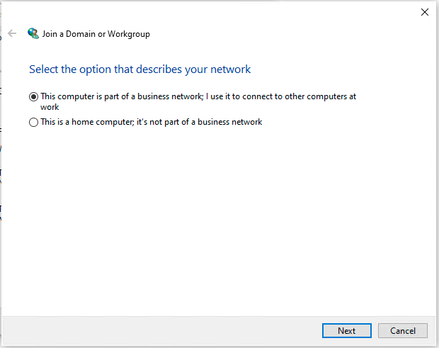
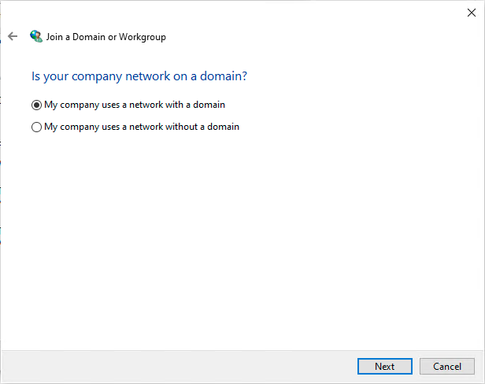
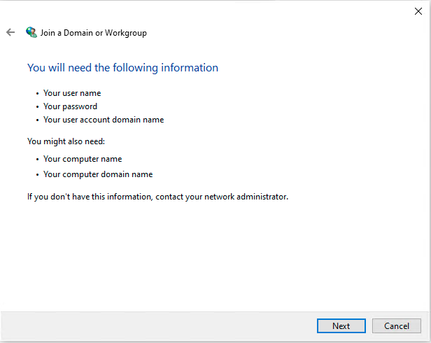
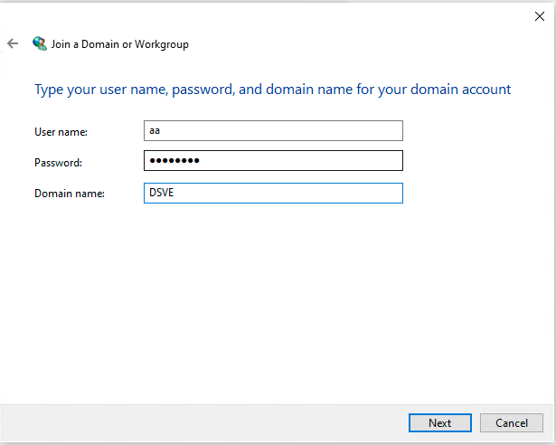
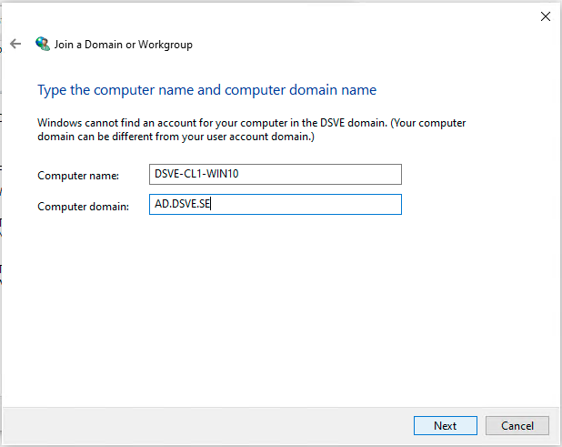
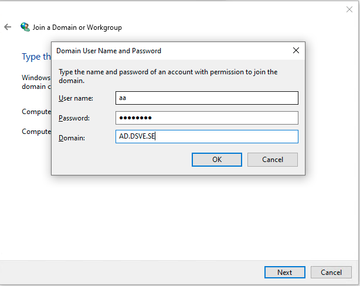
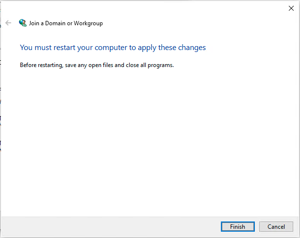
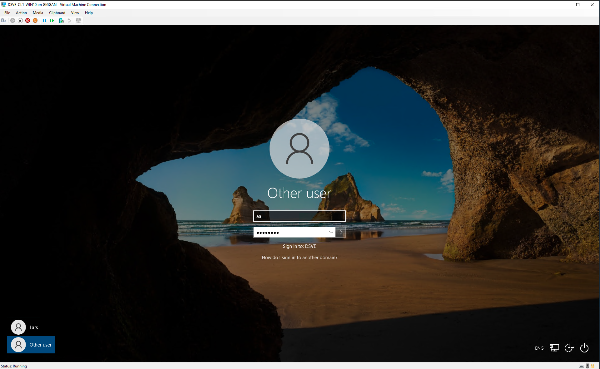
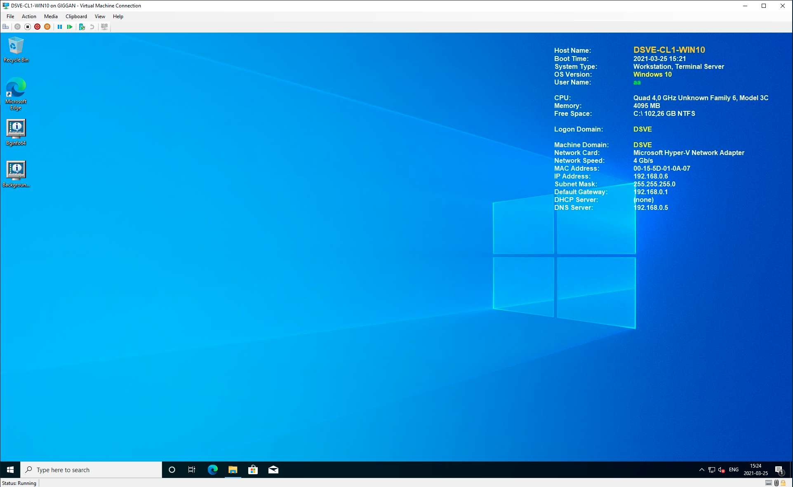

## 2nd way to do it (PowerShell)

1. Run Script

```powershell
 $VMName = "DSVE-CL2"
 $RefDisk = "F:\Windows10Pro_Ref_210326.vhdx"
 $VMPath = "G:\Virtual Hard Disks\$VMName.vhdx"
 $VMMemorySize = 4096MB
 $VMProcCount = 4

 Copy-Item $RefDisk -Destination $VMPath

 $VM = New-VM -Name $VMName -MemoryStartupBytes $VMMemorySize -VHDPath $VMPath -Generation 2 -SwitchName LAN
 $VM | Set-VMProcessor -Count $VMProcCount
 $VM | Start-VM
```

2. Create an offline user

3. IP settings is set through DHCP Server

4. Join Domain

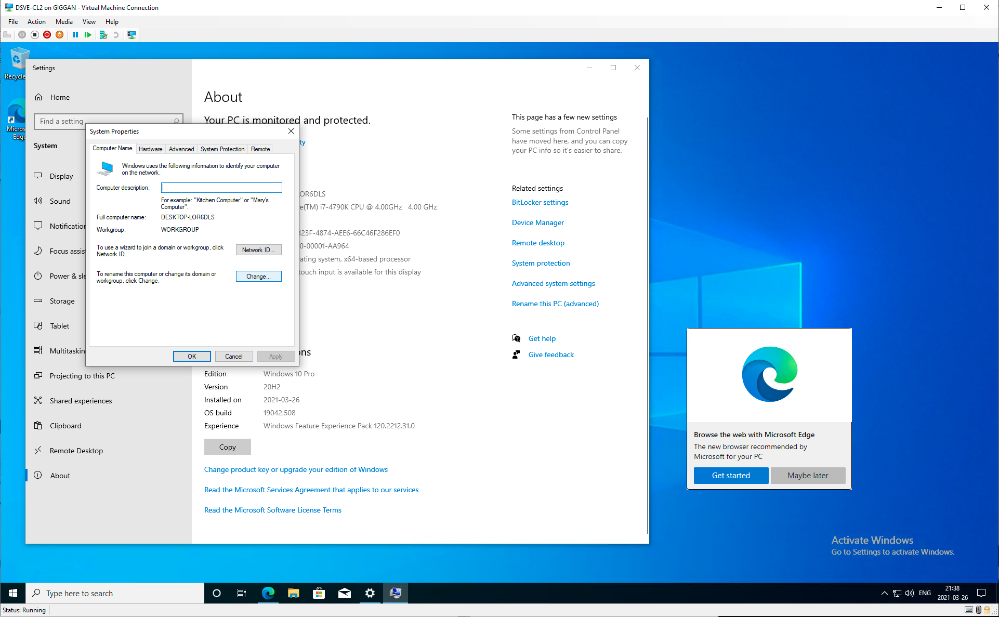


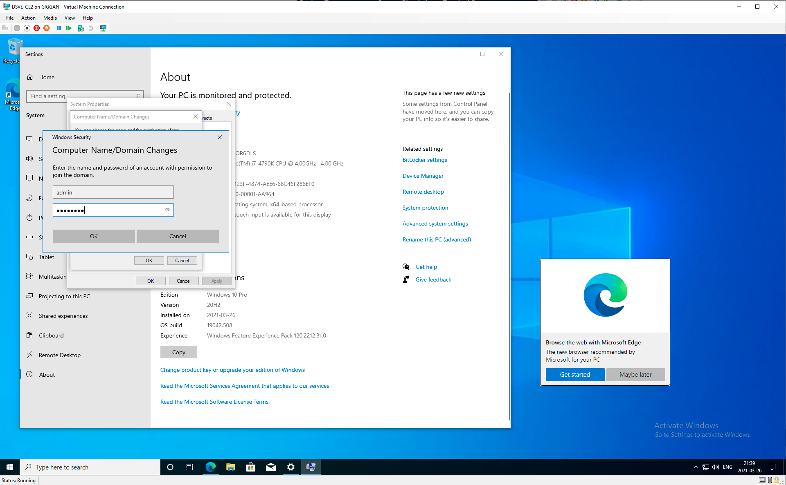

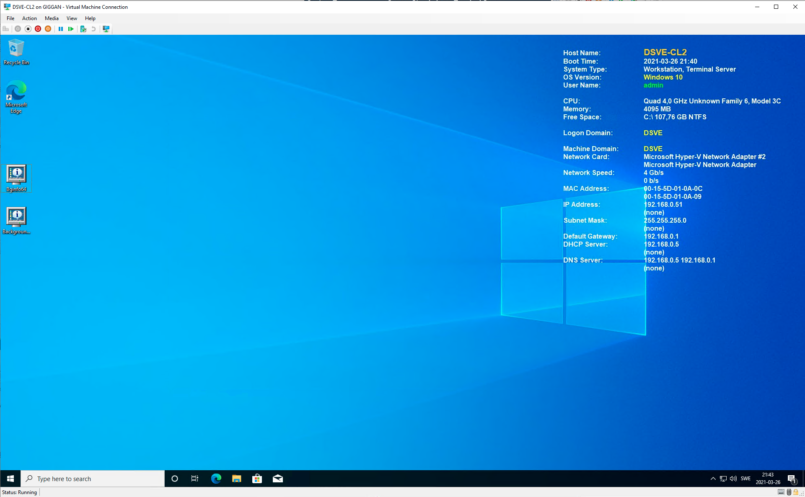
