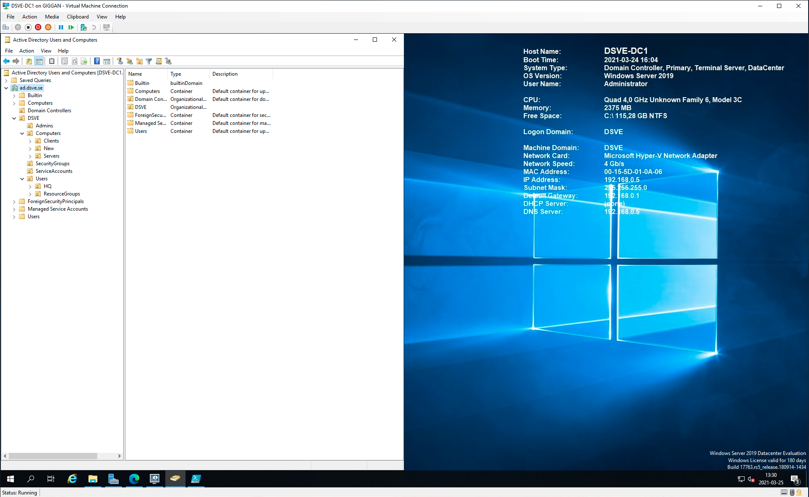
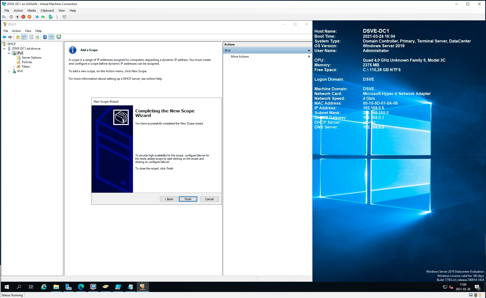

# Create a Windows Server

## Table of Content

- [Windows Server DC1](#windows-server-dc1)
    - [Create DSVE-DC1 VM](#create-dsve-dc1-vm)
    - [Install the role Domain Controller](#install-the-role-domain-controller)
    - [Create users](#create-users)
    - [Security fixes](#security-fixes)
    - [Install the role DHCP Server](#install-the-role-dhcp-server)

# Windows Server DC1

## Create DSVE-DC1 VM

1. Settings for Domain Controller:
    - Name: DSVE-DC1
    - Generation 2
    - Startup memory: 4096 MB
    - Add LAN network
    - Virtual hard disk get standard settings (Location `G:\Virtual Hard Disks\`)
    - Install from ISO (Windows Server 2019
      17763.737.190906-2324.rs5_release_svc_refresh_SERVER_EVAL_x64FRE_en-us_1.iso)
    - Finish

2. Open Settings for "DSVE-DC1" and change:
    - Change to 4 cores

3. Start VM:
    - Start from iso (Pictures from my Windows Server 2016 installation, but it's the same process for Server 2019)
    - [Windows installation in pictures](windows-installation.md)

## Install the role Domain Controller

1. Add new Role Active Directory Domain Controller

Set static IP first


Set Computer name


#### Add role


2. Deploy the server with the setting for the domain which can be seen in the PowerShell-script below

```powershell
#
# Windows PowerShell script for AD DS Deployment
#

Import-Module ADDSDeployment
Install-ADDSForest `
-CreateDnsDelegation:$false `
-DatabasePath "C: \Windows \NTDS" `
-DomainMode "WinThreshold" `
-DomainName "ad.dsve.se" `
-DomainNetbiosName "DSVE" `
-ForestMode "WinThreshold" `
-InstallDns:$true `
-LogPath "C: \Windows\NTDS" `
-NoRebootOnCompletion:$false `
-SysvolPath "C: \Windows \SYSVOL" `
-Force: Strue
```

#### Result


3. Restart

## Create users

Here I will use a PowerShell-script to change the structure in "Active Directory Users and Computers" under Tools menu.

#### Standard view (before the script):


#### PowerShell-script to apply

```powershell
$ParentDomain = "DC=AD,DC=DSVE,DC=SE"
$DomainName = "DSVE"

# Create Domain OU
New-ADOrganizationalUnit -Name $DomainName -Path $ParentDomain -ProtectedFromAccidentalDeletion $True

# Create Computer Containers
New-ADOrganizationalUnit -Name Computers -Path "OU=$DomainName,$ParentDomain" -ProtectedFromAccidentalDeletion $True

New-ADOrganizationalUnit -Name Clients -Path "OU=Computers,OU=$DomainName,$ParentDomain" -ProtectedFromAccidentalDeletion $True
New-ADOrganizationalUnit -Name New -Path "OU=Computers,OU=$DomainName,$ParentDomain" -ProtectedFromAccidentalDeletion $True
New-ADOrganizationalUnit -Name Servers -Path "OU=Computers,OU=$DomainName,$ParentDomain" -ProtectedFromAccidentalDeletion $True

# Create User Container
New-ADOrganizationalUnit -Name Users -Path $( "OU=$DomainName,$ParentDomain" ) -ProtectedFromAccidentalDeletion $True
New-ADOrganizationalUnit -Name HQ -Path $( "OU=Users,OU=$DomainName,$ParentDomain" ) -ProtectedFromAccidentalDeletion $True
New-ADOrganizationalUnit -Name ResourceGroups -Path $( "OU=Users,OU=$DomainName,$ParentDomain" ) -ProtectedFromAccidentalDeletion $True

# Create Service Account Container
New-ADOrganizationalUnit -Name "ServiceAccounts" -Path "OU=$DomainName,$ParentDomain" -ProtectedFromAccidentalDeletion $True

# Create Security Groups Container
New-ADOrganizationalUnit -Name "SecurityGroups" -Path "OU=$DomainName,$ParentDomain" -ProtectedFromAccidentalDeletion $True

# Create Admins Container
New-ADOrganizationalUnit -Name "Admins" -Path "OU=$DomainName,$ParentDomain" -ProtectedFromAccidentalDeletion $True
```

#### PowerShell image of executed command


#### Result



### Added Users Manually

- Adam Adamsson
- Bengt Bengtsson

## Security fixes

1. Move Administrator account to Admins folder under The domain DSVE.
2. Create new Admin account

#### Add random users

```powershell
$Names = (Invoke-RestMethod -Uri "http://names.drycodes.com/10?nameOptions=boy_names").split("_")
$FirstName = $Names[0]
$Lastname = $Names[1]

Write "$FirstName $Lastname"
```

## Install the role DHCP Server

#### Add Roles and Features -> DHCP Server


#### Post installation


#### Open DHCP Manager


#### Create a new Scope




### Result


