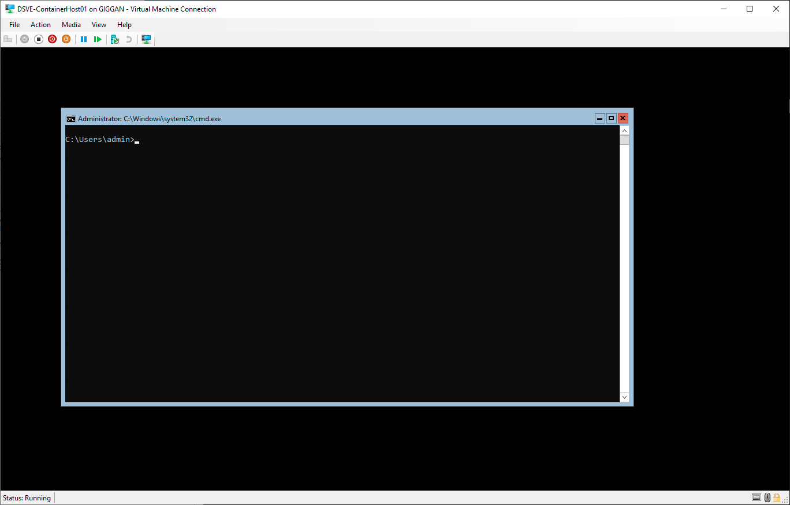
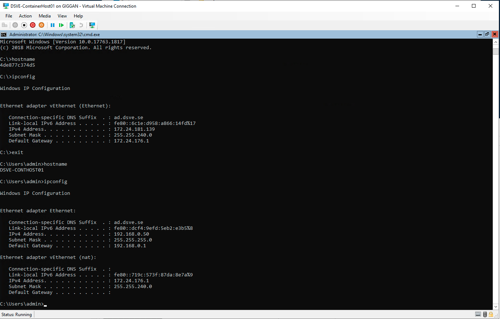

# Del 4 - Nano Server

## Table of Content

- [Nano Server](#nano-server)
    - [Create DSVE-ContainerHost01 VM](#create-dsve-containerhost01-vm)
    - [Make RefDisk](#make-refdisk)
    - [Create a new VM (optional)](#create-a-new-vm-optional)
    - [Installation of Docker](#installation-of-docker)

# Nano Server

## Create DSVE-ContainerHost01 VM

1. Settings for Nano Server:
    - Name: DSVE-ContainerHost01
    - Generation 2
    - Startup memory: 8192 MB
    - Add LAN network
    - Virtual hard disk get standard settings (Location `G:\Virtual Hard Disks\`)
    - Install from ISO (en_windows_server_2019_updated_feb_2021_x64_dvd_277a6bfe.iso)
    - Finish

2. Open Settings for "DSVE-ContainerHost01" and change:
    - Change to 4 cores

3. Start VM:
    - Start from iso
    - Install Standard Version without GUI
    - Enter Administrator password on reboot

## Make RefDisk

Make a sysprep in cmd/powershell:

```powershell
cd C:\Windows\System32\Sysprep\
sysprep
#alt
./sysprep
```


Export the VM `DSVE-ContainerHost01.vhdx`, rename to `WindowsNanoServer_Ref_210326.vhdx` and put in RefDisk location.

## Create a new VM (optional)

```powershell
 $VMName = "DSVE-ContainerHost02"
 $RefDisk = "F:\WindowsNanoServer_Ref_210326.vhdx"
 $VMPath = "G:\Virtual Hard Disks\$VMName.vhdx"
 $VMMemorySize = 8192MB
 $VMProcCount = 4

 Copy-Item $RefDisk -Destination $VMPath

 $VM = New-VM -Name $VMName -MemoryStartupBytes $VMMemorySize -VHDPath $VMPath -Generation 2 -SwitchName LAN
 $VM | Set-VMProcessor -Count $VMProcCount
 $VM | Start-VM
```

#### Result


4. Join to my domain `ad.dsve.se`


#### PowerShell commands for joining a domain

```powershell
 Add-Computer -DomainName ad.dsve.se -NewName DSVE-ContainerHost01
 Restart-Computer
```





## Installation of Docker

#### PowerShell commands

Somehow I ended upp with an old installation ISO-file, so I had to install `nanoserver:1809` because of this.

```powershell
 Install-Module -Name DockerMsftProvider -Repository PSGallery -Force

 Install-Package -Name docker -ProviderName DockerMsftProvider -Force

 Restart-Computer

 #docker pull mcr.microsoft.com/windows/nanoserver:20H2
 docker pull mcr.microsoft.com/windows/nanoserver:1809

 docker images

 docker run -it mcr.microsoft.com/windows/nanoserver:1809

```


#### Pull docker container from the internet and Start a docker container


#### Last image shows that the container id and docker host computer have different hostnames


