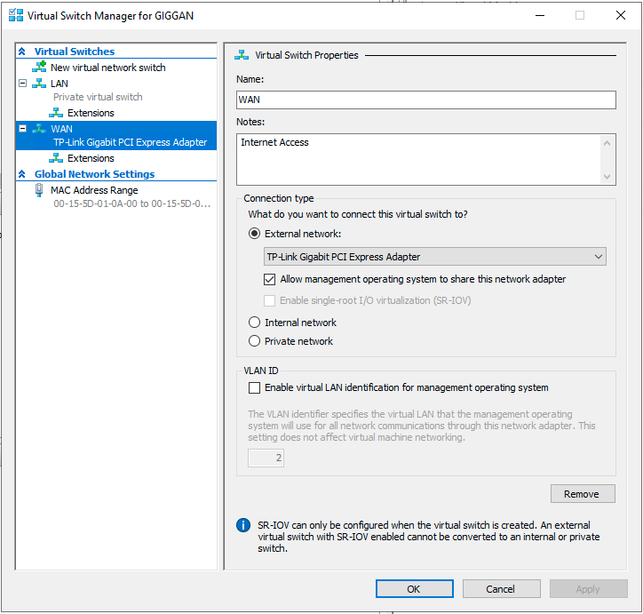
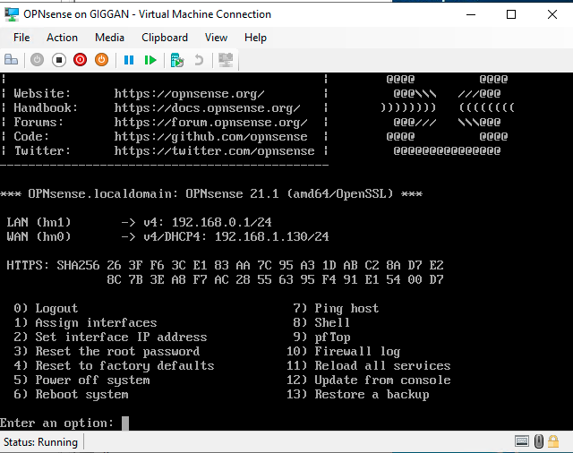

# Network

## Table of Content

- [Setup](#setup)
- [Router VM](#router-vm)

# Setup

All VMs will run on their own privat network, so they don't interfere with my regular network. This forces me to create
2 virtual networks in the "Virtual Switch Manager" on GIGGAN. I will call them:

- WAN (Internet Access)
- LAN (VM network)

The names are used according to my LAB-environments perspective!

I could just shield of the network since it's a LAB-environment, but I need internet access for **"part 4"** in this
assignment.

# Router VM

Since I need a router to be able to access the internet on my LAB-environment I start by creating it first. I'll
Use [OPNsense](https://opnsense.org/) as router software.

1. Settings for Router:
    - Name: OPNsense
    - Generation 1 for compatibility reasons (don't work on Gen2)
    - Startup memory: 2048 MB
    - Add WAN network
    - Virtual hard disk get standard settings (Location `G:\Virtual Hard Disks\`)
    - Install from ISO (OPNsense-21.1-OpenSSL-dvd-amd64.iso)
    - Finish

2. Open Settings for "OPNsense" and change:
    - Change to 2 cores
    - Add LAN network

3. Start VM:
    - Start from iso
    - log in with
        - user: `installer`
        - password: `opnsense`
        - To start installation and follow on-screen instructions
    - log in with
        - user: `root`
        - password: `your choosen password during setup`
    - Connect WAN and LAN network-ports to the correct interface
        - `1) Assign interfaces`
        - `2) Set interface IP address`
        - Result:  
          

    - WAN network gets ip from my real router on my network
    - LAN network IP is set static to `192.168.0.1`
    - When we install our other machines on the LAN network we will be able to connect to `192.168.0.1` to administrate
      the router through a webb interface.

