# Installation of Windows Server

## Table of content

- [Requirements](#requirements)
    - [Minimum requirements](#minimum-requirements)
    - [My configurations](#my-computer)
        - [My computer](#my-computer)
        - [Domain Controller](#domain-controller)
        - [Member Server](#member-server)
        - [Client Server](#client-server)
        - [Core Server](#core-server)
- [Installation](#installation)
    - [VMWare Fusion](#vmware-fusion)
    - [Installation of Windows Server 2016 in pictures](#installation-of-windows-server-2016-in-pictures)
    - [Installing VMware Tools in a Fusion virtual machine running Windows in pictures](#installing-vmware-tools-in-a-fusion-virtual-machine-running-windows-in-pictures)
    - [Change network adapter in pictures](#change-network-adapter-in-pictures)

# Requirements

- [VMWare Fusion][1] (in my case), VirtualBox or other Virtual Machine Manager
- [Download Windows Server][2]
    - Windows Server 2016 - ISO [Requirements][3]
    - Windows Server 2019 - ISO [Requirements][4]

[1]: https://www.vmware.com/products/fusion/fusion-evaluation.html

[2]: https://www.microsoft.com/en-US/evalcenter/evaluate-windows-server-2019?filetype=ISO

[3]: https://docs.microsoft.com/en-us/windows-server/get-started/system-requirements

[4]: https://docs.microsoft.com/en-us/windows-server/get-started-19/sys-reqs-19

## Minimum requirements

| Property         | Value              |
| ---------------- | ------------------ |
| CPU              | 1,4 GHz, 2 cores   |
| RAM              | 512 MB Server Core |
| RAM              | 2048 MB Server GUI |
| HDD              | 32 GB              |

## My configurations

### My computer

I have a rather good setup, so I can give each VM a lot of resources. So you can set up each VM with lesser resources.

My computer:

- 6 Cores with hyper-threading
- 64GB RAM
- 500 GB Free SSD drive

### Domain Controller

| Property          | Value               |
| ----------------- | ------------------- |
| Windows Version   | `Windows Server 2016 - Datacenter GUI` |
| Computer Name     | `LAB2-DC1`          |
| CPU               | 6 cores             |
| RAM               | 4096 MB Server Core |
| HDD               | 60 GB               |

### Member Server

| Property          | Value               |
| ----------------- | ------------------- |
| Windows Version   | `Windows Server 2016 - Datacenter GUI` |
| Computer Name     | `LAB2-DC2`          |
| CPU               | 6 cores             |
| RAM               | 4096 MB Server Core |
| HDD               | 60 GB               |

### Client Server

| Property          | Value               |
| ----------------- | ------------------- |
| Windows Version   | `Windows Server 2016 - Standard GUI` |
| Computer Name     | `LAB2-CL1`          |
| CPU               | 6 cores             |
| RAM               | 2048 MB Server Core |
| HDD               | 30 GB               |

### Core Server

| Property          | Value               |
| ----------------- | ------------------- |
| Windows Version   | `Windows Server 2016 - Standard noGUI` |
| Computer Name     | `LAB2-CORE1`        |
| CPU               | 6 cores             |
| RAM               | 2048 MB Server Core |
| HDD               | 30 GB               |

# Installation

It's very similar installation procedure for Windows Server and Windows 10.

## VMWare Fusion (MacOS)

1. [Installing Windows 10 as a guest operating system in VMware Fusion](https://kb.vmware.com/s/article/2128765
   )
    - Follow "Process to Install Windows 10 in a virtual machine using Windows 10 `ISO` disc image:"
    - In step 9 "In the Windows Easy Install screen, Select the Use Easy Install option" _I didn't choose Easy Install_.
      In step 14 I gave th VMs:
    - Same name as intended Computer name.
    - Half of my cpu cores
    - LAB2-DC1 4 GB ram, the rest 2 GB ram
    - LAB2-DC1 60 GB HDD, the rest 30 GB HDD
2. After installation Enter an administrator password and log in.
    - For simplicity, I use the same password for all Administrative Accounts on all servers and the same Password for
      all users.
3. Then follow this guide to install "Guest System addons"
    - [Installing VMware Tools in a Fusion virtual machine running Windows](https://kb.vmware.com/s/article/1003417)
4. Windows will activate automatically sins it is connected to internet by chairing your internet connection, and you
   will get a 180 days trail edition.
5. In the settings for your VM in VMWare Fusion, klick on "Network Adapter", change to "Private" under "custom".
6. Then set the network settings according to the specified list under [servers](../Servers)

## VMware Workstation (Windows/Linux) Player/Pro (Pro evaluation used here) in Pictures

  
  
  
  
  
  
  
  
  
  

## Installation of Windows Server 2016 in pictures

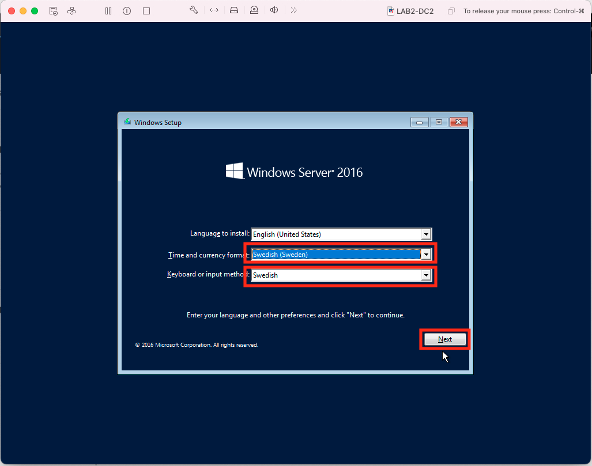
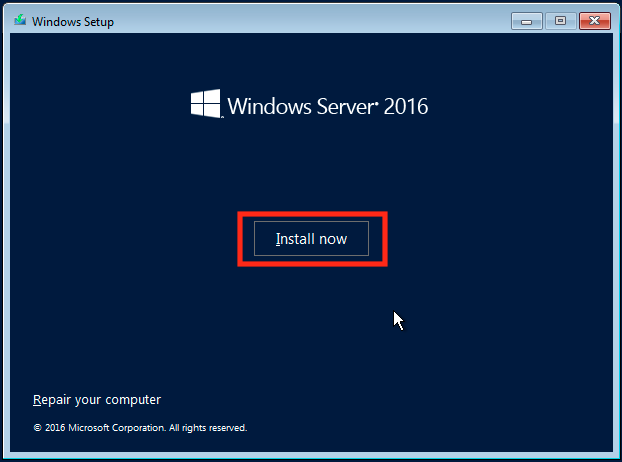
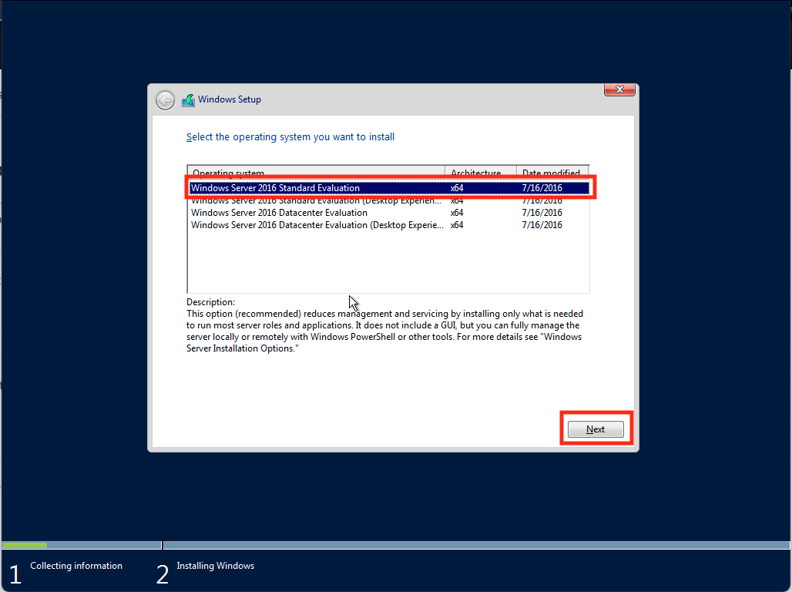
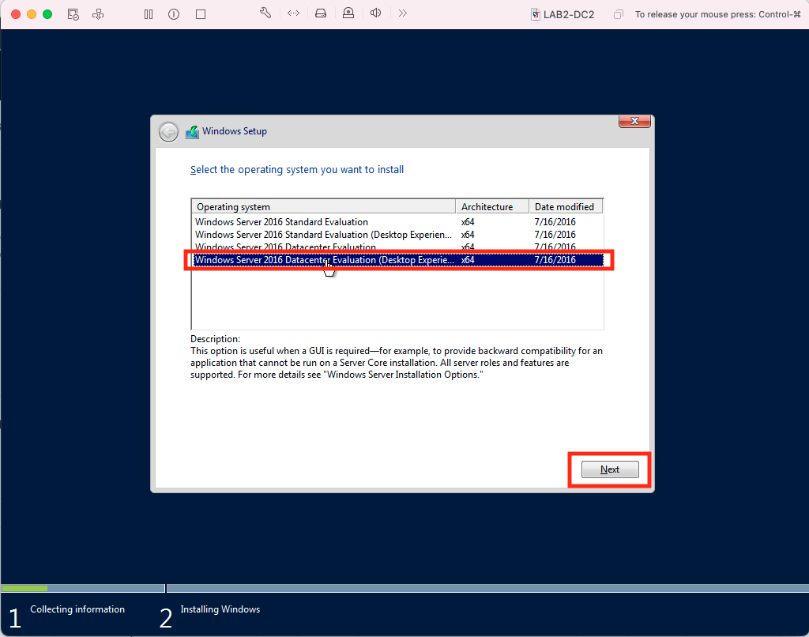
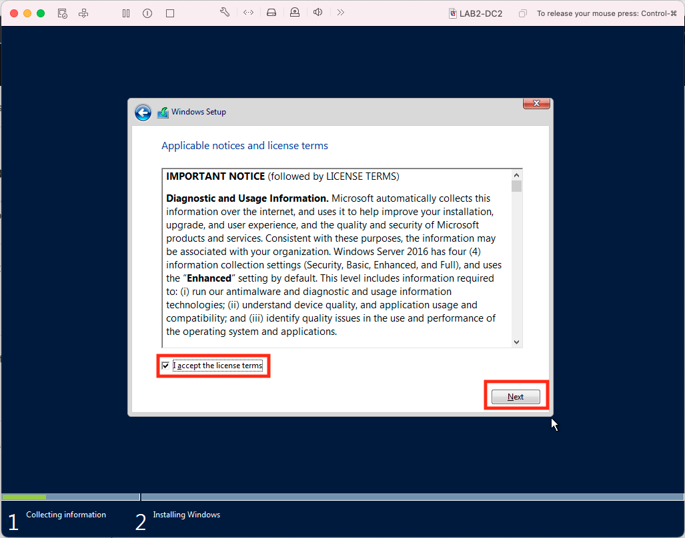
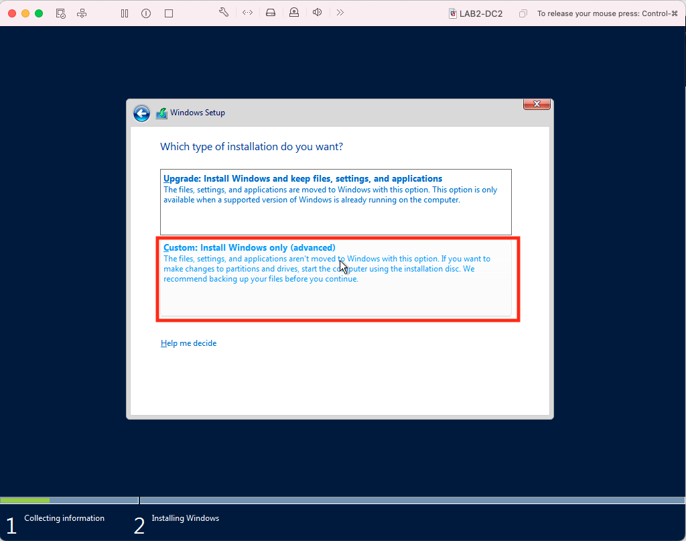
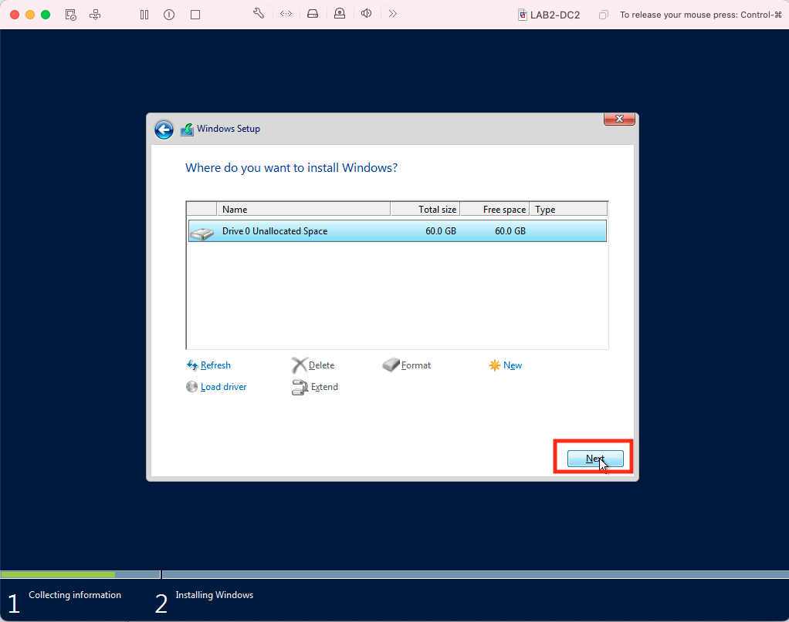

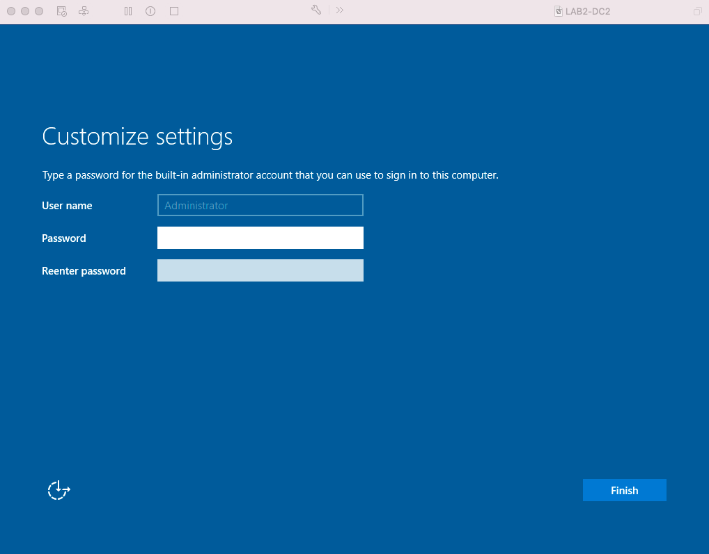

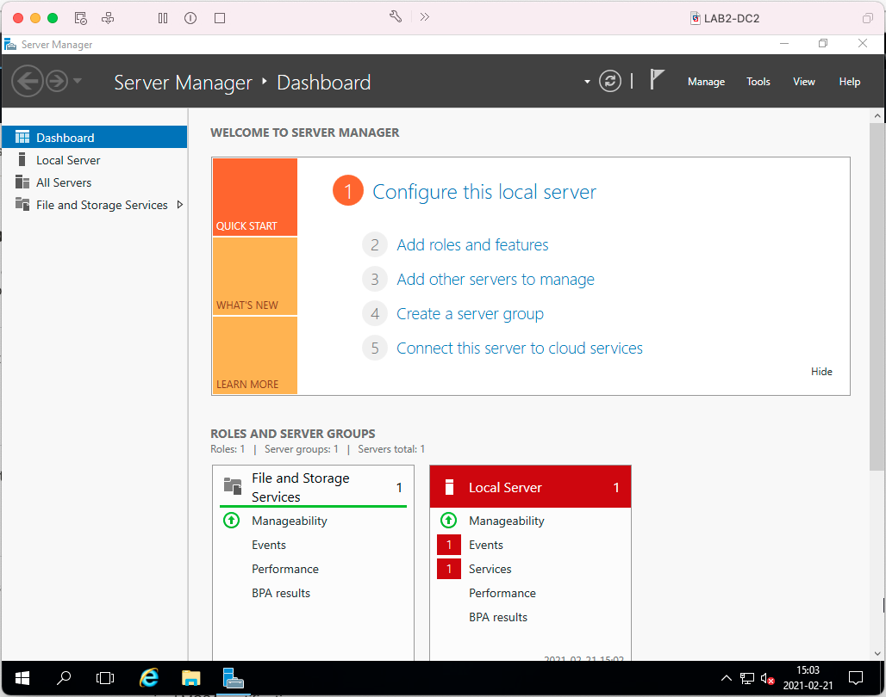

## Installing VMware Tools in a Fusion virtual machine running Windows in pictures

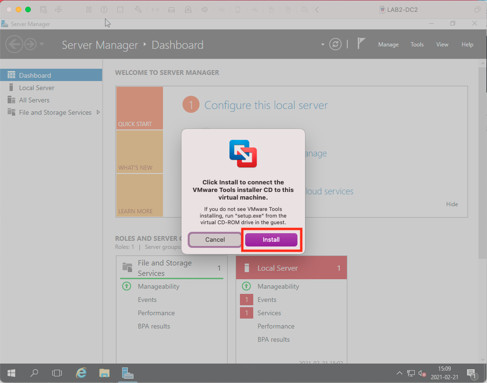

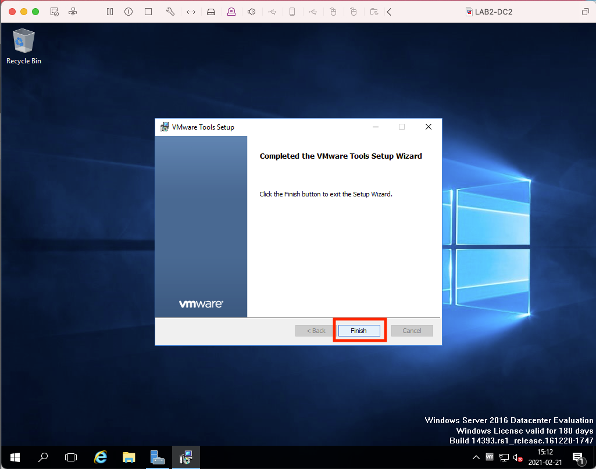
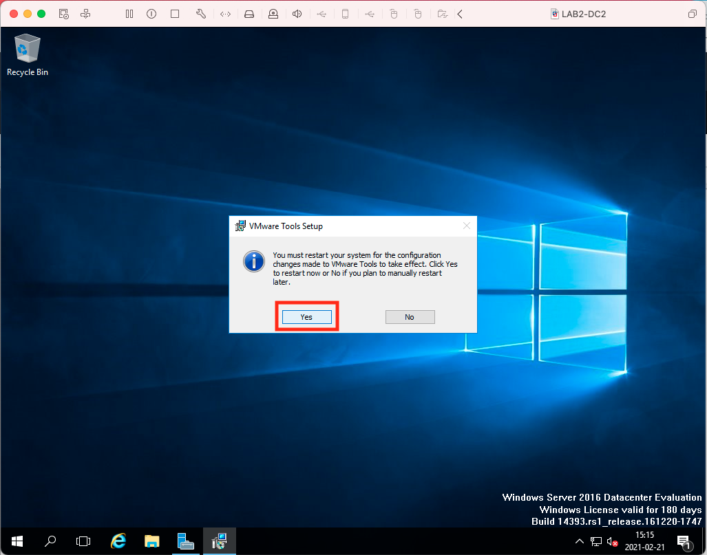

## Change network adapter in pictures

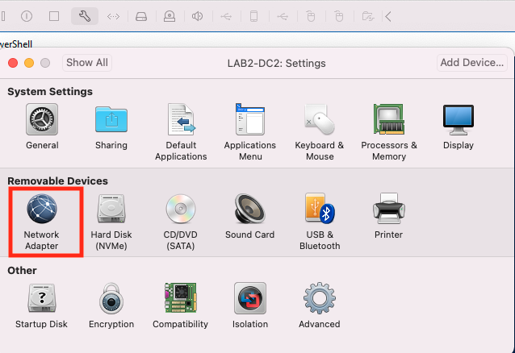  
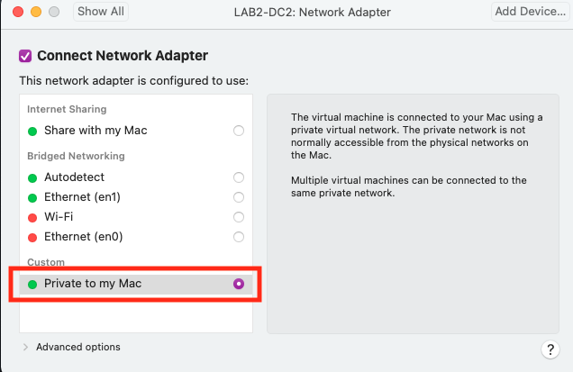
