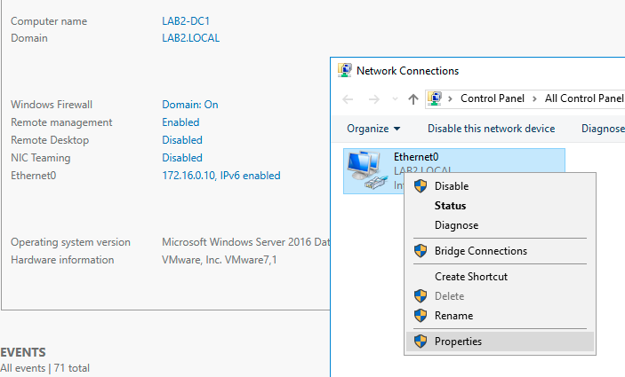
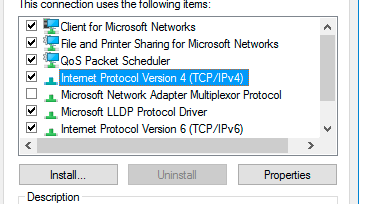
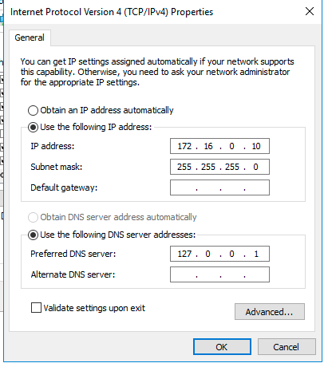

# Network

## Table of content

- [Configure network](#configure-network-with-static-ip)

# Configure Network with Static-IP 

1. Open Server Manager
2. Click on Computer name and set it to what you want (in my case `LAB2-DC1`) then reboot
3. Set static IP if not set already
  - Click on ethernet
  - Right klick Ethernet0 and klick on properties  
    
  - Dubble klick on "Internet Protocol Version 4 (TCP/IPv4)"  
    
  - Enter the following  
    
  - Press OK end close all windows

